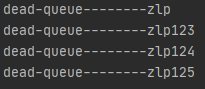

### 死信队列

​		死信队列中保存无法被正常消费的消息，但需要保留历史记录。如当消息消费发生异常时，将消息投入死信队列中。用户在商城下单成功并点击去支付后在指定时 间未支付时自动失效。


消息死亡的条件

一般为：

- 消息的ttl过期
- 队列已满无法继续加入新消息
- 被拒绝并且不重新入队的消息


### 示例1-消息TTL过期

关键点：

> 使用扩展属性
>
> * x-dead-letter-exchange：死亡消息转发給哪个交换机
> * x-dead-letter-routing-key：死亡消息的路由键
>
> 过期设置
>
> * x-message-ttl：队列参数维度设置过期TTL
>
> * 消息维度设置过期TTL
>
> * ```java
>   AMQP.BasicProperties properties = new AMQP.BasicProperties().builder().expiration("10000").build();
>   ```

```java
/**
 * 死信队列示例
 */
public class DeathQueue {
    public static void main(String[] args) throws Exception{
        init();
        sendMessage();
    }

    public static void init() throws Exception{
        try(Channel channel = MQConnectFactory.getChannel()){

            /**
             * 创建普通交换机、死信交换机
             */
            channel.exchangeDeclare("normal-exchange", BuiltinExchangeType.DIRECT);
            channel.exchangeDeclare("dead-exchange",BuiltinExchangeType.DIRECT);
            /**
             * 创建普通队列和死信队列
             * 通过扩展参数：
             * x-dead-letter-exchange：死亡消息转发給哪个交换机
             * x-dead-letter-routing-key：死亡消息的路由键
             */
            Map<String,Object> map = new HashMap<>();
            map.put("x-dead-letter-exchange","dead-exchange");
            map.put("x-dead-letter-routing-key","dead");
            channel.queueDeclare("normal-queue",false,false,false,map);
            channel.queueDeclare("dead-queue",false,false,false,null);
            /**
             * 普通交换机-普通队列
             * 死信交换机-死信队列
             */
            channel.queueBind("normal-queue","normal-exchange","normal");
            channel.queueBind("dead-queue","dead-exchange","dead");
        }
    }
    public static void sendMessage() throws Exception{
        try (final Channel channel = MQConnectFactory.getChannel()){
            // 设置消息过期时间
            AMQP.BasicProperties properties = new AMQP.BasicProperties().builder().expiration("10000").build();
            channel.basicPublish("normal-exchange","normal",properties,"zlp".getBytes());
            channel.basicPublish("normal-exchange","normal",properties,"zlp123".getBytes());
        }
    }
}

```

测试1：在发送消息后等待消息过期启功死信队列消费者

测试结果


测试2：在消息发送后还没过期前启动正常队列消费者

测试结果


测试3：在消息被正常消费后，消费者没有确认消费，在关闭正常队列消费者

测试结果


总结：

- 消息过期后会根据扩展参数的设置转发到对应的交换机上
- 已经消费但未确认的消息在TTL过期后不会被认定为死亡，只有在消费者断开连接后才会被认定为死亡

### 示例2-队列已满

关键点：

> 使用扩展属性
>
> * x-dead-letter-exchange：死亡消息转发給哪个交换机
> * x-dead-letter-routing-key：死亡消息的路由键
> * x-max-length：设置队列长度

```java
/**
 * 死信队列示例
 */
public class DeathQueue {
    public static void main(String[] args) throws Exception{
        init();
        sendMessage();
    }

    public static void init() throws Exception{
        try(Channel channel = MQConnectFactory.getChannel()){

            /**
             * 创建普通交换机、死信交换机
             */
            channel.exchangeDeclare("normal-exchange", BuiltinExchangeType.DIRECT);
            channel.exchangeDeclare("dead-exchange",BuiltinExchangeType.DIRECT);
            /**
             * 创建普通队列和死信队列
             * 通过扩展参数：
             * x-dead-letter-exchange：死亡消息转发給哪个交换机
             * x-dead-letter-routing-key：死亡消息的路由键
             */
            Map<String,Object> map = new HashMap<>();
            map.put("x-max-length",3);
            map.put("x-dead-letter-exchange","dead-exchange");
            map.put("x-dead-letter-routing-key","dead");
            channel.queueDeclare("normal-queue",false,false,false,map);
            channel.queueDeclare("dead-queue",false,false,false,null);
            /**
             * 普通交换机-普通队列
             * 死信交换机-死信队列
             */
            channel.queueBind("normal-queue","normal-exchange","normal");
            channel.queueBind("dead-queue","dead-exchange","dead");
        }
    }
    public static void sendMessage() throws Exception{
        try (final Channel channel = MQConnectFactory.getChannel()){
            channel.basicPublish("normal-exchange","normal",null,"zlp".getBytes());
            channel.basicPublish("normal-exchange","normal",null,"zlp123".getBytes());
            channel.basicPublish("normal-exchange","normal",null,"zlp124".getBytes());
            channel.basicPublish("normal-exchange","normal",null,"zlp125".getBytes());
        }
    }
}

```

测试1：不启动正常队列消费者

测试结果：Drop Head


测试2：启动正常队列消费者，并回复消费确认

测试结果：全部消费


测试3：启动正常队列消费者，不回复消费确认，断掉消费者

测试结果：正常队列被消费，消费者断开后，Drop Head


### 示例3-消息被拒

关键点：

> 使用扩展属性
>
> * x-dead-letter-exchange：死亡消息转发給哪个交换机
> * x-dead-letter-routing-key：死亡消息的路由键
>
> 消费者拒绝消费：若配置了死信队列则被拒绝的消息将自动转发给配置的死信交换机（拒绝的消息不重新加入队列时）

```java
/**
 * 死信队列示例
 */
public class DeathQueue {
    public static void main(String[] args) throws Exception{
        init();
        sendMessage();
    }

    public static void init() throws Exception{
        try(Channel channel = MQConnectFactory.getChannel()){

            /**
             * 创建普通交换机、死信交换机
             */
            channel.exchangeDeclare("normal-exchange", BuiltinExchangeType.DIRECT);
            channel.exchangeDeclare("dead-exchange",BuiltinExchangeType.DIRECT);
            /**
             * 创建普通队列和死信队列
             * 通过扩展参数：
             * x-dead-letter-exchange：死亡消息转发給哪个交换机
             * x-dead-letter-routing-key：死亡消息的路由键
             */
            Map<String,Object> map = new HashMap<>();
            map.put("x-dead-letter-exchange","dead-exchange");
            map.put("x-dead-letter-routing-key","dead");
            channel.queueDeclare("normal-queue",false,false,false,map);
            channel.queueDeclare("dead-queue",false,false,false,null);
            /**
             * 普通交换机-普通队列
             * 死信交换机-死信队列
             */
            channel.queueBind("normal-queue","normal-exchange","normal");
            channel.queueBind("dead-queue","dead-exchange","dead");
        }
    }
    public static void sendMessage() throws Exception{
        try (final Channel channel = MQConnectFactory.getChannel()){
            channel.basicPublish("normal-exchange","normal",null,"zlp".getBytes());
            channel.basicPublish("normal-exchange","normal",null,"zlp123".getBytes());
            channel.basicPublish("normal-exchange","normal",null,"zlp124".getBytes());
            channel.basicPublish("normal-exchange","normal",null,"zlp125".getBytes());
        }
    }
}

```

```java
channel.basicNack(msg.getEnvelope().getDeliveryTag(),true,false);
```

测试1：启动正常消费则和死信队列消费者

测试结果：拒绝后将进入死信队列




