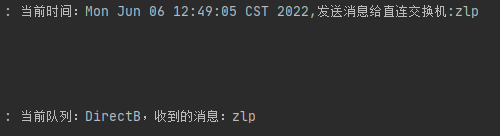

### 依赖

```xml
        <dependency>
            <groupId>org.springframework.boot</groupId>
            <artifactId>spring-boot-starter-amqp</artifactId>
        </dependency>
```


### 配置文件

```properties
spring.rabbitmq.host=175.24.202.196
spring.rabbitmq.port=5672
spring.rabbitmq.username=root
spring.rabbitmq.password=root

# 生成者发布确认
spring.rabbitmq.publisher-confirm-type=correlated
# 消费者消费确认
spring.rabbitmq.publisher-returns=true
```


### 1、Direct交换机

1、配置类

```java
@Configuration
public class DirectExchangeConfig {
    @Bean
    public DirectExchange directExchange(){
        return new DirectExchange("direct", false,true);
    }

    @Bean
    public Queue queueDirectA(){
        return new Queue("DirectA",false,false,true);
    }

    @Bean
    public Queue queueDirectB(){
        return new Queue("DirectB",false,false,true);
    }

    @Bean
    public Binding bindingA(){
        return BindingBuilder.bind(queueDirectA()).to(directExchange()).with("DirectA");
    }

    @Bean
    public Binding bindingB(){
        return BindingBuilder.bind(queueDirectB()).to(directExchange()).with("DirectB");
    }
}
```

2、生产者

```java
    @GetMapping("msg/{direct}/{data}")
    public void sendDirect(@PathVariable("data") String data,@PathVariable("direct") String direct){
        log.info("当前时间：{},发送消息给直连交换机:{}", new Date(), data);
        rabbitTemplate.convertAndSend("direct",direct,data);
    }
```

3、消费者

```java
@Slf4j
@Component
public class Worker {
    @RabbitListener(queues = "DirectA")
    @RabbitHandler
    public void receiveA(Message message){
        String msg = new String(message.getBody());
        log.info("当前队列：{}，收到的消息：{}","DirectA",msg);
    }

    @RabbitListener(queues = "DirectB")
    public void receiveB(Message message){
        String msg = new String(message.getBody());
        log.info("当前队列：{}，收到的消息：{}","DirectB",msg);
    }
}
```

测试1


结果


测试2


结果


### 2、Fanout交换机

1、配置类

```java
@Configuration
public class FanoutExchangeConfig {
    @Bean
    public FanoutExchange fanoutExchange(){
        return new FanoutExchange("fanout", false,true);
    }

    @Bean
    public Queue queueFanoutA(){
        return new Queue("FanoutA",false,false,true);
    }

    @Bean
    public Queue queueFanoutB(){
        return new Queue("FanoutB",false,false,true);
    }

    @Bean
    public Binding bindingFanoutA(){
        return BindingBuilder.bind(queueFanoutA()).to(fanoutExchange());
    }

    @Bean
    public Binding bindingFanoutB(){
        return BindingBuilder.bind(queueFanoutB()).to(fanoutExchange());
    }
}
```

2、生成者

```java
    @GetMapping("msg/fanout/{data}")
    public void sendFanout(@PathVariable("data") String data){
        log.info("当前时间：{},发送消息给直连交换机:{}", new Date(), data);
        rabbitTemplate.convertAndSend("fanout","",data);
    }
```


3、消费者

```java
    @RabbitListener(queues = "FanoutA")
    public void receiveFanoutA(Message message){
        String msg = new String(message.getBody());
        log.info("当前队列：{}，收到的消息：{}","FanoutA",msg);
    }

    @RabbitListener(queues = "FanoutB")
    public void receiveFanoutB(Message message){
        String msg = new String(message.getBody());
        log.info("当前队列：{}，收到的消息：{}","FanoutB",msg);
    }
```

测试


结果


### 3、Topic交换机

1、配置类

```java
@Configuration
public class TopicExchangeConfig {
    @Bean
    public TopicExchange topicExchange(){
        return new TopicExchange("topic", false,true);
    }

    @Bean
    public Queue queueTopicA(){
        return new Queue("TopicA",false,false,true);
    }

    @Bean
    public Queue queueTopicB(){
        return new Queue("TopicB",false,false,true);
    }
    
    @Bean
    public Queue queueTopicC(){
        return new Queue("TopicC",false,false,true);
    }

    @Bean
    public Binding bindingTopicA(){
        return BindingBuilder.bind(queueTopicA()).to(topicExchange()).with("com.info.*");
    }

    @Bean
    public Binding bindingTopicB(){
        return BindingBuilder.bind(queueTopicB()).to(topicExchange()).with("com.warn.*");
    }

    @Bean
    public Binding bindingTopicC(){
        return BindingBuilder.bind(queueTopicB()).to(topicExchange()).with("com.#");
    }
}
```

2、生成者

```java
    @GetMapping("msg/topic/{data}")
    public void sendTopic(@PathVariable("data") String data){
        log.info("当前时间：{},发送消息给直连交换机:{}", new Date(), data);
        rabbitTemplate.convertAndSend("topic","com.info.zlp","info" + data);
        rabbitTemplate.convertAndSend("topic","com.warn.zlp123","warn" + data);
        rabbitTemplate.convertAndSend("topic","com.xff.si","total" + data);
    }
```

3、消费者

```java
    @RabbitListener(queues = "TopicA")
    public void receiveTopicA(Message message){
        String msg = new String(message.getBody());
        log.info("当前队列：{}，收到的消息：{}","TopicA",msg);
    }

    @RabbitListener(queues = "TopicB")
    public void receiveTopicB(Message message){
        String msg = new String(message.getBody());
        log.info("当前队列：{}，收到的消息：{}","TopicB",msg);
    }

    @RabbitListener(queues = "TopicC")
    public void receiveTopicC(Message message){
        String msg = new String(message.getBody());
        log.info("当前队列：{}，收到的消息：{}","TopicC",msg);
    }
```

测试：


结果：


### 4、发布确认

1、配置类

```java
@Configuration
public class PublicExchangeConfig {
    @Bean
    public DirectExchange publicExchange(){
        return new DirectExchange("public", false,true);
    }

    @Bean
    public Queue queuePublicA(){
        return new Queue("publicA",false,false,true);
    }
    

    @Bean
    public Binding bindingPublicA(){
        return BindingBuilder.bind(queuePublicA()).to(publicExchange()).with("publicA");
    }
    
}
```

2、回调函数

```java
@Component
public class CallBack {
    public RabbitTemplate.ConfirmCallback myConfirmCallback(){
        return (correlationData, ack, cause)->{
            System.out.println("ConfirmCallback");
            System.out.println("相关数据：" + correlationData);
            System.out.println("确认情况：" + ack);
            System.out.println("原因：" + cause);
        };
    }

    public RabbitTemplate.ReturnCallback myReturnCallback(){
        return (message, replayCode, replayText, exchange, routingKey)->{
            System.out.println("myReturnCallback");
            System.out.println("消息：" + message);
            System.out.println("响应码：" + replayCode);
            System.out.println("响应内容：" + replayText);
            System.out.println("交换机：" + exchange);
            System.out.println("路由键：" + routingKey);
        };
    }
}
```

3、配置回调函数

```java
    @PostConstruct
    public void init(){
        rabbitTemplate.setConfirmCallback(callBack.myConfirmCallback());
        // 消息无法路由时触发的回调函数
        rabbitTemplate.setReturnCallback(callBack.myReturnCallback());
        // 消息无法路由时是否发送消息给生成者
        rabbitTemplate.setMandatory(true);
    }
```

4、生成者

```java
    @GetMapping("msg/public/{routingKey}/{data}")
    public void sendPublic(@PathVariable("routingKey") String routingKey,@PathVariable("data") String data){
        rabbitTemplate.convertAndSend("public",routingKey,data);
    }
```

测试1：交换机找不到


结果：触发ConfirmCallback

```
ConfirmCallback
相关数据：null
确认情况：false
原因：channel error; protocol method: #method<channel.close>(reply-code=404, reply-text=NOT_FOUND - no exchange 'publicx' in vhost '/', class-id=60, method-id=40)
```

测试2：交换机找到、路由没有匹配


结果：触发myReturnCallback、ConfirmCallback

```
myReturnCallback
消息：(Body:'zlp' MessageProperties [headers={}, contentType=text/plain, contentEncoding=UTF-8, contentLength=0, receivedDeliveryMode=PERSISTENT, priority=0, deliveryTag=0])
响应码：312
响应内容：NO_ROUTE
交换机：public
路由键：publicB

ConfirmCallback
相关数据：null
确认情况：true
原因：null
```

测试3：交换机路由都找不到


结果：触发ConfirmCallback

```
ConfirmCallback
相关数据：null
确认情况：false
原因：channel error; protocol method: #method<channel.close>(reply-code=404, reply-text=NOT_FOUND - no exchange 'publicx' in vhost '/', class-id=60, method-id=40)
```

测试4：交换机路由都找得到


结果：触发ConfirmCallback

```
ConfirmCallback
相关数据：null
确认情况：true
原因：null
```


### 5、消费确认

1、配置类

```java
@Configuration
public class DirectExchangeConfig {
    @Bean
    public DirectExchange directExchange(){
        return new DirectExchange("direct", false,true);
    }

    @Bean
    public Queue queueDirectA(){
        return new Queue("DirectA",false,false,true);
    }

    @Bean
    public Queue queueDirectB(){
        return new Queue("DirectB",false,false,true);
    }

    @Bean
    public Binding bindingA(){
        return BindingBuilder.bind(queueDirectA()).to(directExchange()).with("DirectA");
    }

    @Bean
    public Binding bindingB(){
        return BindingBuilder.bind(queueDirectB()).to(directExchange()).with("DirectB");
    }
}
```

2、生产者

```java
    @GetMapping("msg/{direct}/{data}")
    public void sendDirect(@PathVariable("data") String data,@PathVariable("direct") String direct){
        log.info("当前时间：{},发送消息给直连交换机:{}", new Date(), data);
        rabbitTemplate.convertAndSend("direct",direct,data);
    }
```

3、自定义消息监听器

```java
@Component
public class MyAckReceiver {
    public ChannelAwareMessageListener myListener(){
        return (messages,channel)->{
            long deliveryTag = messages.getMessageProperties().getDeliveryTag();
            System.out.println("myListener");
            try{
                System.out.println(messages.toString());
                System.out.println("消息属性："+messages.getMessageProperties());
                System.out.println("消息内容：" + Arrays.toString(messages.getBody()));
                System.out.println("消息来自：" + messages.getMessageProperties().getConsumerQueue());
                channel.basicAck(deliveryTag,false);
            }catch (Exception e){
                System.out.println("发生异常");
                channel.basicReject(deliveryTag, false);
                e.printStackTrace();
            }
        };
    }
}
```

4、添加自定义监听器到自定义容器中

```java
@Configuration
public class MessageListenerConfig{
    @Autowired
    private CachingConnectionFactory cachingConnectionFactory;
    @Autowired
    private MyAckReceiver myAckReceiver;

    @Bean
    public SimpleMessageListenerContainer simpleMessageListenerContainer(){
        SimpleMessageListenerContainer simpleMessageListenerContainer = new SimpleMessageListenerContainer(cachingConnectionFactory);
        // 设置消费者最大同时消费的消息
        simpleMessageListenerContainer.setMaxConcurrentConsumers(1);
        // 设置消息应答模式：手动应答
        simpleMessageListenerContainer.setAcknowledgeMode(AcknowledgeMode.MANUAL);
        // 添加消息监听器
        simpleMessageListenerContainer.setMessageListener(myAckReceiver.myListener());
        simpleMessageListenerContainer.setQueueNames("DirectA","DirectB");
        return simpleMessageListenerContainer;
    }
}
```

5、消费者

```java

```

测试1：发送给DirectA


结果

```
myListener
(Body:'zlp' MessageProperties [headers={spring_listener_return_correlation=a3f00a37-87c4-465d-a241-75b408009646}, contentType=text/plain, contentEncoding=UTF-8, contentLength=0, receivedDeliveryMode=PERSISTENT, priority=0, redelivered=false, receivedExchange=direct, receivedRoutingKey=DirectA, deliveryTag=1, consumerTag=amq.ctag-zv5RnxHN6r1Jqn0FKS6pzA, consumerQueue=DirectA])

消息属性：MessageProperties [headers={spring_listener_return_correlation=a3f00a37-87c4-465d-a241-75b408009646}, contentType=text/plain, contentEncoding=UTF-8, contentLength=0, receivedDeliveryMode=PERSISTENT, priority=0, redelivered=false, receivedExchange=direct, receivedRoutingKey=DirectA, deliveryTag=1, consumerTag=amq.ctag-zv5RnxHN6r1Jqn0FKS6pzA, consumerQueue=DirectA]
消息内容：[122, 108, 112]
消息来自：DirectA
```

测试2：发送给DirectB


结果

```
(Body:'zlp' MessageProperties [headers={spring_listener_return_correlation=a3f00a37-87c4-465d-a241-75b408009646}, contentType=text/plain, contentEncoding=UTF-8, contentLength=0, receivedDeliveryMode=PERSISTENT, priority=0, redelivered=false, receivedExchange=direct, receivedRoutingKey=DirectB, deliveryTag=2, consumerTag=amq.ctag-lnpjOf8GUJyY-2XZRQFiug, consumerQueue=DirectB])

消息属性：MessageProperties [headers={spring_listener_return_correlation=a3f00a37-87c4-465d-a241-75b408009646}, contentType=text/plain, contentEncoding=UTF-8, contentLength=0, receivedDeliveryMode=PERSISTENT, priority=0, redelivered=false, receivedExchange=direct, receivedRoutingKey=DirectB, deliveryTag=2, consumerTag=amq.ctag-lnpjOf8GUJyY-2XZRQFiug, consumerQueue=DirectB]
消息内容：[122, 108, 112]
消息来自：DirectB
```


### 6、备份交换机

1、配置类

```java
@Configuration
public class DirectExchangeConfig {
    @Bean
    public DirectExchange directExchange(){
        // 配置备份交换机，当点交换机存在无法路由的消息时会将消息转发给备份交换机处理
        Map<String,Object> map = new HashMap<>();
        map.put("alternate-exchange", "backExchange");
        return new DirectExchange("direct", false,true,map);
    }

    @Bean
    public DirectExchange backExchange(){
        return new DirectExchange("backExchange", false,true);
    }
    
    @Bean
    public Queue queueDirectA(){
        return new Queue("DirectA",false,false,true);
    }

    @Bean
    public Queue queueDirectB(){
        return new Queue("DirectB",false,false,true);
    }

    @Bean
    public Queue queueBackC(){
        return new Queue("BackC",false,false,true);
    }

    @Bean
    public Binding bindingA(){
        return BindingBuilder.bind(queueDirectA()).to(directExchange()).with("DirectA");
    }

    @Bean
    public Binding bindingB(){
        return BindingBuilder.bind(queueDirectB()).to(directExchange()).with("DirectB");
    }

    @Bean
    public Binding bindingBackC(){
        return BindingBuilder.bind(queueBackC()).to(backExchange()).with("BackC");
    }
    
}
```

2、生产者

```java
    @GetMapping("msg/{direct}/{data}")
    public void sendDirect(@PathVariable("data") String data,@PathVariable("direct") String direct){
        log.info("当前时间：{},发送消息给直连交换机:{}", new Date(), data);
        rabbitTemplate.convertAndSend("direct",direct,data);
    }
```

3、消费者

```java
    @RabbitListener(queues = "DirectA")
    public void receiveA(Message message){
        String msg = new String(message.getBody());
        log.info("当前队列：{}，收到的消息：{}","DirectA",msg);
    }

    @RabbitListener(queues = "DirectB")
    public void receiveB(Message message){
        String msg = new String(message.getBody());
        log.info("当前队列：{}，收到的消息：{}","DirectB",msg);
    }

    @RabbitListener(queues = "BackC")
    public void receiveBackC(Message message){
        String msg = new String(message.getBody());
        log.info("当前队列：{}，收到的消息：{}","BackC",msg);
    }
```

测试1：直连交换机知道路由的情况


结果：




测试2：直连交换机没有路由


结果：


> 配置了备份交换机的情况下，只有在备份交换机也不存在路由的情况下才会触发`ReturnCallback`