### 自动配置错误处理

相关官方文档地址：https://docs.spring.io/spring-boot/docs/current/reference/html/features.html#features.developing-web-applications.spring-mvc.error-handling.error-pages

#### 1、效果

对于Web场景Spring Boot自动配置`/error`映射处理所有错误

该映射给浏览器端响应一个whitelabel，给非浏览器端返回一个json

返回的消息中都包含详细的错误消息


#### 2、自动配置类

ErrorMvcAutoConfiguration

```java
@Configuration(proxyBeanMethods = false)
@ConditionalOnWebApplication(type = Type.SERVLET)
@ConditionalOnClass({ Servlet.class, DispatcherServlet.class })
// Load before the main WebMvcAutoConfiguration so that the error View is available
@AutoConfigureBefore(WebMvcAutoConfiguration.class)
@EnableConfigurationProperties({ ServerProperties.class, WebMvcProperties.class })
public class ErrorMvcAutoConfiguration
```

相关配置前缀

```java
@ConfigurationProperties(prefix = "server", ignoreUnknownFields = true)
@ConfigurationProperties(prefix = "spring.mvc")
```


#### 3、组件

ErrorMvcAutoConfiguration自动配置了如下组件

- DefaultErrorAttributes（定义错误信息包含的内容）
- BasicErrorController（处理错误的控制器）
- DefaultErrorViewResolver（默认错误视图解析器，用来处理自定义视图）
- ErrorPageCustomizer（错误页自定义器）
- WhitelabelErrorViewConfiguration（白页）


##### BasicErrorController

绑定路径：

```java
@RequestMapping("${server.error.path:${error.path:/error}}")
```

控制器方法响应HTML

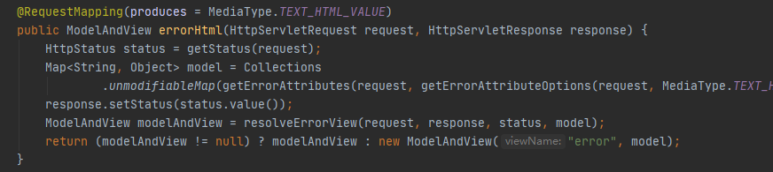

控制器方法响应JSON

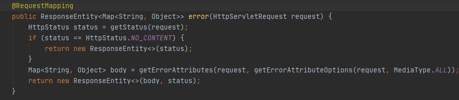


##### DefaultErrorViewResolver

解析自定义视图

```java
 
	@Override
	public ModelAndView resolveErrorView(HttpServletRequest request, HttpStatus status, Map<String, Object> model) {
		ModelAndView modelAndView = resolve(String.valueOf(status.value()), model);
		if (modelAndView == null && SERIES_VIEWS.containsKey(status.series())) {
			modelAndView = resolve(SERIES_VIEWS.get(status.series()), model);
		}
		return modelAndView;
	}

// 自定义视图必须放在静态资源的error路径下
	private ModelAndView resolve(String viewName, Map<String, Object> model) {
		String errorViewName = "error/" + viewName;
		TemplateAvailabilityProvider provider = this.templateAvailabilityProviders.getProvider(errorViewName,
				this.applicationContext);
		if (provider != null) {
			return new ModelAndView(errorViewName, model);
		}
		return resolveResource(errorViewName, model);
	}
```


##### DefaultErrorAttributes

定义错误内容信息

错误状态码，错误详情，错误报文，错误堆栈信息，错误路径

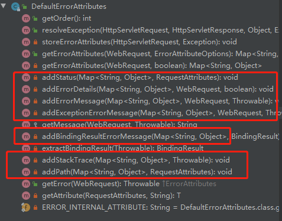

本身也是一个异常处理器

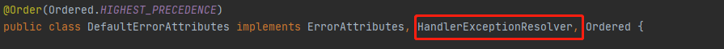


##### WhitelabelErrorViewConfiguration

白页

```java
private final StaticView defaultErrorView = new StaticView();		
@Bean(name = "error")
@ConditionalOnMissingBean(name = "error")
public View defaultErrorView() {
	return this.defaultErrorView;
}

```

StaticView中具体实现了白页html内容

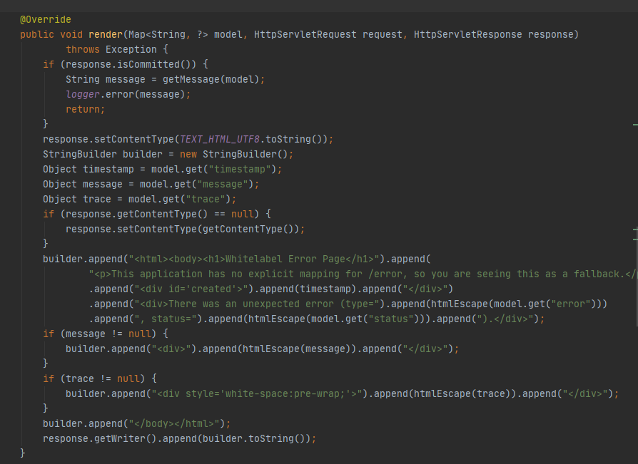


### 异常处理流程

doDispatch方法

1. 执行控制器方法
2. 捕获异常，保存异常信息
3. 处理异常处理或视图渲染
4. 若以上过程无法处理异常则spring boot会转发请求到`/error`控制器处理异常

```java
			try {
					...
// 执行控制器方法
				HandlerAdapter ha = getHandlerAdapter(mappedHandler.getHandler());
					... 
			}
// 捕获异常
			catch (Exception ex) {
				dispatchException = ex;
			}
			catch (Throwable err) {
				dispatchException = new NestedServletException("Handler dispatch failed", err);
			}
// 解析异常处理或视图渲染
			processDispatchResult(processedRequest, response, mappedHandler, mv, dispatchException);
```

#### 1、进入processDispatchResult方法

1. 判断异常不为空

   ```java
   if (exception != null)
   ```

2. 进行异常处理，得到ModelAndView对象

   ```java
   mv = processHandlerException(request, response, handler, exception);
   ```

3. 若ModelAndView对象不为空使用ModelAndView对象进行视图渲染

   ```java
   render(mv, request, response);
   ```

   

#### 2、进入processHandlerException

1. 遍历控制器异常解析器，处理异常，获得ModelAndView对象

   ```java
   		ModelAndView exMv = null;
   		if (this.handlerExceptionResolvers != null) {
   			for (HandlerExceptionResolver resolver : this.handlerExceptionResolvers) {
   				exMv = resolver.resolveException(request, response, handler, ex);
   				if (exMv != null) {
   					break;
   				}
   			}
   		}
   ```

   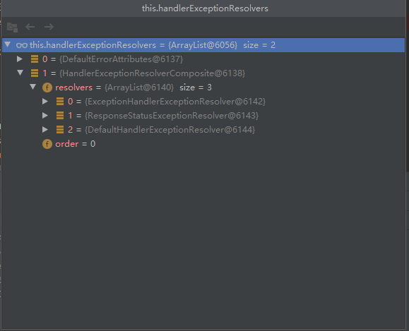

   DefaultErrorAttributes：只设置响应的异常信息内容，不返回ModelAndView对象

   HandlerExceptionResolverComposite：是一个解析器集合，内部有包含了其他解析器，会在resolveException方法中遍历选择适合的解析器

   ```java
   // HandlerExceptionResolverComposite的resolveException方法
   
   public ModelAndView resolveException(
   			HttpServletRequest request, HttpServletResponse response, @Nullable Object handler, Exception ex) {
       if (this.resolvers != null) {
           // 也是遍历所有解析器，调用resolveException方法
           // 若有一个返回了ModelAndView则直接返回结果，不进行下一个遍历
           // resolveException会判断是否能够处理该异常
           for (HandlerExceptionResolver handlerExceptionResolver : this.resolvers) {
               ModelAndView mav = handlerExceptionResolver.resolveException(request, response, handler, ex);
               if (mav != null) {
                   return mav;
               }
           }
       }
       return null;
   }
   ```

2. 设置ModelAndView对象的视图名称，返回ModelAndView对象

   ```java
   String defaultViewName = getDefaultViewName(request);
   				if (defaultViewName != null) {
   					exMv.setViewName(defaultViewName);
   				}
   ```

#### 3、转发到/error

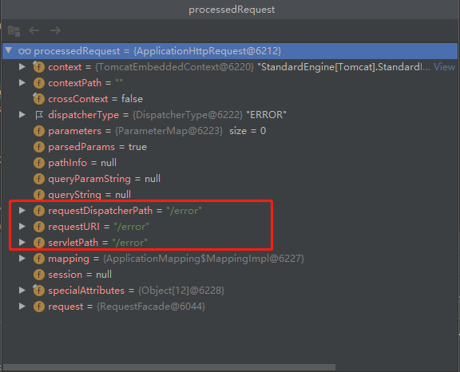

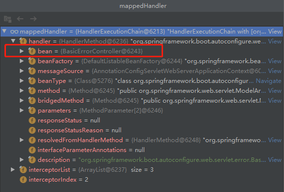

#### 4、进入BasicErrorController的errorHtml方法

1. 获取请求响应状态码

   ```java
   HttpStatus status = getStatus(request);
   ```

2. 获取错误信息

   ```java
   Map<String, Object> model = Collections
   				.unmodifiableMap(getErrorAttributes(request, getErrorAttributeOptions(request, MediaType.TEXT_HTML)));
   		response.setStatus(status.value());
   ```

3. 设置响应状态码

   ```java
   response.setStatus(status.value());
   ```

4. 解析错误视图，获得ModelAndView对象

   ```java
   ModelAndView modelAndView = resolveErrorView(request, response, status, model);
   ```

5. 若没有得到ModelAndView对象，则调用内置的视图创建ModelAndView对象
   （内置视图为白页）

   ```java
   return (modelAndView != null) ? modelAndView : new ModelAndView("error", model);
   ```

   

#### 5、进入resolveErrorView方法

1. 遍历错误视图解析器集合解析

   ```java
   		for (ErrorViewResolver resolver : this.errorViewResolvers) {
   			ModelAndView modelAndView = resolver.resolveErrorView(request, status, model);
   			if (modelAndView != null) {
   				return modelAndView;
   			}
   		}a
   ```

   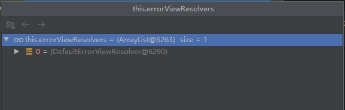

DefaultErrorViewResolver：spring Boot自动配置的默认错误视图解析器


#### 6、进入resolveErrorView方法

1. 调用resolve解析

   ```java
   modelAndView = resolve(SERIES_VIEWS.get(status.series()), model);
   ```

2. resolve方法使用状态码设置视图访问路径名，调用resolveResource方法获取视图

   ```java
   	private ModelAndView resolve(String viewName, Map<String, Object> model) {
   		String errorViewName = "error/" + viewName;
   			...
   		return resolveResource(errorViewName, model);
   	}
   ```

3. resolveResource尝试方法从静态资源获取错误视图

   ```java
   	private ModelAndView resolveResource(String viewName, Map<String, Object> model) {
           // 遍历静态资源位置
   		for (String location : this.resources.getStaticLocations()) {
   			try {
   				Resource resource = this.applicationContext.getResource(location);
                   // 使用视图访问路径名搜索静态资源
   				resource = resource.createRelative(viewName + ".html");
                   // 若存在错误页面静态资源则封装到ModelAndView中
   				if (resource.exists()) {
   					return new ModelAndView(new HtmlResourceView(resource), model);
   				}
   			}
   			catch (Exception ex) {
   			}
   		}
   		return null;
   	}
   ```

   

### 总结

1. 控制器方法发生异常，若控制器异常解析器集合（handlerExceptionResolvers）能够处理，则返回一个ModelAndView给processDispatchResult方法渲染视图，根据解析器的不同器返回值也不同（详情见下面自定义异常处理）
2. 若控制器异常解析器集合不能处理，则Spring Boot内部转发请求到`/error`，对应的控制器进行处理
   1. 控制器会先从静态资源中的`error/`路径下寻找4xx、5xx页面，若存在则返回对应的ModelAndView给processDispatchResult方法渲染视图
      （先使用状态码进行精确匹配，在使用4xx、5xx的模糊匹配）
   2. 若静态资源中不存在对应的错误页面，则调用内置的白页作为ModelAndView的内容给processDispatchResult方法渲染视图


### 自定义错误页

在静态资源的error文件下下放置自定义错误页

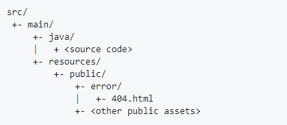


### 自定义异常处理

#### 1、ExceptionHandlerExceptionResolver方式

使用：@ControllerAdvice+@ExceptionHandler

@ControllerAdvice：作用在类上向容器中注入对象，表示该类可以处理异常

@ExceptionHandler：作用在方法上，使用value属性标记该方法可以处理那种异常（可以接受数组形式）

返回值：返回ModelAndView类型，或者视图名，最后会被渲染视图


示例

```java
@ControllerAdvice
public class MyException {
    // 处理除数为0异常
    @ExceptionHandler(ArithmeticException.class)
    public String handleArithmeticException(Exception ex, Model model){
        model.addAttribute("ex", ex);
        return "error";
    }
}
```


#### 2、ResponseStatusExceptionResolver方式

使用：@ResponseStatus

@ResponseStatus：作用在自定义异常类上，使用value属性表示错误状态码，reason属性表示错误信息

返回值：无，response.sendError(statusCode, resolvedReason)，内部转发请求到`error`，进行对应处理过程

底层通过判断异常类是否使用@ResponseStatus注解判断是否使用这种异常解析器

示例

```java
@ResponseStatus(value = HttpStatus.NOT_FOUND,reason = "页面不存在")
public class Test extends RuntimeException{
    public Test(String message) {
        super(message);
    }
}

```

控制器方法抛出自定义异常

```java
throw new Test("页面不存在");
```

#### 3、DefaultHandlerExceptionResolver

spring boot底层定义的异常解析器

底层也是调用response.sendError方法将请求转发到`/error`

response.sendError(HttpServletResponse.SC_BAD_REQUEST, ex.getMessage())


### 自定义异常解析器

使用：自定义类继承HandlerExceptionResolver接口

示例

```java
// 设置该解析器优先级最高
@Order(value = Ordered.HIGHEST_PRECEDENCE)
@Component
public class CustomerHandlerExceptionResolver implements HandlerExceptionResolver {
    @Override
    public ModelAndView resolveException(HttpServletRequest request,
                                         HttpServletResponse response,
                                         Object handler, Exception ex) {
        try {
            // 使用转发到/error的方式
            response.sendError(404,"页面不存在");
        } catch (IOException e) {
            e.printStackTrace();
        }
        // 返回一个null的ModelAndView，使得后续循环不在执行
        return new ModelAndView();
    }
}
```

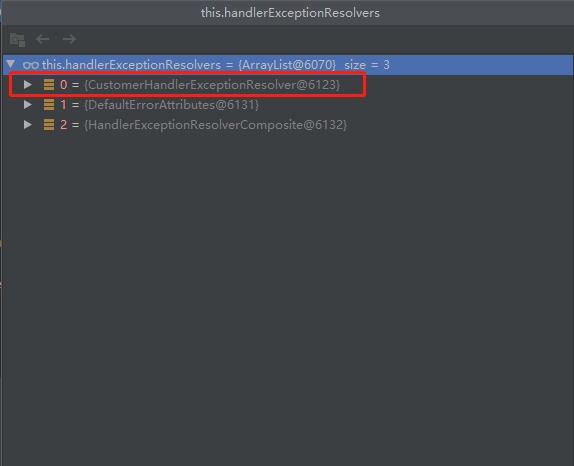

（一般情况下不需要使用自定义解析器，使用自定义异常处理和spring boot底层的异常处理已经能够处理全部异常情况了）