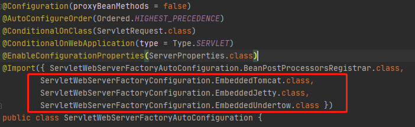
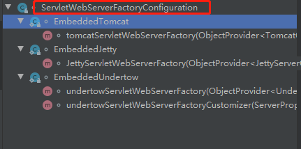
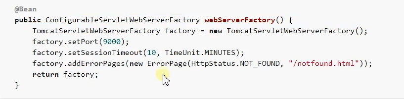
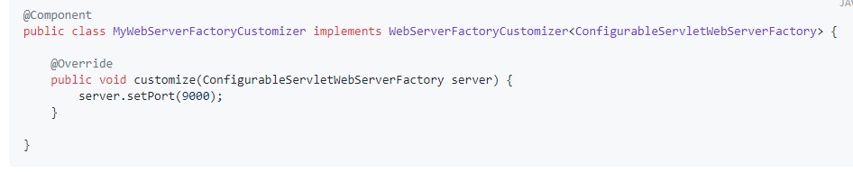
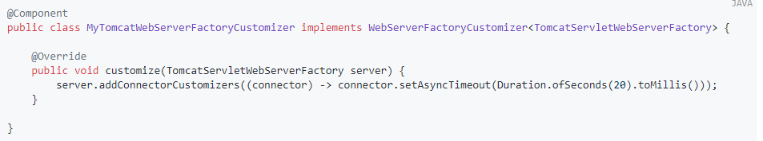

### Servlet容器

Tomcat、Jetty、Undertow、Netty等，在Spring Boot中这些容器被嵌入到项目中，不需要单独配置


ApplicationContext：Spring Boot应用的顶层接口，对应不同的应用场景有不同的实现，

web场景下有：ReactiveWebServerApplicationContext（响应式实现），ServletWebServerApplicationContext（传统实现）

ServletWebServerApplicationContext：场景下启动应用时会寻找ServletWebServerFactory去创建web服务器

ServletWebServerFactory：有三个实现类，TomcatServletWebServerFactory、JettyServletWebServerFactory、UndertowServletWebServerFactory。可以分别创建Tomcat、Jetty、Undertow服务器


#### ServletWebServerFactoryAutoConfiguration自动配置

向容器中注册ServletWebServerFactoryConfiguration的三个服务器工厂





三个服务器工厂根据条件注入，若存在对应依赖则注入

```java
// Tomcat工厂注入条件
@ConditionalOnClass({ Servlet.class, Tomcat.class, UpgradeProtocol.class })

// Jetty工厂注入条件
@ConditionalOnClass({ Servlet.class, Server.class, Loader.class, WebAppContext.class })

// Undertow工厂注入条件
@ConditionalOnClass({ Servlet.class, Undertow.class, SslClientAuthMode.class })
```


#### Servlet容器启动过程

ServletWebServerApplicationContext类下Debug

1. onRefresh方法调用createWebServer创建web服务

   ```java
   	@Override
   	protected void onRefresh() {
   		super.onRefresh();
   		try {
   			createWebServer();
   		}
   		catch (Throwable ex) {
   			throw new ApplicationContextException("Unable to start web server", ex);
   		}
   	}
   ```

2. createWebServer方法，获取服务器工厂，创建web服务

   ```java
   ServletWebServerFactory factory = getWebServerFactory();
   ...
   this.webServer = factory.getWebServer(getSelfInitializer());
   ```

3. getWebServerFactory方法在容器中寻找ServletWebServerFactory对象作为工厂
   若存在多个服务器工厂则抛出异常

   ```JAVA
   getBeanFactory().getBean(beanNames[0], ServletWebServerFactory.class);
   ```

4. getWebServer方法，创建了对应的服务器对象，并进行初始化和启动

   ```java
   	@Override
   	public WebServer getWebServer(ServletContextInitializer... initializers) {
   		if (this.disableMBeanRegistry) {
   			Registry.disableRegistry();
   		}
           // 创建对象
   		Tomcat tomcat = new Tomcat();
   		File baseDir = (this.baseDirectory != null) ? this.baseDirectory : createTempDir("tomcat");
           // 设置基础路径
   		tomcat.setBaseDir(baseDir.getAbsolutePath());
   		Connector connector = new Connector(this.protocol);
   		connector.setThrowOnFailure(true);
           // 添加连接器
   		tomcat.getService().addConnector(connector);
   		customizeConnector(connector);
   		tomcat.setConnector(connector);
   		tomcat.getHost().setAutoDeploy(false);
   		configureEngine(tomcat.getEngine());
   		for (Connector additionalConnector : this.additionalTomcatConnectors) {
   			tomcat.getService().addConnector(additionalConnector);
   		}
   		prepareContext(tomcat.getHost(), initializers);
           // 启动了Tomcat
   		return getTomcatWebServer(tomcat);
   	}
   ```

5. getTomcatWebServer方法中启动了Tomcat

   ```java
   	protected TomcatWebServer getTomcatWebServer(Tomcat tomcat) {
   		return new TomcatWebServer(tomcat, getPort() >= 0, getShutdown());
   	}
   
   
   //TomcatWebServer类
   	public TomcatWebServer(Tomcat tomcat, boolean autoStart, Shutdown shutdown) {
   		Assert.notNull(tomcat, "Tomcat Server must not be null");
   		this.tomcat = tomcat;
   		this.autoStart = autoStart;
   		this.gracefulShutdown = (shutdown == Shutdown.GRACEFUL) ? new GracefulShutdown(tomcat) : null;
   		initialize();
   	}
   
   
   // initialize方法
   this.tomcat.start();
   ```


### 定制化Servlet容器

1. 修改配置文件

2. 直接创建ConfigurableServletWebServerFactory
   

3. 实现WebServerFactoryCustomizer
   
   定制化Tomcat

   

