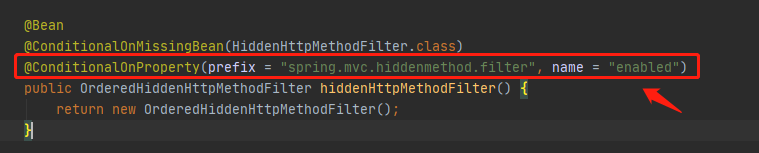

Rest映射

- Rest风格支持（*使用**HTTP**请求方式动词来表示对资源的操作*）

- - 以前：/getUser  获取用户    /deleteUser 删除用户  /editUser  修改用户   /saveUser 保存用户
  - 现在： /user    GET-获取用户    DELETE-删除用户    PUT-修改用户     POST-保存用户

- - 核心Filter；HiddenHttpMethodFilter

- - - 用法： 表单method=post，隐藏域 _method=put
    - SpringBoot配置文件中手动开启

原理就是将请求重新封装，修改请求方式，将post请求封装成PUT或Delete，使得前端控制器可以正确匹配

具体流程见spring mvc笔记