### URL匹配处理器的过程

由Spring MVC学习可以知道DispatcherServlet处理请求的方法是doDispatch

在doDispatch方法中mappedHandler = this.getHandler(processedRequest);语句获取到了对应请求处理的控制器。


### debug调试

1. 执行mappedHandler = this.getHandler(processedRequest);

2. getHandler方法体`判断是否存在请求对应的控制器`，若有则返回控制器方法
   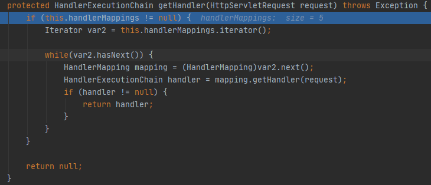

3. 这里一共有5个handlerMapping，每个handlerMapping都保存了对应的映射处理器
   RequestMappingHandlerMapping是使用RequestMapping注解绑定的请求-处理器映射集合
   WelcomePageHandlerMapping是spring boot自动配置的欢迎页请求-处理器映射集合

   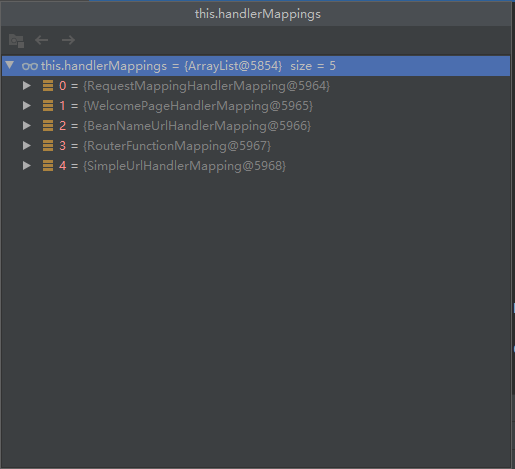

4. 遍历handlerMapping，携带请求信息查找是否有绑定的处理器，若有则返回处理器

5. RequestMappingHandlerMapping的getHandler处理过程

6. getHandler调用getHandlerInternal方法
   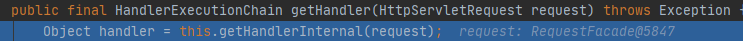

7. getHandlerInternal调用父类getHandlerInternal方法

   ```java
   super.getHandlerInternal(request);
   ```

8. 父类getHandlerInternal方法调用lookupHandlerMethod查`找请求路径对应的处理器方法`

   ```java
   HandlerMethod handlerMethod = this.lookupHandlerMethod(lookupPath, request);
   ```

   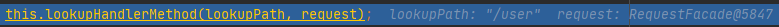

9. lookupHandlerMethod方法调用`getMappingsByDirectPath`,`查找所有与绑定路径匹配的映射器`

   ```java
   this.mappingRegistry.getMappingsByDirectPath(lookupPath);
   ```

   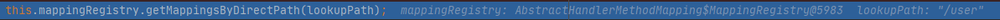

10. getMappingsByDirectPath方法内部使用原生Map方式查找，以`/user`为键。mappingRegistry对象中有6个，结果有4个匹配路径的映射对象
    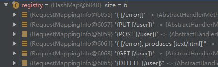
    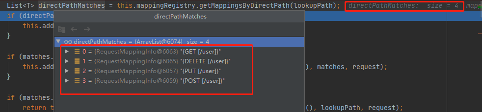

11. lookupHandlerMethod方法调用`addMatchingMappings`，`对`匹配到的4个`映射器对象`进行进一步`筛选`

12. addMatchingMappings方法内部迭代所有映射器对象调用getMatchingMapping方法，`根据请求方式和映射器绑定的方法进行比对`，若两者一致则加入matches变量用作为返回结果
    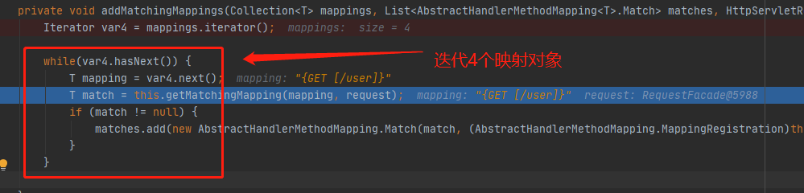

13. 最终筛选出来的结果matches大小为1
    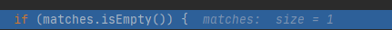

14. lookupHandlerMethod调用`getHandlerMethod方法`,`获取映射器绑定的处理器方法`
    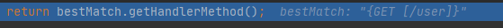
    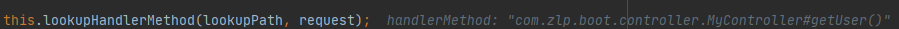

15. 最后由getHandler方法返回给doDispatch方法中mappedHandler变量完成请求映射到处理器的过程

