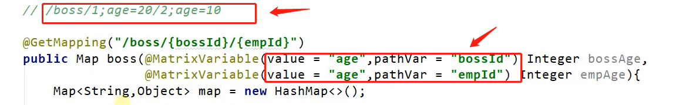

#### @MatrixVariable

矩阵变量`是一种获取get请求中参数的方式`，它从特殊的格式的url中获取参数信息

它定义url参数格式为：路径后使用分号分隔参数，每个参数之间使用分号分隔，参数使用K-V形式表示，若一个参数有多个值可以使用逗号分隔多个参数，也可以多次对相同K复制

示例：/user;name=zlp;age=18;inters=篮球,足球;

上述url中请求路径为/user，请求参数为name=zlp;age=18;inters=篮球,足球;

应用场景：在浏览器禁用cookie时，可以使用矩阵变量来携带会话ID


#### UrlPathHelper类

是Spring MVC中处理请求路径的实现类，要使用矩阵变量功能，需要该类的支持。

该类的setRemoveSemicolonContent方法中设置了对象属性removeSemicolonContent默认为true，表示删除路径中冒号后的内容，所有矩阵变量需要手动开启


#### 使用示例

使用要求

1. 请求格式符合规则
2. 前端控制器中的映射需要有路径变量才能获取矩阵变量
3. 修改UrlPathHelper类的removeSemicolonContent属性，需要底层定制化WebMvc，覆盖自动配置的

前端访问路径

```
/user;name=zlp;age=18;inters=篮球,足球;
```

控制器

```java
    @GetMapping("/{user}")
    public Map getUser(@MatrixVariable(value = "name") String name,
                       @MatrixVariable(value = "age") Integer age,
                       @MatrixVariable(value = "inters")List<String> inters,
                       @PathVariable(value = "user") String user){
        Map<String, Object> map = new HashMap<>();
        map.put("name",name);
        map.put("age", age);
        map.put("inters", inters);
        // 打印路径信息
        map.put("path", user);
        return map;
    }
```

底层定制化

方法一：配置类继承WebMvcConfigurer重写configurePathMatch方法

由于java8的特性，接口都有默认实现方法，所以不需要重写接口的全部方法

```java
@Configuration
public class Myconfig implements WebMvcConfigurer {
    @Override
    public void configurePathMatch(PathMatchConfigurer configurer) {
        // 创建UrlPathHelper实例，修改removeSemicolonContent属性
        UrlPathHelper urlPathHelper = new UrlPathHelper();
        urlPathHelper.setRemoveSemicolonContent(false);
        // 把自定义的UrlPathHelper设置到PathMatchConfigurer中
        configurer.setUrlPathHelper(urlPathHelper);
    }
}
```

方法二：在配置类中直接创建一个WebMvcConfigurer实例

```java
    @Bean
    public WebMvcConfigurer webMvcConfigurer(){
        return new WebMvcConfigurer(){
            @Override
            public void configurePathMatch(PathMatchConfigurer configurer){
                UrlPathHelper urlPathHelper = new UrlPathHelper();
                urlPathHelper.setRemoveSemicolonContent(false);
                configurer.setUrlPathHelper(urlPathHelper);
            }
        };
    }
```


结果：

{"inters":["篮球","足球"],"name":"zlp","path":"user","age":18}

匹配的路径为user，其余为参数


三种控制器匹配方式

1. 原生url路径`携带参数`
   路径参数分离，拿路径匹配控制器，参数独立获取
2. 原生url路径`含路径变量`
   全部路径信息拿来匹配控制器，在路径信息中获取参数
3. 原生url路径含路径变量`携带矩阵参数`
   将路径与矩阵参数分离，路径信息匹配控制器，矩阵参数单独获取，路径参数从路径中获取


> 若矩阵变量中存在同名参数，但是要分开获取则可以使用pathVar属性进行指定获取
>
> 