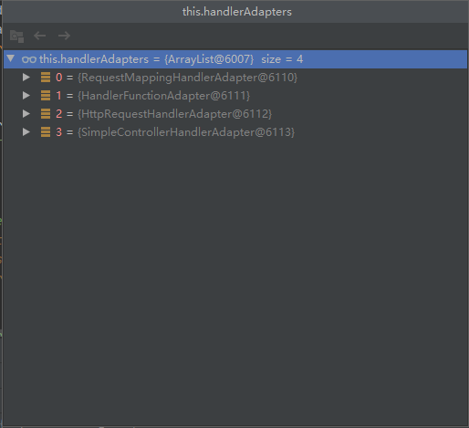
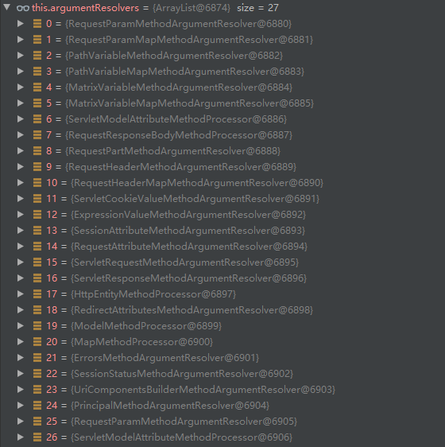
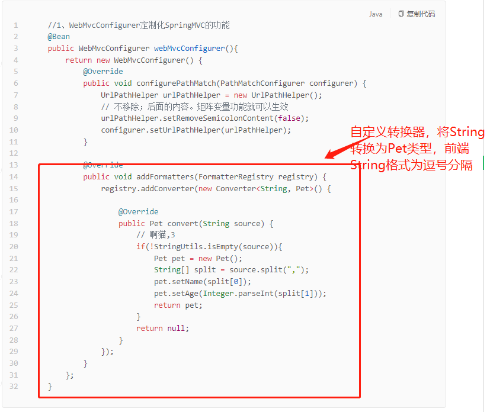

### 控制器参数处理

doDispatch方法中有关控制器参数处理如下：

1. 获得控制器方法对应的适配器

   ```java
   HandlerAdapter ha = getHandlerAdapter(mappedHandler.getHandler());
   ```

2. 适配器调用控制器方法，传入参数

   ```java
   mv = ha.handle(processedRequest, response, mappedHandler.getHandler());
   ```

#### 选取适配器

遍历内置适配器，每个适配器调用supports方法判断是否支持该控制器方法，若支持则返回

```java
	protected HandlerAdapter getHandlerAdapter(Object handler) throws ServletException {
		if (this.handlerAdapters != null) {
			for (HandlerAdapter adapter : this.handlerAdapters) {
				if (adapter.supports(handler)) {
					return adapter;
				}
			}
		}
		throw new ServletException("No adapter for handler [" + handler +
				"]: The DispatcherServlet configuration needs to include a HandlerAdapter that supports this handler");
	}
```

内置适配器种类

1. RequestMappingHandlerAdapter适配器，支持@RequestMapping注解作用的控制器
2. HandlerFunctionAdapter适配器，支持函数式适配器



此处返回RequestMappingHandlerAdapter适配器


#### 适配器选择数据放入形参

##### 1、进入invokeHandlerMethod方法

1. 设置处理器方法参数解析器集合

   ```java
   invocableMethod.setHandlerMethodArgumentResolvers(this.argumentResolvers);
   ```

2. 调用处理器方法，处理结果保存在mavContainer

   ```java
   invocableMethod.invokeAndHandle(webRequest, mavContainer);
   ```

##### 2、进入invokeAndHandle方法

invokeAndHandle调用getMethodArgumentValues方法

##### 3、进入getMethodArgumentValues方法

解析形参，选择数据传入形参

1. 获取控制器方法所以形参

   ```java
   MethodParameter[] parameters = getMethodParameters();
   ```

2. 创建形参对应长度的数组，原来保存要传入形参的数据

   ```java
   Object[] args = new Object[parameters.length];
   ```

3. 遍历形参

   ```java
   for (int i = 0; i < parameters.length; i++)
   ```

4. 判断解析器集合中是否存在能够解析目标形参的解析器

   ```java
   MethodParameter parameter = parameters[i];
   this.resolvers.supportsParameter(parameter)
   ```

5. 调用解析器解析形参，返回要传入形参的值保存在args数组中

   ```java
   args[i] = this.resolvers.resolveArgument(parameter, mavContainer, request, this.dataBinderFactory);
   ```

##### 4、进入resolvers.supportsParameter方法

判断解析器集合是否能够解析

```java
	private HandlerMethodArgumentResolver getArgumentResolver(MethodParameter parameter) {
        // 尝试从缓存中获取，若存在缓存则直接返回，不需要进行遍历
		HandlerMethodArgumentResolver result = this.argumentResolverCache.get(parameter);
		if (result == null) {
            // 遍历解析器集合
			for (HandlerMethodArgumentResolver resolver : this.argumentResolvers) {
                // 每个解析器调用supportsParameter方法判断是否支持解析这个参数
				if (resolver.supportsParameter(parameter)) {
					result = resolver;
                    // 若支持则加入缓存
					this.argumentResolverCache.put(parameter, result);
					break;
				}
			}
		}
		return result;
	}
```

解析器集合如下



RequestParamMethodArgumentResovler解析器supportsParameter方法示例

```java
	@Override
	public boolean supportsParameter(MethodParameter parameter) {
        // 判断形参是否使用@RequestParam注解，若是则支持该参数
		if (parameter.hasParameterAnnotation(RequestParam.class)) {
            ...
        }
        else{...}
    }
```

##### 5、进入this.resolvers.resolveArgument方法

解析获取形参数据过程

调用解析器对应的resolveArgument方法分析要传递给形参的数据

```java
resolver.resolveArgument(parameter, mavContainer, webRequest, binderFactory);
```

RequestParamMethodArgumentResovler解析器resolveArgument方法示例

1. 调用resolveName解析键名，从请求对象中获取对应值

   ```java
   Object arg = resolveName(resolvedName.toString(), nestedParameter, webRequest);
   ```

2. resolveName方法调用原生servletAPI获取请求值

   ```java
   String[] paramValues = request.getParameterValues(name);
   ```

   

#### 其他：

Model、Map类型参数向请求域共享数据是在渲染视图步骤进行，是调用原生ServletAPI实现


POJO参数封装是ServletModelAttributeMethodProcessor解析器进行处理

ServletModelAttributeMethodProcessor解析过程中使用了大量的内置Converter，将请求报文的String类型数据转换为POJO中各式各样的数据


自定义Converter，进行请求数据到POJO转换

应用场景：自定义前端上传的数据格式下的数据转换




