### 响应值处理过程

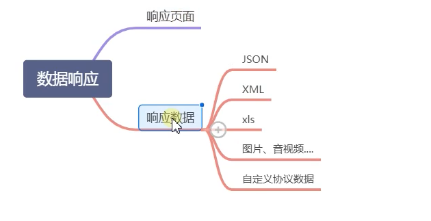

doDispatch方法中响应值处理：

1. 调用控制器方法处理请求，处理控制器方法返回值
   若响应形式是数据则直接在这一步处理进行响应
   若响应的是页面内容则把数据包装在ModelAndView中交给后续处理
   （@ResponseBody注解代表返回数据）

   ```java
   mv = ha.handle(processedRequest, response, mappedHandler.getHandler());
   ```

2. 处理ModelAndView，渲染页面，返回页面

   ```java
   processDispatchResult(processedRequest, response, mappedHandler, mv, dispatchException);
   ```


#### 1、进入invokeHandlerMethod方法

1. 设置控制器方法返回值处理器集合

   ```java
   invocableMethod.setHandlerMethodReturnValueHandlers(this.returnValueHandlers);
   ```

   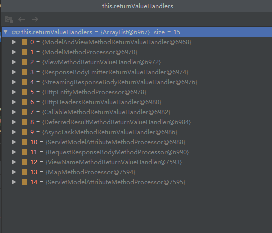

2. 调用控制器方法，使用对应的返回值处理器处理返回值，处理后结果封装在mavContainer容器中

   ```java
   invocableMethod.invokeAndHandle(webRequest, mavContainer);
   ```

3. 根据mavContainer容器中的数据封装一个ModelAndView作为返回

   ```java
   getModelAndView(mavContainer, modelFactory, webRequest);
   ```


#### 2、进入invokeAndHandle方法

1. 调用控制器方法，获取返回值

   ```java
   Object returnValue = invokeForRequest(webRequest, mavContainer, providedArgs);
   ```

2. 使用返回值处理器处理返回值，封装在mavContainer中

   ```java
   this.returnValueHandlers.handleReturnValue(
   					returnValue, getReturnValueType(returnValue), mavContainer, webRequest);
   ```

   

#### 3、进入handleReturnValue方法

1. 从返回值处理器集合中挑选处理器

   ```java
   HandlerMethodReturnValueHandler handler = selectHandler(returnValue, returnType);
   ```

2. 调用处理器处理返回值，包装在mavContainer中

   ```java
   handler.handleReturnValue(returnValue, returnType, mavContainer, webRequest);
   ```

   

#### 4、进入selectHandler方法

1. 遍历返回值处理器集合

   ```java
   for (HandlerMethodReturnValueHandler handler : this.returnValueHandlers)
   ```

2. 调用处理器supportsReturnType方法判断是否支持处理该返回值，若支持则返回处理器

   ```java
   if (handler.supportsReturnType(returnType))
   ```

ModelAndView返回值处理器supportsReturnType方法示例

```java
	public boolean supportsReturnType(MethodParameter returnType) {
        // 判断是否为ModelAndView类型，若是则支持
		return ModelAndView.class.isAssignableFrom(returnType.getParameterType());
	}
```

Spring MVC支持的处理返回值类型

```java
ModelAndView
Model
View
ResponseEntity 
ResponseBodyEmitter
StreamingResponseBody
HttpEntity
HttpHeaders
Callable
DeferredResult
ListenableFuture
CompletionStage
WebAsyncTask
有 @ModelAttribute 且为对象类型的
@ResponseBody 注解 ---> RequestResponseBodyMethodProcessor；

```

#### 5、进入handleReturnValue方法

1. 设置mavContainer属性

   ```java
   mavContainer.setRequestHandled(true);
   ```

2. 创建请求对象

   ```java
   ServletServerHttpRequest inputMessage = createInputMessage(webRequest);
   ```

3. 创建响应对象

   ```java
   ServletServerHttpResponse outputMessage = createOutputMessage(webRequest);
   ```

4.  使用消息转换器写入

   ```java
   writeWithMessageConverters(returnValue, returnType, inputMessage, outputMessage);
   ```

   

#### 6、进入writeWithMessageConverters方法

1. 获取浏览器支持的响应类型

   ```java
   List<MediaType> acceptableTypes;
   // 内部使用原生ServletAPI从请求头的ACCEPT字段获取支持的媒体类型
   acceptableTypes = getAcceptableMediaTypes(request);
   ```

   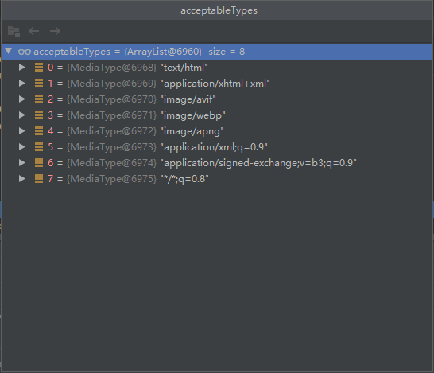

2. 获取服务器可以提供的响应类型

   ```java
   // 获取后端支持的媒体类型
   List<MediaType> producibleTypes = getProducibleMediaTypes(request, valueType, targetType);
   
   
   //getProducibleMediaTypes方法
   	protected List<MediaType> getProducibleMediaTypes(
   			HttpServletRequest request, Class<?> valueClass, @Nullable Type targetType) {
   
   		Set<MediaType> mediaTypes =
   				(Set<MediaType>) request.getAttribute(HandlerMapping.PRODUCIBLE_MEDIA_TYPES_ATTRIBUTE);
   		if (!CollectionUtils.isEmpty(mediaTypes)) {
   			return new ArrayList<>(mediaTypes);
   		}
   		List<MediaType> result = new ArrayList<>();
   //遍历所有信息转换器
   		for (HttpMessageConverter<?> converter : this.messageConverters) {
   			if (converter instanceof GenericHttpMessageConverter && targetType != null) {
   // 若转换器支持处理当前控制器返回值，则添加该转换器能够支持的媒体类型
   				if (((GenericHttpMessageConverter<?>) converter).canWrite(targetType, valueClass, null)) {
   					result.addAll(converter.getSupportedMediaTypes(valueClass));
   				}
   			}
   			else if (converter.canWrite(valueClass, null)) {
   				result.addAll(converter.getSupportedMediaTypes(valueClass));
   			}
   		}
   		return (result.isEmpty() ? Collections.singletonList(MediaType.ALL) : result);
   	}
   ```

   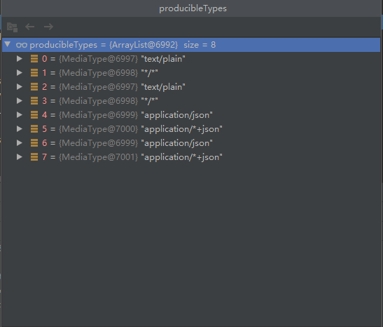

3. 内容协商，查看内些类型是浏览器支持并且服务器支持的

   ```java
   // 双重for循环遍历
   List<MediaType> mediaTypesToUse = new ArrayList<>();
   // 浏览器支持类型
   for (MediaType requestedType : acceptableTypes) {
       // 服务器支持类型
       for (MediaType producibleType : producibleTypes) {
           // 两个类型等价则添加到结果集合中
           if (requestedType.isCompatibleWith(producibleType)) {
               mediaTypesToUse.add(getMostSpecificMediaType(requestedType, producibleType));
   					}
   				}
   			}
   ```

4. 内容协商，从mediaTypesToUse中选择一种类型作为响应类型

   ```java
   // 将媒体类型根据权重值排序
   MediaType.sortBySpecificityAndQuality(mediaTypesToUse);
   
   // 选择一种响应类型保存到selectedMediaType变量
   // 排序靠前的媒体类型能够优先被选择
   for (MediaType mediaType : mediaTypesToUse) {
       if (mediaType.isConcrete()) {
           selectedMediaType = mediaType;
           break;
       }
       else if (mediaType.isPresentIn(ALL_APPLICATION_MEDIA_TYPES)) {
           selectedMediaType = MediaType.APPLICATION_OCTET_STREAM;
           break;
   
       }
   }
   ```

5. 遍历消息转换器，选择能够处理响应类型转换器

   ```java
   for (HttpMessageConverter<?> converter : this.messageConverters)
   ```

   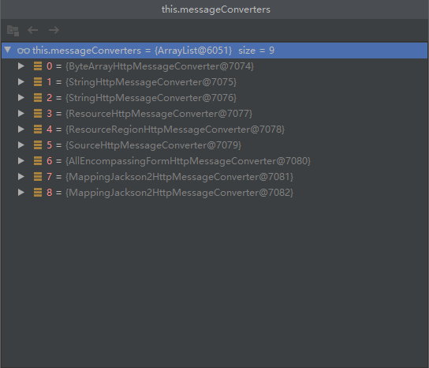

   > 0 - 只支持Byte类型的
   >
   > 1 - String
   >
   > 2 - String
   >
   > 3 - Resource
   >
   > 4 - ResourceRegion
   >
   > 5 - DOMSource.class SAXSource.class  StAXSource.class StreamSource.class Source.class
   >
   > 6 - MultiValueMap
   >
   > 7 - true
   >
   > 8 - true

6. 每个消息转换器调用canWrite方法判断是否能处理响应类型

   ```java
   converter.canWrite(valueType, selectedMediaType)
   ```

   HttpMessageConverter接口方法如下
   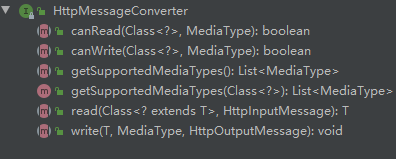
   ByteArrayHttpMessageConverter类canWrite方法示例

   ```java
   	@Override
   	public boolean canWrite(Class<?> clazz, @Nullable MediaType mediaType) {
           // 若类型为字节数组则支持
   		return supports(clazz) && canWrite(mediaType);
   	}
   
   // supports方法
   	@Override
   	public boolean supports(Class<?> clazz) {
   		return byte[].class == clazz;
   	}
   ```

7. 若能处理则调用消息转换器的write方法，将响应内容写入输出流

   ```java
   ((HttpMessageConverter) converter).write(body, selectedMediaType, outputMessage);
   ```

   StringHttpMessageConverterwrite方法示例

   ```java
   	@Override
   	public final void write(final T t, @Nullable MediaType contentType, HttpOutputMessage outputMessage)
   			throws IOException, HttpMessageNotWritableException {
   
           // 数组响应头信息
   		final HttpHeaders headers = outputMessage.getHeaders();
   		addDefaultHeaders(headers, t, contentType);
   
   		if (outputMessage instanceof StreamingHttpOutputMessage) {
   			...
   		}
   		else {
               // 写入响应内容
   			writeInternal(t, outputMessage);
               // 输出响应内容
   			outputMessage.getBody().flush();
   		}
   	}
   ```

   

#### 总结：控制器方法返回值处理过程

1. 从内置的返回值处理器集合中`选择一个处理器处理返回值`（HandlerMethodReturnValueHandler）
2. 处理器`进行响应内容协商,选择响应类型`（MediaType）
3. `选择`一种能处理响应类型的`消息转换器`（HttpMessageConverter）
4. 调用转换器将返回值转换为响应格式


### 内容协商管理器

获取客户端可以接受的媒体类型时，这个过程有内容协商管理器控制

```java
acceptableTypes = getAcceptableMediaTypes(request);
```

getAcceptableMediaTypes方法

```java
	private List<MediaType> getAcceptableMediaTypes(HttpServletRequest request)
			throws HttpMediaTypeNotAcceptableException {
// 调用内容协商管理器去获取媒体类型
		return this.contentNegotiationManager.resolveMediaTypes(new ServletWebRequest(request));
	}
```

resolveMediaTypes方法

```java
	public List<MediaType> resolveMediaTypes(NativeWebRequest request) throws HttpMediaTypeNotAcceptableException {
        // 遍历策略，每个策略尝试获取媒体类型
        // 若获取的媒体类型非	*/*，则直接返回，不在进行下一策略尝试
		for (ContentNegotiationStrategy strategy : this.strategies) {
			List<MediaType> mediaTypes = strategy.resolveMediaTypes(request);
			if (mediaTypes.equals(MEDIA_TYPE_ALL_LIST)) {
				continue;
			}
			return mediaTypes;
		}
		return MEDIA_TYPE_ALL_LIST;
	}
```

内容协商管理器默认策略

从请求头中获取媒体类型，该策略使用ServletAPI从ACCEPT字段获取媒体类型


#### 基于请求参数的内容协商策略

策略效果：从GET请求的format参数中获取媒体类型，作为客户端支持的媒体类型

配置文件开启

```properties
spring.mvc.contentnegotiation.favor-parameter=true
```

调试测试

测试url：http://localhost:8080/test?format=json

内容协商管理器策略数：2


获取媒体类型结果

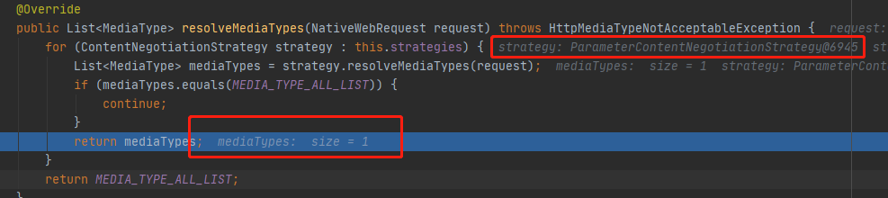


获取精确媒体类型后不进行从请求头获取媒体类型的策略，直接返回，application/json


### 自定义HttpMessageConverter

步骤：

1. 自定义类继承HttpMessageConverter接口
2. 重写WebMvcConfigurer的extendMessageConverters方法添加自定义信息转换器


#### 自定义Converter

1. 重写canWrite支持HashMap返回值类型
2. 重写getSupportedMediaTypes，增加服务器支持的媒体类型
3. 重写write进行输出数据

```java
public class MyConverter implements HttpMessageConverter<Map<String,Object>> {
	
    // 不需要实现
    @Override
    public boolean canRead(Class<?> clazz, MediaType mediaType) {
        return false;
    }
    
    // 不需要实现
        @Override
    public Map<String, Object> read(Class<? extends Map<String, Object>> clazz, HttpInputMessage inputMessage) throws IOException, HttpMessageNotReadableException {
        return null;
    }
   
    @Override
    public boolean canWrite(Class<?> clazz, MediaType mediaType) {
        return clazz.isAssignableFrom(HashMap.class);
    }

    @Override
    public List<MediaType> getSupportedMediaTypes() {
        return MediaType.parseMediaTypes("application/x-zlp");
    }

    @Override
    public void write(Map<String, Object> stringObjectMap, MediaType contentType, HttpOutputMessage outputMessage) throws IOException, HttpMessageNotWritableException {
        // 获取控制器方法返回值，进行输出
        String res = stringObjectMap.get("name") + ";" + stringObjectMap.get("age") + ";" + stringObjectMap.get("inters") + ";";
        OutputStream body = outputMessage.getBody();
        body.write(res.getBytes());
    }
}
```


#### 添加自定义Converter到Spring MVC中

```java
@Configuration
public class Myconfig{

    @Bean
    public WebMvcConfigurer webMvcConfigurer(){
        return new WebMvcConfigurer(){
            @Override
            public void extendMessageConverters(List<HttpMessageConverter<?>> converters) {
                converters.add(new MyConverter());
            }
        }
    }
}
```

#### 测试

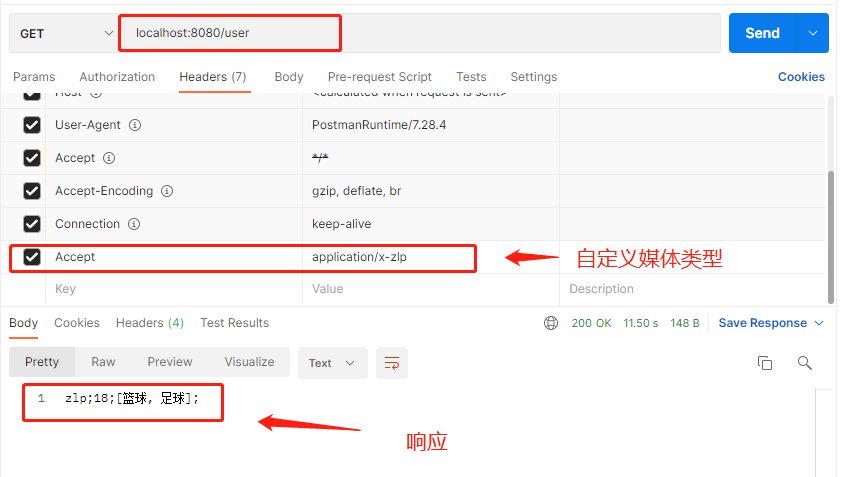


#### 过程分析

1. 获取客户端支持媒体类型时可以得到自定义类型（通过请求头获得）
   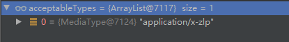

2. 获取服务器支持媒体类型时可以得到自定义类型
   （通过自定义Converter的getSupportedMediaTypes方法获得）
   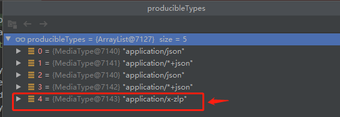

3. 调用自定义信息转换器处理
   （canWrite方法、write方法实现）

   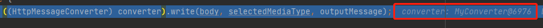


### 自定义内容管理器策略

重写WebMvcConfigurer的configureContentNegotiation方法

```java
    @Bean
    public WebMvcConfigurer webMvcConfigurer(){
        return new WebMvcConfigurer(){
            @Override
            public void configureContentNegotiation(ContentNegotiationConfigurer configurer) {
                // 准备数据创建
                Map<String, MediaType> map = new HashMap<>();
                map.put("json", MediaType.APPLICATION_JSON);
                map.put("xml", MediaType.APPLICATION_XML);
                map.put("zlp", MediaType.parseMediaType("application/x-zlp"));
                
// 自定义参数策略，接受一个map对象，对象包含参数到媒体类型的映射
// 包含在map中的媒体类型表示这个策略支持的媒体类型
                ParameterContentNegotiationStrategy parameterContentNegotiationStrategy  = new ParameterContentNegotiationStrategy(map);
                
// 自定义策略会导致原来的请求同策略失效，所以要手动重新配置
                HeaderContentNegotiationStrategy headerContentNegotiationStrategy = new HeaderContentNegotiationStrategy();
      
//将策略设置到内容管理器中，接受一个数组格式的参数
                configurer.strategies(Arrays.asList(parameterContentNegotiationStrategy,headerContentNegotiationStrategy));
            }
```

#### 测试

自定义参数参数值被自定义Converter正确处理

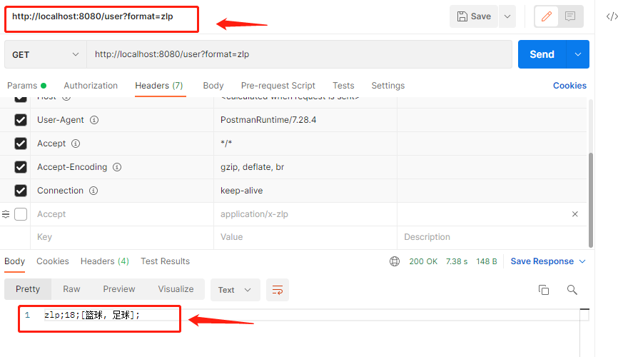