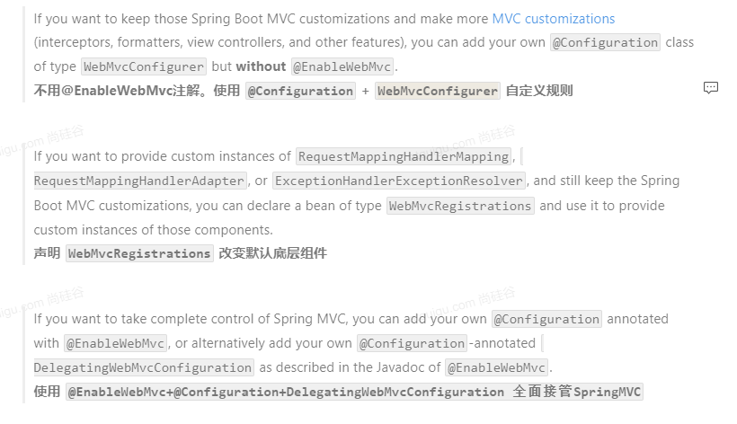

https://docs.spring.io/spring-boot/docs/current/reference/html/features.html#features.developing-web-applications

spring boot实现web应用底层有两种实现，一种时传统的mvc实现，另一种是响应式实现

对于两种实现spring boot都自动配置了大部分需要的组件

mvc自动配置如下

Spring Boot provides auto-configuration for Spring MVC that works well with most applications.

The auto-configuration adds the following features on top of Spring’s defaults:

- Inclusion of `ContentNegotiatingViewResolver` and `BeanNameViewResolver` beans.（内容协商视图解析器，）
- Support for serving static resources, including support for WebJars (covered [later in this document](https://docs.spring.io/spring-boot/docs/current/reference/html/features.html#features.developing-web-applications.spring-mvc.static-content)).（支持静态资源，包括webjar）
- Automatic registration of `Converter`, `GenericConverter`, and `Formatter` beans.
- Support for `HttpMessageConverters` (covered [later in this document](https://docs.spring.io/spring-boot/docs/current/reference/html/features.html#features.developing-web-applications.spring-mvc.message-converters)).
- Automatic registration of `MessageCodesResolver` (covered [later in this document](https://docs.spring.io/spring-boot/docs/current/reference/html/features.html#features.developing-web-applications.spring-mvc.message-codes)).
- Static `index.html` support.
- Automatic use of a `ConfigurableWebBindingInitializer` bean (covered [later in this document](https://docs.spring.io/spring-boot/docs/current/reference/html/features.html#features.developing-web-applications.spring-mvc.binding-initializer)).

定制化

