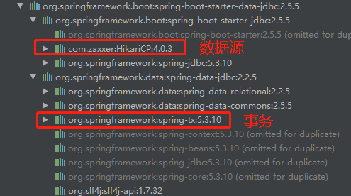

### 导入数据库场景

官方started：https://docs.spring.io/spring-boot/docs/current/reference/html/using.html#using.build-systems.starters


#### 导入starter

```xml
        <dependency>
            <groupId>org.springframework.boot</groupId>
            <artifactId>spring-boot-starter-data-jdbc</artifactId>
        </dependency>
```



手动导入数据库驱动

```java
        <dependency>
            <groupId>mysql</groupId>
            <artifactId>mysql-connector-java</artifactId>
        </dependency>
```

HiKari数据源是当前性能较好的数据库连接，类比Druid


### 自动配置项

org.springframework.boot.autoconfigure.jdbc包下

- DataSourceAutoConfiguration

  - 自动配数据源

    ```java
    	@Configuration(proxyBeanMethods = false)
    	@Conditional(PooledDataSourceCondition.class)
    // 没有自定义数据源的情况下
    	@ConditionalOnMissingBean({ DataSource.class, XADataSource.class })
    	@Import({ DataSourceConfiguration.Hikari.class, DataSourceConfiguration.Tomcat.class,
    			DataSourceConfiguration.Dbcp2.class, DataSourceConfiguration.OracleUcp.class,
    			DataSourceConfiguration.Generic.class, DataSourceJmxConfiguration.class })
    	protected static class PooledDataSourceConfiguration {
    
    	}
    ```

  - 绑定的配置前缀：spring.datasource

- DataSourceTransactionManagerAutoConfiguration

  - 绑定的配置前缀：spring.datasource

- JdbcTemplateAutoConfiguration

  - 绑定的配置前缀：spring.jdbc

- JndiDataSourceAutoConfiguration（不常用）

  - 绑定的配置前缀：spring.datasource

- XADataSourceAutoConfiguration（分布式事务，不常用）

  - 绑定的配置前缀：spring.datasource