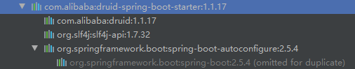
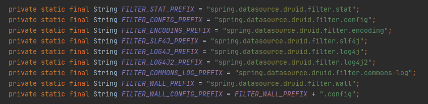
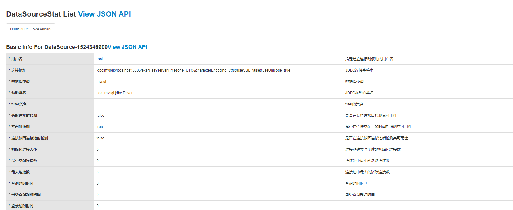
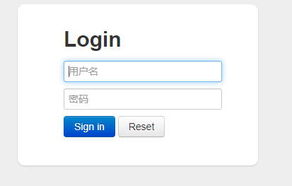
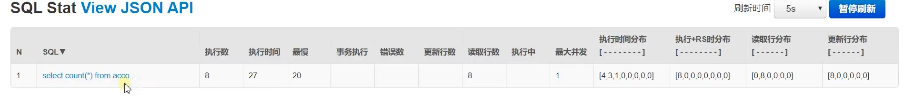
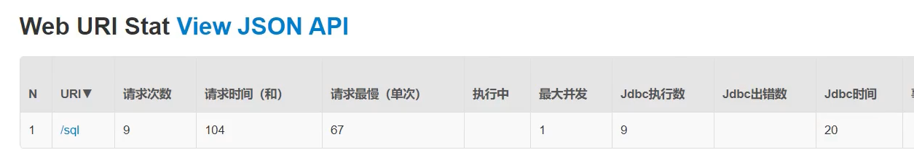

### 引入Druid

两种方式

1. 传统方式引入druid依赖，配置xml或者配置类
2. 找starter包

文档地址：https://github.com/alibaba/druid/wiki/%E5%B8%B8%E8%A7%81%E9%97%AE%E9%A2%98


#### 传统方式引入

1. 引入依赖

   ```java
           <dependency>
               <groupId>com.alibaba</groupId>
               <artifactId>druid</artifactId>
               <version>1.2.6</version>
           </dependency>
   
   ```

2. 配置对象

   ```java
       // 从配置文件中获取数据库连接信息
   	@ConfigurationProperties(prefix = "spring.datasource")
       @Bean
       public DataSource dataSource(){
           DruidDataSource druidDataSource = new DruidDataSource();
           return druidDataSource;
       }
   ```

#### starter方式引入

仓库地址：https://github.com/alibaba/druid/tree/master/druid-spring-boot-starter

```xml
        <dependency>
            <groupId>com.alibaba</groupId>
            <artifactId>druid-spring-boot-starter</artifactId>
            <version>1.1.17</version>
        </dependency>
```



自动配置类：DruidDataSourceAutoConfigure

自动配置

- DataSource：配置数据源

  - 相关前缀：spring.datasource

- DruidSpringAopConfiguration.class：配置AOP功能用于监控Spirng

  - 相关前缀：spring.datasource.druid.aop-patterns

- DruidStatViewServletConfiguration.class：监控页，默认开启

  - 相关前缀：spring.datasource.druid.stat-view-servlet

- DruidWebStatFilterConfiguration.class：web监控功能，默认开启

  - 相关前缀：spring.datasource.druid.web-stat-filter

- DruidFilterConfiguration.class：注入一些filter

  - 相关前缀：spring.datasource.druid.filter

  


### 使用Druid扩展功能

#### 开启监控页

配置StatViewServlet，或者StatViewFilter

1. 配置com.alibaba.druid.support.http.StatViewServlet，映射路径`/druid/*`

   ```java
       @Bean
       public ServletRegistrationBean statViewServlet(){
           StatViewServlet statViewServlet = new StatViewServlet();
           ServletRegistrationBean<StatViewServlet> registrationBean = new ServletRegistrationBean<>(statViewServlet,"/druid/*");
           return registrationBean;
       }
   ```

   

2. 或者使用StatViewFilter开启监控页
   xml方式 

   ```xml
    <filter>
       <filter-name>DruidStatViewFilter</filter-name>
       <filter-class>com.alibaba.druid.support.http.StatViewFilter</filter-class>
     </filter>
     <filter-mapping>
       <filter-name>DruidStatViewFilter</filter-name>
       <url-pattern>/druid/*</url-pattern>
     </filter-mapping>
   ```

   配置类方式

   ```java
       @Bean
       public FilterRegistrationBean statViewServlet(){
           StatViewFilter statViewFilter = new StatViewFilter();
           FilterRegistrationBean<StatViewFilter> filterRegistrationBean = new FilterRegistrationBean<>(statViewFilter);
           filterRegistrationBean.setUrlPatterns(Arrays.asList("/druid/*"));
           return filterRegistrationBean;
       }
   ```

设置监控页密码，通过设置servlet初始化参数完成

```java
    @Bean
    public ServletRegistrationBean statViewServlet(){
        StatViewServlet statViewServlet = new StatViewServlet();
        ServletRegistrationBean<StatViewServlet> registrationBean = new ServletRegistrationBean<>(statViewServlet,"/druid/*");
        registrationBean.addInitParameter("loginUsername","zlp");
        registrationBean.addInitParameter("loginPassword", "zlp123");
        return registrationBean;
    }
```




#### 开启SQL监控

配置`数据源filters属性`使用监控功能，展示在监控页上

```java
    @ConfigurationProperties(prefix = "spring.datasource")
    @Bean
    public DataSource dataSource() throws SQLException {
        DruidDataSource druidDataSource = new DruidDataSource();
        druidDataSource.setFilters("stat");
        return druidDataSource;
    }
```




#### 开启Web页面监控

配置WebStatFilter

```java
    @Bean
    public FilterRegistrationBean webStatServlet(){
        WebStatFilter webStatFilter = new WebStatFilter();
        FilterRegistrationBean<WebStatFilter> filterRegistrationBean = new FilterRegistrationBean<>(webStatFilter);
        filterRegistrationBean.addInitParameter("exclusions","*.js,*.gif,*.jpg,*.png,*.css,*.ico,/druid/*");
        filterRegistrationBean.setUrlPatterns(Arrays.asList("/*"));
        return filterRegistrationBean;
    }
```




#### 开启防火墙

配置`数据源filters属性`

```java
    @ConfigurationProperties(prefix = "spring.datasource")
    @Bean
    public DataSource dataSource() throws SQLException {
        DruidDataSource druidDataSource = new DruidDataSource();
        druidDataSource.setFilters("stat,wall");
        return druidDataSource;
    }
```

#### 开启Spring监控

官方连接：https://github.com/alibaba/druid/wiki/%E9%85%8D%E7%BD%AE_Druid%E5%92%8CSpring%E5%85%B3%E8%81%94%E7%9B%91%E6%8E%A7%E9%85%8D%E7%BD%AE

