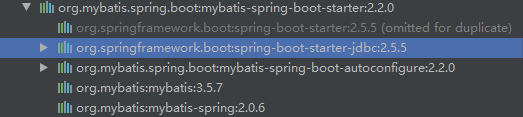

### 整合Mybatis

官方starter地址：https://github.com/mybatis/spring-boot-starter/tree/master

```xml
        <dependency>
            <groupId>org.mybatis.spring.boot</groupId>
            <artifactId>mybatis-spring-boot-starter</artifactId>
            <version>2.2.0</version>
        </dependency>
```




自动配置类：MybatisAutoConfiguration，相关前缀：mybatis

- SqlSessionFactory：创建SqlSession
- SqlSessionTemplate：使用SqlSession内置SQL模板
- AutoConfiguredMapperScannerRegistrar：相当于ssm整合时的MapperScannerConfigurer扫描mapper所在包，这里对使用@Mapper注解实现


### 使用示例

1. 引入starter

2. 配置文件

   ```properties
   // 若配置了mybatis.configuration.xxx，就标识使用这个配置属性代替配置文件
   // 下面配置文件所在就不需要进行配置了，否则会报错
   mybatis.config-location=classpath:mybatis/mybatis-config.xml
   mybatis.mapper-locations=classpath:mybatis/mapper/*.xml
   ```

3. 编写接口添加@Mapper注解

   ```java
   @Mapper
   public interface LolMapper {
       public List<Anchor> getAnchors(@Param("start") int start,@Param("len") int len);
   }
   
   ```

4. 编写mapper

   ```xml
   <?xml version="1.0" encoding="UTF-8" ?>
   <!DOCTYPE mapper
           PUBLIC "-//mybatis.org//DTD Config 3.0//EN"
           "http://mybatis.org/dtd/mybatis-3-mapper.dtd">
   
   <mapper namespace="com.zlp.boot.dao.LolMapper">
       <select id="getAnchors" resultType="com.zlp.boot.Anchor">
           select * from lol limit #{start},#{len}
       </select>
   </mapper>
   ```

（在启动类上使用@MapperScan("com.zlp.boot.dao")注解可以不用在每个接口上使用@Mapper注解）


### Mybatis-plus

[MyBatis-Plus (opens new window)](https://github.com/baomidou/mybatis-plus)（简称 MP）是一个 [MyBatis (opens new window)](https://www.mybatis.org/mybatis-3/)的增强工具，在 MyBatis 的基础上只做增强不做改变，为简化开发、提高效率而生。

快速开始：https://mp.baomidou.com/guide/quick-start.html