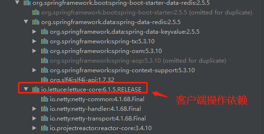

### 整合redis

#### 1、引入依赖

```XML
        <dependency>
            <groupId>org.springframework.boot</groupId>
            <artifactId>spring-boot-starter-data-redis</artifactId>
        </dependency>
```



自动配置类

- RedisAutoConfiguration：配置文件相关前缀：spring.redis，自动配置组件如下
  - LettuceConnectionConfiguration：Lettuce客户端连接redis，内部使用连接池
  - JedisConnectionConfiguration：Jedis连接redis，内部使用连接池
  - RedisTemplate\<Object, Object\>：操作redis模板，k-v可以时对象类型
  - StringRedisTemplate：操作redis模板，k-v为string类型

- RedisReactiveAutoConfiguration

- RedisRepositoriesAutoConfiguration


### 使用示例

1. 引入依赖

2. 配置配置文件

   ```properties
   // 本地使用，这两个都有默认值，可以不用设置
   spring.redis.host=localhost
   spring.redis.port=6379
   
   
   // 远程redis
   spring.redis.host=
   spring.redis.port=6379
   spring.redis.username=
   spring.redis.password=
   
   ```

3. service

   ```java
   @Service
   public class RedisServiceImpl implements RedisService {
   
       @Autowired
       StringRedisTemplate stringRedisTemplate;
   
       @Override
       public String useRedis() {
           ValueOperations<String, String> ops = stringRedisTemplate.opsForValue();
           ops.set("1","zlp");
           String res = ops.get("1");
           return res;
       }
   }
   ```

4. controller

   ```java
   @RequestMapping("/redis")
   public String testRedis(){
       String res = redisService.useRedis();
       return res;
   }
   ```


#### 切换到jedis客户端

默认使用lettuce客户端

1. 导入依赖

   ```xml
           <dependency>
               <groupId>org.springframework.boot</groupId>
               <artifactId>spring-boot-starter-data-redis</artifactId>
           </dependency>
   
   <!--        导入jedis-->
           <dependency>
               <groupId>redis.clients</groupId>
               <artifactId>jedis</artifactId>
           </dependency>
   ```

2. 配置文件

   ```yaml
   spring:
     redis:
         host: r-bp1nc7reqesxisgxpipd.redis.rds.aliyuncs.com
         port: 6379
         password: lfy:Lfy123456
         # 设置使用的客户端
         client-type: jedis
         jedis:
           pool:
             max-active: 10
   ```

   