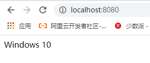
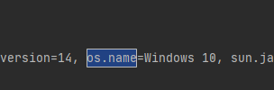

### 外部化配置

将数据从代码中提取出来，放置在配置文件中，spring boot的application.properties就是一个示例


#### 配置源

外部化配置不止配置文件一种（properties、yaml），也可以从环境变量、命令行参数中获取

14种配置源：https://docs.spring.io/spring-boot/docs/current/reference/html/features.html#features.external-config，按照排列顺序越往后的配置源优先级越高，会覆盖前面相同的配置属性

1. Default properties (specified by setting `SpringApplication.setDefaultProperties`).
2. [`@PropertySource`](https://docs.spring.io/spring-framework/docs/5.3.10/javadoc-api/org/springframework/context/annotation/PropertySource.html) annotations on your `@Configuration` classes. Please note that such property sources are not added to the `Environment` until the application context is being refreshed. This is too late to configure certain properties such as `logging.*` and `spring.main.*` which are read before refresh begins.
3. Config data (such as `application.properties` files)（配置文件）
4. A `RandomValuePropertySource` that has properties only in `random.*`.
5. OS environment variables.（系统环境变量）
6. Java System properties (`System.getProperties()`).
7. JNDI attributes from `java:comp/env`.
8. `ServletContext` init parameters.
9. `ServletConfig` init parameters.
10. Properties from `SPRING_APPLICATION_JSON` (inline JSON embedded in an environment variable or system property).
11. Command line arguments.（命令行参数）
12. `properties` attribute on your tests. Available on [`@SpringBootTest`](https://docs.spring.io/spring-boot/docs/2.5.5/api/org/springframework/boot/test/context/SpringBootTest.html) and the [test annotations for testing a particular slice of your application](https://docs.spring.io/spring-boot/docs/current/reference/html/features.html#features.testing.spring-boot-applications.autoconfigured-tests).
13. [`@TestPropertySource`](https://docs.spring.io/spring-framework/docs/5.3.10/javadoc-api/org/springframework/test/context/TestPropertySource.html) annotations on your tests.
14. [Devtools global settings properties](https://docs.spring.io/spring-boot/docs/current/reference/html/using.html#using.devtools.globalsettings) in the `$HOME/.config/spring-boot` directory when devtools is active.


#### 示例

从配置文件中获取参数

```properties
# application.properties
name=zlp
```

```java
@RestController
public class MyController {

    // 获取配文件中的数据
    @Value("${name}")
    private String name;

    @RequestMapping("/")
    public String index(){
        return name;
    }

}
```


从系统环境中获取配置

```java
@RestController
public class MyController {

    // 获取系统环境中的值
    @Value("${os.name}")
    private String name;

    @RequestMapping("/")
    public String index(){
        return name;
    }

}
```



所有环境信息

```java
@SpringBootApplication
public class SpringBootDemo3Application {

    public static void main(String[] args) {
        ConfigurableApplicationContext run = SpringApplication.run(SpringBootDemo3Application.class, args);
        ConfigurableEnvironment environment = run.getEnvironment();
        // 获取环境变量信息
        Map<String, Object> systemProperties = environment.getSystemProperties();
        // 获取系统环境信息
        Map<String, Object> systemEnvironment = environment.getSystemEnvironment();
        System.out.println(systemEnvironment);
        System.out.println(systemProperties);
    }

}
```




#### 位置文件位置

spring boot默认以下下路径获取配置文件，同样按照排列顺序后面配置文件会覆盖前面的配置文件，可以利用这种方法改变配置文件

1. From the classpath（类路径）
   1. The classpath root
   2. The classpath `/config` package
2. From the current directory（jar等打包后的路径下，与jar同级）
   1. The current directory
   2. The `/config` subdirectory in the current directory
   3. Immediate child directories of the `/config` subdirectory（/comgif下的一级子目录）


