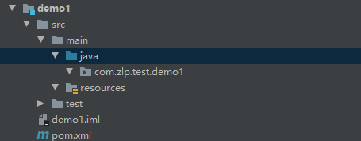

### 自定义starter

#### 结构

- starter.jar（只包含场景中可能存在的依赖，不包含实际代码）
  - pom.xml
    - xxx依赖（每个依赖中都包含spring-boot-start核心依赖）
    - xxx依赖
    - xxx依赖

#### 步骤

1. 创建starter包
2. 创建实际功能包demo1
3. 将demo1.jar作为依赖在starter的pom中引入
4. 编写test.js的自动配置类，和功能代码
5. 在类路径下创建META-INF文件夹，在文件夹中创建spring.factories文件
6. 在配置文件的org.springframework.boot.autoconfigure.EnableAutoConfiguration属性中添加自动配置类，实现从自动配置类作为入口进行自动装配
7. 打包封装


#### 1、创建starter包

starter就是一个简单的maven包


#### 2、创建demo1

只有一个spring-boot-starter依赖




#### 3、在starter包中引入demo1依赖


#### 4、编写demo1代码

User.java

```java
@ConfigurationProperties(prefix = "myuser")
public class User {
    private String name;
    private Integer age;

    public String getName() {
        return name;
    }

    public void setName(String name) {
        this.name = name;
    }

    public Integer getAge() {
        return age;
    }

    public void setAge(Integer age) {
        this.age = age;
    }

    @Override
    public String toString() {
        return "User{" +
                "name='" + name + '\'' +
                ", age=" + age +
                '}';
    }
}
```

HelloService.java

```java
public class HelloService {

    @Autowired
    private User user;

    public String hello(){
        return "Hello" + user.getName();
    }

}
```

Demo1AutoConfiguration.java

```java
@Configuration
@EnableConfigurationProperties(User.class)
@ConditionalOnMissingBean({HelloService.class})
public class Demo1AutoConfiguration {
    @Bean
    public HelloService helloService(){
        return new HelloService();
    }
}
```

#### 5、编辑spring.factories文件


```factories
org.springframework.boot.autoconfigure.EnableAutoConfiguration=\
com.zlp.test.demo1.Demo1AutoConfiguration
```

#### 6、打包

安装到本地仓库


#### 7、被使用

1. 引入自定义starter

   ```xml
           <dependency>
               <groupId>com.zlp.start</groupId>
               <artifactId>test-spring-boot-start</artifactId>
               <version>1.0-SNAPSHOT</version>
           </dependency>
   ```

2. 自动装配HelloService

   ```java
   @RestController
   public class MyController {
   
       @Autowired
       private HelloService helloService;
   
       @RequestMapping("/")
       public String index(){
           return helloService.hello();
       }
   
   }
   ```

3. 配置文件

   ```properties
   myuser.name=ZLP
   myuser.age=18
   ```

4. 测试

