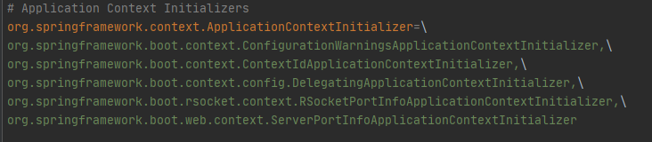
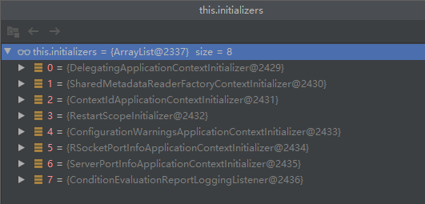
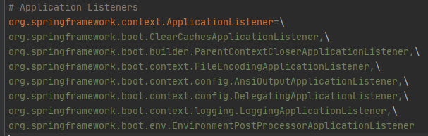
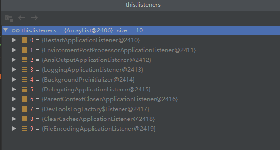
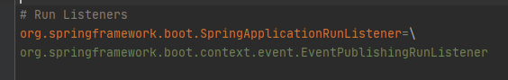
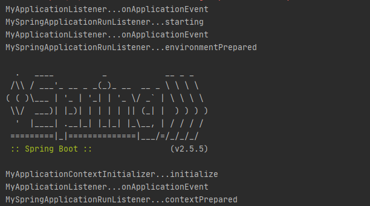
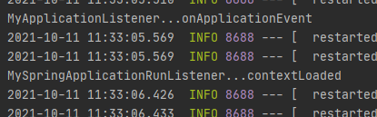
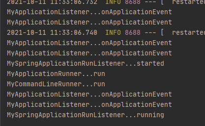

```java
public static ConfigurableApplicationContext run(Class<?>[] primarySources, String[] args) {
    // 创建应用，运行应用
   return new SpringApplication(primarySources).run(args);
}
```

### 创建SpringApplication

构造方法

```java
public SpringApplication(ResourceLoader resourceLoader, Class<?>... primarySources) {
    // 设置资源加载器
   this.resourceLoader = resourceLoader;
   Assert.notNull(primarySources, "PrimarySources must not be null");
    // 设置主程序资源
   this.primarySources = new LinkedHashSet<>(Arrays.asList(primarySources));
    // 判断当前应用类型，web情况下是Servlet还是Reactiver
   this.webApplicationType = WebApplicationType.deduceFromClasspath();
    // 设置引导启动器，默认为null
   this.bootstrapRegistryInitializers = getBootstrapRegistryInitializersFromSpringFactories();
    // 设置应用上下文初始化器
   setInitializers((Collection) getSpringFactoriesInstances(ApplicationContextInitializer.class));
    // 设置应用监听器
   setListeners((Collection) getSpringFactoriesInstances(ApplicationListener.class));
   this.mainApplicationClass = deduceMainApplicationClass();
}
```

所有有关SpringFactories的方法都是从spring.factories文件中获取相应的配置信息


#### 应用上下文初始化器

spring-boot包

上下文初始化器不仅仅从一个文件中获取，所有设置了应用监听器的spring.factories都会被扫描设置





#### 监听器

spring-boot包

监听器不仅仅从一个文件中获取，所有设置了应用监听器的spring.factories都会被扫描设置






### 运行SpringApplication

run方法

1. 设置StopWatch对象，用来监控应用启停

2. 调用StopWatch对象的start()，记录应用启动时间

3. 创建引导上下文

   1. 创建一个默认的上下文引导启动器

   2. 遍历其他上下文引导启动器，并调用initialize方法

   3. 返回默认上下文引导启动器

      ```java
      	private DefaultBootstrapContext createBootstrapContext() {
      		DefaultBootstrapContext bootstrapContext = new DefaultBootstrapContext();
      		this.bootstrapRegistryInitializers.forEach((initializer) -> initializer.initialize(bootstrapContext));
      		return bootstrapContext;
      	}
      ```

4. 设置Headless模式

5. 从spring.factories中获取RunListeners（运行时监听器），保存到对象中

   ```java
   SpringApplicationRunListeners listeners = getRunListeners(args);
   ```

   
   

6. 遍历所有listeners，并调用starting方法，这个行为在告诉所有对应用启动感兴趣的监听器应用正在启动（这个时候一些监听器可以做一些hook动作）

7. 保存命令行参数

8. 准备环境（prepareEnvironment方法）

   1. 根据应用类型创建应用环境对象（ApplicationServletEnvironment）
   2. 配置环境信息对象
      1. 读取所有配置源的配置属性（@PropertySource、命令行）
      2. 读取所有Profiles
   3. 保存环境对象
   4. 遍历所有listener，告诉它们环境已经准备好
   5. 读取激活的环境配置

9. 创建应用上下文（IOC容器）

   1. 根据当前应用类型创建（AnnotationConfigServletWebServerApplicationContext）

10. 保存容器启动信息

11. 准备ApplicationContext（IOC）（prepareContext方法）

    1. 保存环境信息到IOC中

    2. IOC容器后置处理，设置ConversionService

    3. applyInitializers应用初始化器（创建SpringApplication时准备的Initializers），每个初始化器都会调用一遍方法

       ```java
       initializer.initialize(context);
       ```

    4.  通知所有监听器ApplicationContext准备完毕

       ```java
       listeners.contextPrepared(context);
       ```

    5. 调用IOC容器获取各种工厂

    6. 通知所有监听器上下文加载完毕

       ```java
       listeners.contextLoaded(context);
       ```

12. 刷新IOC容器

    1. 创建容器中的所有组件

       ```java
       // Instantiate all remaining (non-lazy-init) singletons.
       finishBeanFactoryInitialization(beanFactory);
       ```

13. 执行刷新容器之后的工作

    ```java
    afterRefresh(context, applicationArguments);
    ```

14. 通知所有监听器

    ```java
    listeners.started(context);
    ```

15. 获取容器中的所有runner，安装@Order排序，遍历调用run方法

    ```java
    	private void callRunners(ApplicationContext context, ApplicationArguments args) {
    		List<Object> runners = new ArrayList<>();
    		runners.addAll(context.getBeansOfType(ApplicationRunner.class).values());
    		runners.addAll(context.getBeansOfType(CommandLineRunner.class).values());
    		AnnotationAwareOrderComparator.sort(runners);
    		for (Object runner : new LinkedHashSet<>(runners)) {
    			if (runner instanceof ApplicationRunner) {
    				callRunner((ApplicationRunner) runner, args);
    			}
    			if (runner instanceof CommandLineRunner) {
    				callRunner((CommandLineRunner) runner, args);
    			}
    		}
    	}
    ```

16. 通知监听器

    1. 以上工作有异常则通知失败

       ```java
       listeners.failed(context, exception);
       ```

    2. 若没有异常则

       ```java
       listeners.running(context);
       ```

       


### 自定义启动时组件

ApplicationContextInitializer（从spring.factories配置文件中获取）

```java
public class MyApplicationContextInitializer implements ApplicationContextInitializer {
    @Override
    public void initialize(ConfigurableApplicationContext applicationContext) {
        System.out.println("MyApplicationContextInitializer...initialize");
    }
}

```

```spring.factories
# Application Context Initializers
org.springframework.context.ApplicationContextInitializer=\
com.zlp.springboot.springbootdemo3.My.MyApplicationContextInitializer
```

ApplicationListener（从spring.factories配置文件中获取）

```java
public class MyApplicationListener implements ApplicationListener {
    @Override
    public void onApplicationEvent(ApplicationEvent event) {
        System.out.println("MyApplicationListener...onApplicationEvent");
    }
}
```

```
# Application Listeners
org.springframework.context.ApplicationListener=\
com.zlp.springboot.springbootdemo3.My.MyApplicationListener
```

SpringApplicationRunListener（从spring.factories配置文件中获取）

```java
public class MySpringApplicationRunListener implements SpringApplicationRunListener {
    
    private SpringApplication application;
    
    // 有参构造器是必须的
    public MySpringApplicationRunListener(SpringApplication application, String[] args) {
        this.application = application;
    }

    // 应用刚开始运行上下文引导启动器准备完毕，环境还没准备，IOC容器还没准备
    @Override
    public void starting(ConfigurableBootstrapContext bootstrapContext) {
        System.out.println("MySpringApplicationRunListener...starting");
    }


    // 应用环境准备完毕，IOC容器还没准备
    @Override
    public void environmentPrepared(ConfigurableBootstrapContext bootstrapContext, ConfigurableEnvironment environment) {
        System.out.println("MySpringApplicationRunListener...environmentPrepared");
    }


    // IOC容器刚创建，各种初始化器已经运行完毕，IOC工厂还未获取
    @Override
    public void contextPrepared(ConfigurableApplicationContext context) {
        System.out.println("MySpringApplicationRunListener...contextPrepared");
    }

    // IOC加载完毕，IOC工厂都已获取
    @Override
    public void contextLoaded(ConfigurableApplicationContext context) {
        System.out.println("MySpringApplicationRunListener...contextLoaded");
    }

    // Refresh方法执行完毕，容器中所有组件都已经创建
    @Override
    public void started(ConfigurableApplicationContext context) {
        System.out.println("MySpringApplicationRunListener...started");
    }

    // 应用开始运行，所有runner都已经被调用
    @Override
    public void running(ConfigurableApplicationContext context) {
        System.out.println("MySpringApplicationRunListener...running");
    }

    // 应用运行出错
    @Override
    public void failed(ConfigurableApplicationContext context, Throwable exception) {
        System.out.println("MySpringApplicationRunListener...failed");
    }
}
```

```spring.factories
# Run Listeners
org.springframework.boot.SpringApplicationRunListener=\
com.zlp.springboot.springbootdemo3.My.MySpringApplicationRunListener
```


ApplicationRunner（从IOC容器中获取）

```java
@Component
public class MyApplicationRunner implements ApplicationRunner {
    @Override
    public void run(ApplicationArguments args) throws Exception {
        System.out.println("MyApplicationRunner...run");
    }
}
```

CommandLineRunner（从IOC容器中获取）

```java
@Component
public class MyCommandLineRunner implements CommandLineRunner {

    @Override
    public void run(String... args) throws Exception {
        System.out.println("MyCommandLineRunner...run");
    }
}
```


测试效果





