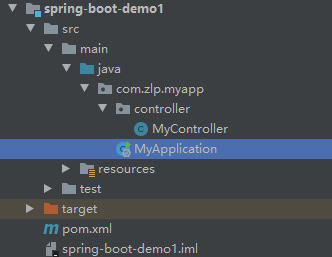

### Spring Boot应用示例

#### 1、创建maven工程

IDEA创建maven工程，注意controller、service、dao等包必须和MyApplication在同一目录下



#### 2、配置pom文件

```xml
    <!--继承官方配置-->
    <parent>
        <artifactId>spring-boot-starter-parent</artifactId>
        <groupId>org.springframework.boot</groupId>
        <version>2.5.4</version>
    </parent>

    <dependencies>
        <!--spring-boot-starter-web就包含了正常spring构建web是所需要的所有依赖-->
        <dependency>
            <groupId>org.springframework.boot</groupId>
            <artifactId>spring-boot-starter-web</artifactId>
            <version>2.5.4</version>
        </dependency>
    </dependencies>
```

#### 3、创建启动类

```java
package com.zlp.myapp;


import org.springframework.boot.SpringApplication;
import org.springframework.boot.autoconfigure.SpringBootApplication;

//   @SpringBootApplication，表示一个SpringBoot应用
@SpringBootApplication
public class MyApplication {
    public static void main(String[] args) {
        SpringApplication.run(MyApplication.class,args);
    }
}

```

#### 4、创建控制器类

```java
package com.zlp.myapp.controller;

import org.springframework.web.bind.annotation.RequestMapping;
import org.springframework.web.bind.annotation.RestController;

// @RestController,是@Controller，@ResponseBody注释的结合体
@RestController
public class MyController {

    @RequestMapping("/")
    public String index(){
        return "zlp spring boot demo1";
    }
}
 
```

#### 5、从启动类中启动


#### 6、spring boot统一配置文件

spring boot具有统一配置文件appcalition.properties，简化了传统spring多个且离散配置文件的管理

可配置内容：https://docs.spring.io/spring-boot/docs/current/reference/html/application-properties.html#application-properties

```properties
// 修改tomcat启动监听端口
server.port=8081
```

#### 7、spring boot简化部署

spring boot简化了部署，可以直接打包成jar包部署到服务器

```xml
<!--在pom添加打包配置-->
<build>
    <plugins>
        <plugin>
            <groupId>org.springframework.boot</groupId>
            <artifactId>spring-boot-maven-plugin</artifactId>
        </plugin>
    </plugins>
</build>

```

