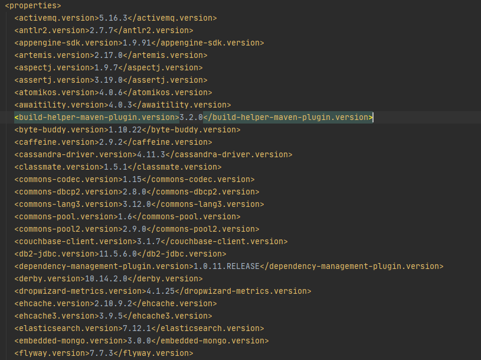
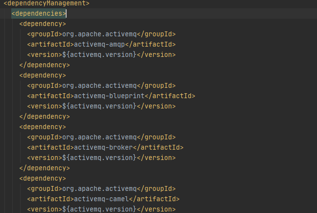

### 依赖管理

#### 依赖版本管理

示例中的pom文件配置了父项目，作用是子项目中的所有依赖版本以父项目为准

```xml
    <parent>
        <artifactId>spring-boot-starter-parent</artifactId>
        <groupId>org.springframework.boot</groupId>
        <version>2.5.4</version>
    </parent>
```

查看org.springframework.boot中的pom文件

```xml
  <parent>
    <groupId>org.springframework.boot</groupId>
    <artifactId>spring-boot-dependencies</artifactId>
    <version>2.5.4</version>
  </parent>
```

spring-boot-dependencies.pom

properties标签配置了2.5.4 spring boot项目应该使用的依赖版本



dependencyManagement标签管理所有依赖




##### 自定义版本

spring-boot-dependencies.pom中的mysql依赖


自定义mysql版本

和spring-boot-dependencies.pom，properties标签中一样的格式在当前项目的pom文件中自定义properties标签，修改依赖版本号

```xml
    <properties>
        <mysql.version>5.1.43</mysql.version>
    </properties>
```

#### 场景启动包

spring boot中的特殊starter依赖，是包含了某一场景下的所有可能依赖集合，引入了starter包就会自动引入一系列当前场景下可能会使用的依赖

官方starter命名格式：`spring-boot-starter-*`

官方starter列表：https://docs.spring.io/spring-boot/docs/current/reference/html/using.html#using.build-systems.starters


##### spring-boot-starter

这个启动包是所有场景启动包都会包含的依赖，该启动包包含了spring核心依赖和自动配置功能


##### 第三方starter

命名规范：*-spring-boot-starter

