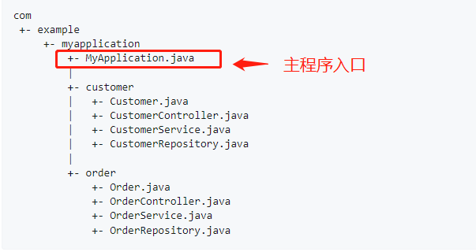
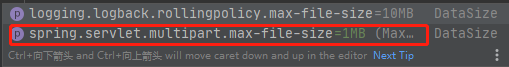

### 自动配置

#### spring boot自动配置

- 自动配置tomcat
- 自动配置spring mvc
- 自动配置字符编码过滤器
- 。。。

所有spring整合spring mvc中web.xml，spring.xml，spring-mvc.xml配置文件中的所有的配置都被spring boot自动配置完成

查看所有配置的bean

```java
@SpringBootApplication
public class MyApplication {
    public static void main(String[] args) {
        // run方法返回spring容器
        ConfigurableApplicationContext run = SpringApplication.run(MyApplication.class, args);
        // getBeanDefinitionNames方法返回所有定义的bean名称
        String[] beanDefinitionNames = run.getBeanDefinitionNames();
        // 打印所有配置的bean
        for (String name : beanDefinitionNames) {
            System.out.println(name);
        }
        // 打印所有bean的数量
        System.out.println(run.getBeanDefinitionCount());
    }
}
```

输出：

数量：138

其中包括常见的：dispatcherServlet、characterEncodingFilter、multipartResolver（文件上传依赖）等

#### spring boot默认包结构

spring boot有默认的包结构，以便spring boot进行自动包扫描，扫描注解、组件、实体类等

结构如下



主程序所在的同级目录、或下级目录都会被扫描


##### 自定义扫描基础包

```java
// 定义spring boot从com.zlp包开始扫描
@SpringBootApplication(scanBasePackages = "com.zlp")

// 或者使用@ComponentScan注解，SpringBootApplication本身是一个符复合注解，包含@ComponentScan注解

@SpringBootApplication
等价于
@SpringBootConfiguration
@EnableAutoConfiguration
@ComponentScan
```

#### spring boot配置了各种默认值

如文件上传默认最大不能超过1MB




#### spring boot配置文件

application.properties中的配置都有对应的java类，每个配置的修改最终会体现在类对象的属性修改上。

这些类都会在spring boot主程序启动时被创建


#### spring boot按需加载自动配置

引入那些场景的starter包就只会加载那些场景的依赖

