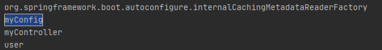
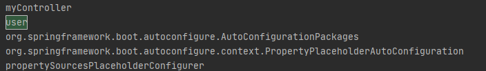
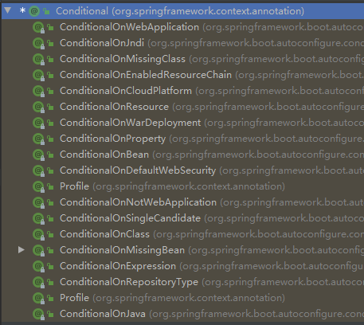
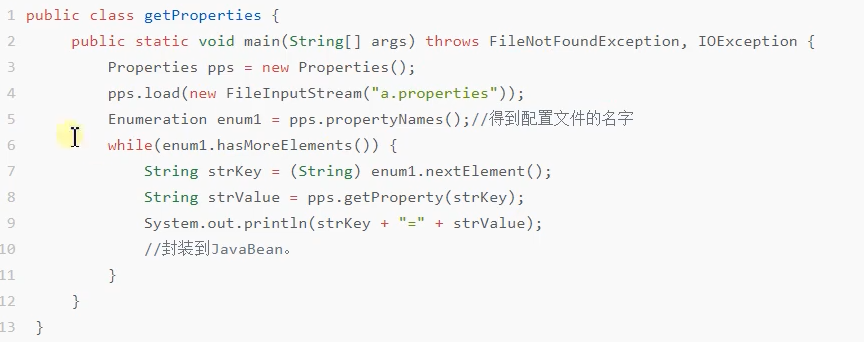

## 容器示例相关

### 一、@Configuration、@Bean

创建配置类注解，依赖代替配置文件

```java
/*
 * Configuration注解中 boolean proxyBeanMethods() default true;默认为true，使得该配置类会成为一个代理对象
 * 每次调用user方法时都会都先判断容器中是否存在类的实例，若存在则返回该实例，始终保存单实例
 *
 * proxyBeanMethods属性为false，则MyConfig就不会被代理，每次调用user方法都会创建一个新的对象实例
 * */


@Configuration // 这是一个配置类 = 一个xml配置文件
public class MyConfig {
    // 方法名表示组件id，方法类型就是组件类型，返回的值就是容器中的实例
    // 可以使用@Bean("name")的形式创建对象ID
    @Bean 
    public User user(){
        return new User("zlp", 18);
    }

}
```

测试：getBeanDefinitionNames方法打印信息中查看

@Configuration注解会被spring boot自动扫描，创建一个对象



@Bean注解会在spring容器中创建一个对象



> @Bean创建的都是单实例对象


### 二、@Component、@Controller、@Service、@Repository

常用的创建对象注解


### 三、@ComponentScan、@Import

@ComponentScan：组件扫描

@Import：导入指定的组件到容器中

```java
// 接受一个数组对象，将数组中的所有类都在容器中创建对象
// 默认对象的名字就是全类名
@Import({User.class, MyConfig.class})
```

### 四、@Conditional

@Conditional：条件装配，只有满足条件时才将组件注入

@Conditional是一个根注解



```java
@ConditionalOnBean	//若容器中存在某个实例时，进行注入
@ConditionalOnMissingBean	// 容器中不存在某个实例时，进行注入
@ConditionalOnClass	// 容器中存在某个类时进行注入
@ConditionalOnMissingClass	// 容器中不存在某个类时进行注入
@ConditionalOnResource	// 资源文件夹下存在某个资源时才进行注入
```

示例

```java
// 容器中存在id为user实例时才进行注入
// @ConditionalOnBean参数也可以为实例的类型
// @ConditionalOnBean注解可以资源在类上
@ConditionalOnBean(name="user")
@Bean
public User user(){
    return new User("zlp", 18);
}
```

测试

```java
public static void main(String[] args) {
    ConfigurableApplicationContext run = SpringApplication.run(MyApplication.class, args);
    // 容器中是否存在ID为user的实例
    boolean res = run.containsBean("user");
    System.out.println(res);
}
```


### 五、@ImportResource

导入资源文件。

示例：

不需要手动将xml的每个bean手动在配置类中重写，使用@ImportResource可以直接导入到配置类中

```java
@Configuration
@ImportResource("classpath:base.xml")
public class MyConfig {
}
```

## 配置绑定

将配置文件中的信息使用java读取并设置到java示例中

原生实现



### 注解实现

1. 在application.properties中添加自定义属性

   ```properties
   zlp.name=ZLP
   zlp.age=18
   ```

2. 创建类

   ```java
   package com.zlp.myapp.repository;
   
   public class User {
       private String name;
       private int age;
   
       public String getName() {
           return name;
       }
   
       public int getAge() {
           return age;
       }
   
       public void setName(String name) {
           this.name = name;
       }
   
       public void setAge(int age) {
           this.age = age;
       }
       
           @Override
       public String toString() {
           return "User{" +
                   "name='" + name + '\'' +
                   ", age=" + age +
                   '}';
       }
   
   }
   ```

3. 将类和自定义属性绑定（@ConfigurationProperties）

   ```java
   @ConfigurationProperties(prefix = "zlp")
   public class User {
   ```

4. 将类注入spring容器中

   ```java
   @Component
   @ConfigurationProperties(prefix = "zlp")
   public class User
   ```

测试

```java
public class MyApplication {
    public static void main(String[] args) {
        ConfigurableApplicationContext run = SpringApplication.run(MyApplication.class, args);
        User bean = run.getBean(User.class);
        System.out.println(bean);
    }
```


> 可以使用@EnableConfigurationProperties注解代替@Component将类注入到spring容器中
>
> @EnableConfigurationProperties注解只能作用在配置类上
>
> ```java
> @Configuration // 这是一个配置类 = 一个xml配置文件
> @EnableConfigurationProperties(User.class)
> public class MyConfig 
> ```
>
> 同理主要能将组件注入到容器中的注解都可以实现，如@Import