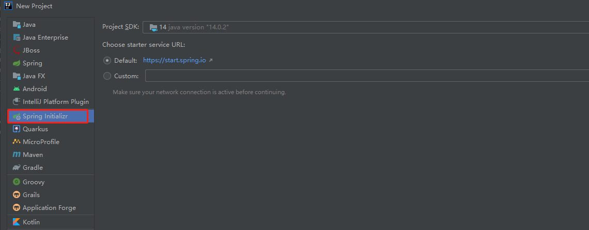

### Spring Boot创建应用流程

- 引入场景启动包
  - https://docs.spring.io/spring-boot/docs/current/reference/html/using-spring-boot.html#using-boot-starter
- 查看自动配置
  - 配置文件中debug=true开启自动配置报告。使用debug启动程序会打印出生效的配置和不生效的配置，Negative（不生效）\Positive（生效）
  - 自己分析，引入场景对应的自动配置一般都生效了
- 是否需要修改配置
  - 参考文档：https://docs.spring.io/spring-boot/docs/current/reference/html/appendix-application-properties.html#common-application-properties
  - 分析源码，查看配置类绑定了哪些前缀
  - 自定义组件替换自动配置的组件（配置类中@Bean创建组件）
  - 使用自定义器


### 使用Lombok

引入依赖

```java
<dependency>
    <groupId>org.projectlombok</groupId>
    <artifactId>lombok</artifactId>
```

idea安装插件


### 使用dev-tools

重新编译后自动重启spring boot（ctrl+F9）

引入依赖

```java
<dependency>
    <groupId>org.springframework.boot</groupId>
    <artifactId>spring-boot-devtools</artifactId>
    <optional>true</optional>
</dependency>
```

### 使用Idea快速创建

