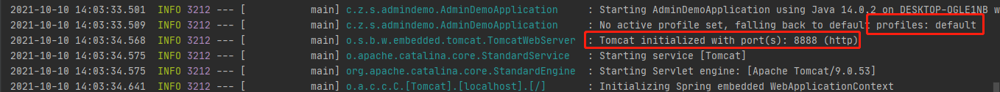
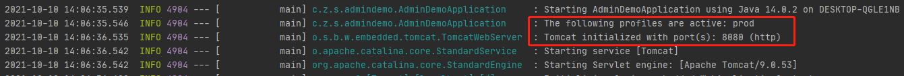
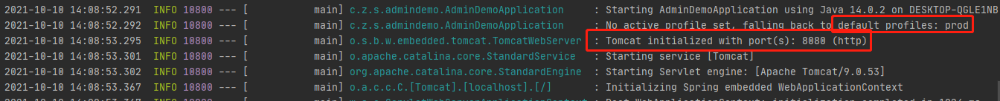
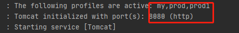

### Profile

Spring Profiles 提供了一种分离应用程序配置部分并使其仅在某些环境中可用的方法

文档地址：https://docs.spring.io/spring-boot/docs/current/reference/html/features.html#features.profiles


配置文件的优化

在不同的环境下使用不同的配置文件，如：生产环境下使用的配置文件和开发环境下使用的配置文件，可以简单的进行切换


与配置文件有关类的优化

任何从配置文件中获取值的自动装配类都可以使用@Profile注解指定从哪个配置文件中获得值


#### 配置文件Profile

application.properties

```properties
server.port=8888
```

application-prod.yaml

```yaml
server:
  port: 8080
```

默认使用默认配置文件




##### 更改使用的配置文件

在默认配置文件中添加配置

```properties
spring.profiles.active=prod
```




##### 更改默认配置文件

```properties
spring.profiles.default=prod
```




##### 在命令行修改配置文件属性

--spring.profiles.active=prod

--server.port=8888


#### @Profile

相当一个条件装配的作用，只有当前环境与@Profile指定的环境相同时才对象才被装配

```java
// 只有在prod配置文件生效时才自动装配
@Profile("prod")
@ConfigurationProperties("user")
@Component
@Data
public class User {
    private String name;
    private int age;
}
```

> 若@ConfigurationProperties("user")关联的类使用@EnableConfigurationProperties方式注入，则@Profile注解要使用在配置类上
>
> 
>
> @Profile注解作用在配置类上表示整个类需要满足条件才会被装配
>
> @Profile注解作用在配置类中的@Bean方法上则只有这@Bean示例会被影响


#### 分组

实现批量加载配置文件功能，每个组里面可以添加多个配置文件，一次启动一个组，组中的所有配置文件都生效

```properties
spring.profiles.group.my[0]=prod
spring.profiles.group.my[1]=prod1
spring.profiles.active=my
```

