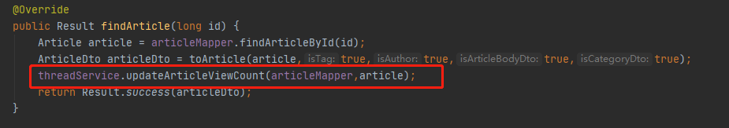

### 创建线程池

```java
@Configuration
@EnableAsync // 开启多线程
public class ThreadPoolConfig {
    @Bean("taskExecutor")
    public Executor asyncServiceExecutor() {
        ThreadPoolTaskExecutor executor = new ThreadPoolTaskExecutor();
        // 设置核心线程数
        executor.setCorePoolSize(5);
        // 设置最大线程数
        executor.setMaxPoolSize(20);
        //配置队列大小
        executor.setQueueCapacity(Integer.MAX_VALUE);
        // 设置线程活跃时间（秒）
        executor.setKeepAliveSeconds(60);
        // 设置默认线程名称
        executor.setThreadNamePrefix("码神之路博客项目");
        // 等待所有任务结束后再关闭线程池
        executor.setWaitForTasksToCompleteOnShutdown(true);
        //执行初始化
        executor.initialize();
        return executor;
    }
}
```

### 配置任务

```java
@Component
public class ThreadService {

    /**
     * 使用线程池执行，分布式场景下要是其他终端修该了view_counts则数据库中的View_counts和当前对象中的不等，
     * 所以不能直接使用当前View_counts+1进行更新
     * @param articleMapper
     * @param article
     */
    @Async("taskExecutor")
    public void updateArticleViewCount(ArticleMapper articleMapper, Article article){
        int view_count = article.getView_counts();
        long id = article.getId();
        articleMapper.updateView_counts(id,view_count);
    }
}
```

### 调用任务



