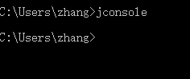
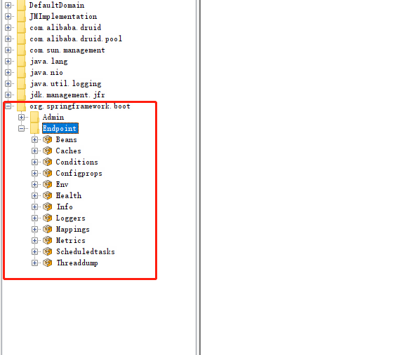

### Actuator

#### 简介

Actuator：是对服务器CPU、内存空间、磁盘空间等底层消息的监控

未来每一个微服务在云上部署以后，我们都需要对其进行监控、追踪、审计、控制等。SpringBoot就抽取了Actuator场景，使得我们每个微服务快速引用即可获得生产级别的应用监控、审计等功能。

官方文档地址：https://docs.spring.io/spring-boot/docs/current/reference/html/actuator.html#actuator


#### 场景引入

```xml
        <dependency>
            <groupId>org.springframework.boot</groupId>
            <artifactId>spring-boot-starter-actuator</artifactId>
        </dependency>
```


#### 1.x与2.x的不同

Spring Boot1使用1.x，Spring Boot2使用2.x


#### Actuator使用

1. 引入starter
2. 进入http://localhost:8080/actuator/**


#### Endpoints

端点

Actuator endpoints let you monitor and interact with your application. Spring Boot includes a number of built-in endpoints and lets you add your own. For example, the `health` endpoint provides basic application health information.

Actuator 端点可让您监控应用程序并与之交互。Spring Boot 包含许多内置端点，并允许您添加自己的端点。例如，`health`端点提供基本的应用程序健康信息。


每个单独的端点都可以[通过 HTTP 或 JMX](https://docs.spring.io/spring-boot/docs/current/reference/html/actuator.html#actuator.endpoints.exposing)[启用或禁用](https://docs.spring.io/spring-boot/docs/current/reference/html/actuator.html#actuator.endpoints.enabling)和[公开（远程访问）](https://docs.spring.io/spring-boot/docs/current/reference/html/actuator.html#actuator.endpoints.exposing)。当端点被启用和公开时，它被认为是可用的。内置端点只有在可用时才会自动配置。大多数应用程序选择通过 HTTP 公开，其中端点的 ID 和前缀`/actuator`被映射到 URL。例如，默认情况下，`health`端点映射到`/actuator/health`.

常用端点：


##### 开启端点

默认端口全部开启，除了shutdown端点

设置默认全部关闭，选择性开启

```yml
management:
  endpoints:
    enabled-by-default: false
  endpoint:
    info:
      enabled: true
    shutdown:
      enabled: true
```


##### 暴露端点

查看端点信息的方式：

1. JMX方式：默认全部端点都开启JMX方式暴露，可以通过配置文件修改

   ```yml
   management:
     endpoints:
       jmx:
         exposure:
           include: "health,info"
   
   ```

2. HTTP方式：默认只有health开启HTTP暴露，可以通过配置文件修改

   ```yml
   management:
     endpoints:
       web:
         exposure:
           include: "*"
           exclude: "env,beans"
   ```

JMX方式查看示例






HTTP查看示例


#### 订制Endpoint


##### 1、订制Health

添加其他组件的健康信息，可以参考内置的端点模板，如（DiskSpaceHealthIndicator）

1. 自定义类，继承AbstractHealthIndicator抽象类，或HealthIndicator接口，放置在容器中
2. 重写doHealthCheck方法，检查健康状态，返回信息

```java
@Component
public class MyComHealthIndicator extends AbstractHealthIndicator {

    /**
     * 真实的检查方法
     * @param builder
     * @throws Exception
     */
    @Override
    protected void doHealthCheck(Health.Builder builder) throws Exception {
        //mongodb。  获取连接进行测试
        Map<String,Object> map = new HashMap<>();
        // 检查健康条件，返回健康状态
        if(1 == 2){
//            builder.up(); //健康
            builder.status(Status.UP);
            map.put("count",1);
            map.put("ms",100);
        }else {
//            builder.down();
            builder.status(Status.OUT_OF_SERVICE);
            map.put("err","连接超时");
            map.put("ms",3000);
        }

		// 返回检查信息
        builder.withDetail("code",100)
                .withDetails(map);

    }
}
```


##### 2、订制info

两种订制方式

1. 配置文件订制

   ```yaml
   # 这里的info不属于端点属性，就是顶层的info用来配置项目的信息，
   # info端点会自动获取设置号的项目信息
   # k可以自定义，v可以自定义也可以从pom获取，使用@xxx@方式
   info:
     anchorname: "zlp"
     appname: "spring boot"
     version: "1.0.0"
     mavenname: @project.name@
     mavenversion: @project.version@
   ```

2. 代码订制

   ```java
   // 自定义类继承InfoContributor，放入容器中
   // withDetail或withDetails方法添加信息
   @Component
   public class AppInfo implements InfoContributor {
       @Override
       public void contribute(Info.Builder builder) {
           builder.withDetail("mysql","8.0.1")
                   .withDetails(Collections.singletonMap("singletonMap","map"));
       }
   }
   ```


##### 3、订制metrics

添加自动监控指标：如某个service方法的调用测试

1. 注册监控指标
2. 进行监控

```java
@Service
public class LolServiceImpl implements LolService {
    @Autowired
    private LolMapper lolMapper;
    private Counter counter;

    // 注册监控
    public LolServiceImpl(MeterRegistry meterRegistry) {
        this.counter = meterRegistry.counter("LolService.getAnchor100.count");
    }

    @Override
    public List<Anchor> getAnchor100(int start) {
        // 进行监控，每调用一次该方法就计数一次
        counter.increment();
        List<Anchor> res = lolMapper.getAnchors(start, 100);
        return  res;
    }
}
```


##### 4、自定义端点

1. 自定义类，标注@Endpoint，并放入容器中
2. 定义操作

```java
@Component
// 端点名必须小写
@Endpoint(id = "myendpoint")
public class MyEndPoint {

    // 定义读操作，访问该端点的url是就会调用该方法
    @ReadOperation
    public Map<String,Object> getInfo(){
        HashMap<String,Object> hashMap = new HashMap<>();
        hashMap.put("servicename","info");
        return hashMap;
    }

    // 端点的写操作
    @WriteOperation
    public void stop(){
        System.out.println("stop");
    }
}
```


#### 可视化界面

开源地址：https://github.com/codecentric/spring-boot-admin

快速开始文档：https://codecentric.github.io/spring-boot-admin/2.5.1/#getting-started

这是一个监控微服务指标的开源仓库

架构：设置一个监控服务器，每隔一段时间去微服务中获取监控指标


步骤：

1. 创建Spring boot应用

2. 导入依赖

   ```xml
   <dependency>
       <groupId>de.codecentric</groupId>
       <artifactId>spring-boot-admin-starter-server</artifactId>
       <version>2.5.1</version>
   </dependency>
   <dependency>
       <groupId>org.springframework.boot</groupId>
       <artifactId>spring-boot-starter-web</artifactId>
   </dependency>
   ```

3. 给启动类标注@EnableAdminServer

   ```java
   @SpringBootApplication
   @EnableAdminServer
   public class AdminDemoApplication {
   
       public static void main(String[] args) {
           SpringApplication.run(AdminDemoApplication.class, args);
       }
   
   }
   ```

4. 注册微服务，在要被监控的微服务上引入依赖

   ```java
   <dependency>
       <groupId>de.codecentric</groupId>
       <artifactId>spring-boot-admin-starter-client</artifactId>
       <version>2.5.1</version>
   </dependency>
   ```

5. 注册微服务，在被监控的微服务上配置监控服务器地址

   ```yaml
   spring:
     boot:
       admin:
         client:
           url: 'http://localhost:8888'
           # 通过IP或者域名查找应用，true表示通过ip，false表示通过域名
           instance:
             prefer-ip: true
   ```

6. 若服务器配置了安全访问场景，则客户端需要添加配置

   ```java
   @Configuration
   public static class SecurityPermitAllConfig extends WebSecurityConfigurerAdapter {
       @Override
       protected void configure(HttpSecurity http) throws Exception {
           http.authorizeRequests().anyRequest().permitAll()  
               .and().csrf().disable();
       }
   }
   ```


##### 效果展示


##### 指标


##### 映射查看


##### 线程信息查看


