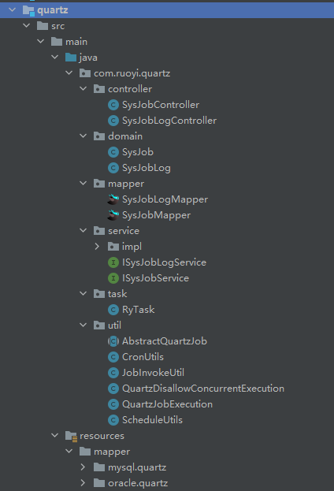
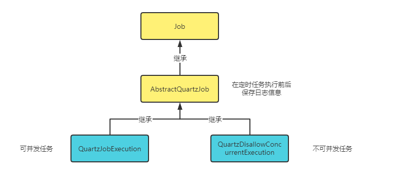
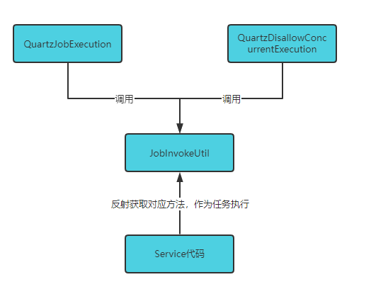
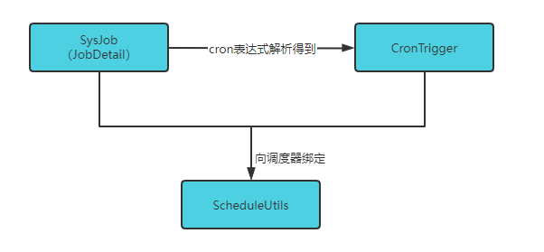
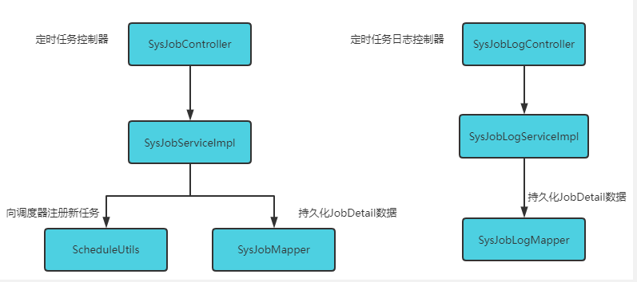
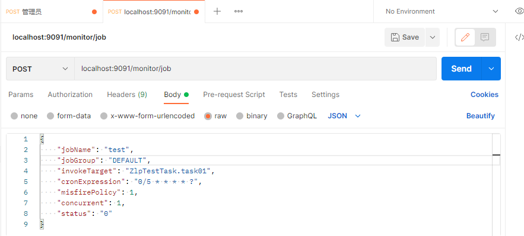
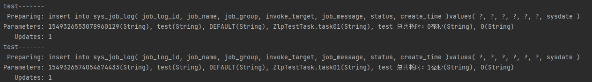
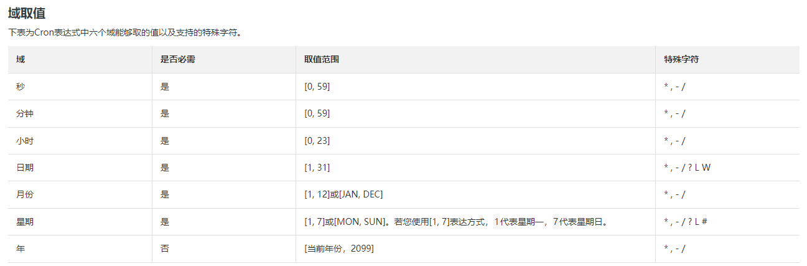
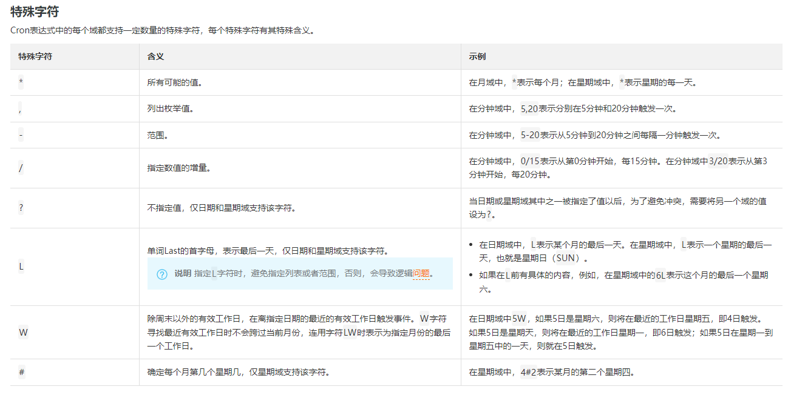
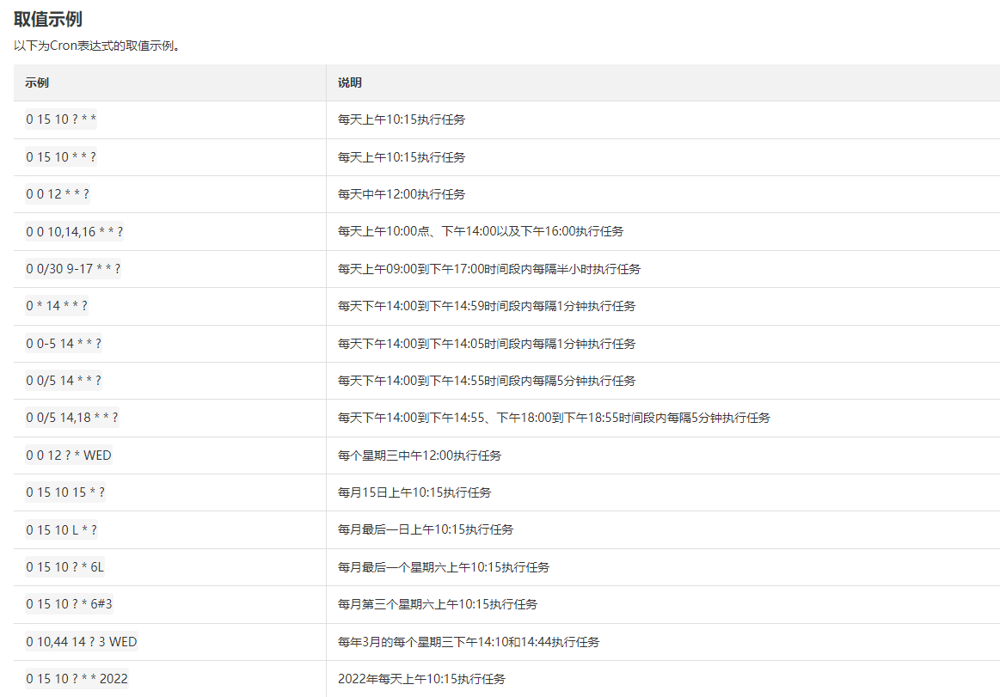

### Spring Boot定时任务常见解决方案


### Quartz

​		Quartz是一个任务调度框架，提供灵活的任务调度管理，提供延迟任务调用、周期性任务调用等功能。

Quartz框架结构如下图：


### Quartz核心组件

- job：任务的具体执行内容，流程代码
- jobDetail：任务的描述：任务名称、任务分组名称，任务数据等

- trgger：触发器，定义任务的执行时机
- shchedule：调度器，统一调度所有任务，所有人物都通过调度器来执行


### Quartz工作流程

1. 创建Job，Quartz中任务的定义只需要通过继承Job接口，job接口下的部分实现有`QuartzJobBean`、`DelegatingJob`可以通过继承这些接口去定义Job

    ```java
    public class HelloJob implements Job {
        public HelloJob() {
        }
    
        public void execute(JobExecutionContext context)
            throws JobExecutionException
        {
            System.err.println("Hello!  HelloJob is executing.");
        }
    }
    ```

2. 创建JobDetail

    ```java
    JobDetail job = newJob(HelloJob.class)
        .withIdentity("myJob", "group1")
        .build();
    ```

3. 创建trigger

    ```java
    Trigger trigger = newTrigger()
        .withIdentity("myTrigger", "group1")
        .startNow()
        .withSchedule(simpleSchedule()
    	.withIntervalInSeconds(40)
    	.repeatForever())            
        .build();
    ```

4. 向调度器注册

    ```java
    sched.scheduleJob(job, trigger);
    ```

### Quartz持久化

JobStore：负责跟踪您提供给调度程序的所有“工作数据”：jobs，triggers，日历等。

JobStore根据存储方式不同可以分为两类：

- RAM JobStore（内存模式）：重启丢失数据
- JDBC JobStore（数据库模式）：重启不丢失数据


### Spring Boot集成Quartz

目标：

1. 通过API动态创建任务
2. 通过API修改任务执行时间
3. 通过API删除任务
4. 通过API暂停、恢复任务
5. 定时任务执行情况收集（log）

目录结构：



#### Job定义




AbstractQuartzJob.class

```java
package com.ruoyi.quartz.util;

import java.util.Date;

import com.ruoyi.common.utils.uuid.IdUtils;
import org.quartz.Job;
import org.quartz.JobExecutionContext;
import org.quartz.JobExecutionException;
import org.slf4j.Logger;
import org.slf4j.LoggerFactory;
import com.ruoyi.common.constant.Constants;
import com.ruoyi.common.constant.ScheduleConstants;
import com.ruoyi.common.utils.ExceptionUtil;
import com.ruoyi.common.utils.StringUtils;
import com.ruoyi.common.utils.bean.BeanUtils;
import com.ruoyi.common.utils.spring.SpringUtils;
import com.ruoyi.quartz.domain.SysJob;
import com.ruoyi.quartz.domain.SysJobLog;
import com.ruoyi.quartz.service.ISysJobLogService;

/**
 * 抽象quartz调用
 *
 * @author tongen
 */
public abstract class AbstractQuartzJob implements Job
{
    private static final Logger log = LoggerFactory.getLogger(AbstractQuartzJob.class);

    /**
     * 线程本地变量
     */
    private static ThreadLocal<Date> threadLocal = new ThreadLocal<>();

    @Override
    public void execute(JobExecutionContext context) throws JobExecutionException
    {
        SysJob sysJob = new SysJob();
        BeanUtils.copyBeanProp(sysJob, context.getMergedJobDataMap().get(ScheduleConstants.TASK_PROPERTIES));
        try
        {
            // 调用开始时间
            before(context, sysJob);
            if (sysJob != null)
            {
                doExecute(context, sysJob);
            }
            // 调用后记录日志
            after(context, sysJob, null);
        }
        catch (Exception e)
        {
            log.error("任务执行异常  - ：", e);
            after(context, sysJob, e);
        }
    }

    /**
     * 执行前
     *
     * @param context 工作执行上下文对象
     * @param sysJob 系统计划任务
     */
    protected void before(JobExecutionContext context, SysJob sysJob)
    {
        threadLocal.set(new Date());
    }

    /**
     * 执行后
     *
     * @param context 工作执行上下文对象
     * @param sysJob 系统计划任务
     */
    protected void after(JobExecutionContext context, SysJob sysJob, Exception e)
    {
        Date startTime = threadLocal.get();
        threadLocal.remove();

        final SysJobLog sysJobLog = new SysJobLog();
        sysJobLog.setJobLogId(IdUtils.simpleUUID());
        sysJobLog.setJobName(sysJob.getJobName());
        sysJobLog.setJobGroup(sysJob.getJobGroup());
        sysJobLog.setInvokeTarget(sysJob.getInvokeTarget());
        sysJobLog.setStartTime(startTime);
        sysJobLog.setStopTime(new Date());
        long runMs = sysJobLog.getStopTime().getTime() - sysJobLog.getStartTime().getTime();
        sysJobLog.setJobMessage(sysJobLog.getJobName() + " 总共耗时：" + runMs + "毫秒");
        if (e != null)
        {
            sysJobLog.setStatus(Constants.FAIL);
            String errorMsg = StringUtils.substring(e.getMessage(), 0, 1000);
            sysJobLog.setExceptionInfo(errorMsg);
        }
        else
        {
            sysJobLog.setStatus(Constants.SUCCESS);
        }

        // 写入数据库当中
        SpringUtils.getBean(ISysJobLogService.class).addJobLog(sysJobLog);
    }

    /**
     * 执行方法，由子类重载
     *
     * @param context 工作执行上下文对象
     * @param sysJob 系统计划任务
     * @throws Exception 执行过程中的异常
     */
    protected abstract void doExecute(JobExecutionContext context, SysJob sysJob) throws Exception;
}

```

QuartzJobExecution.class

```java
package com.ruoyi.quartz.util;

import org.quartz.JobExecutionContext;
import com.ruoyi.quartz.domain.SysJob;

/**
 * 定时任务处理（允许并发执行）
 * 
 * @author tongen
 *
 */
public class QuartzJobExecution extends AbstractQuartzJob
{
    @Override
    protected void doExecute(JobExecutionContext context, SysJob sysJob) throws Exception
    {
        JobInvokeUtil.invokeMethod(sysJob);
    }
}

```

QuartzDisallowConcurrentExecution.class

```java
package com.ruoyi.quartz.util;

import org.quartz.DisallowConcurrentExecution;
import org.quartz.JobExecutionContext;
import com.ruoyi.quartz.domain.SysJob;

/**
 * 定时任务处理（禁止并发执行）
 * 
 * @author tongen
 *
 */
@DisallowConcurrentExecution
public class QuartzDisallowConcurrentExecution extends AbstractQuartzJob
{
    @Override
    protected void doExecute(JobExecutionContext context, SysJob sysJob) throws Exception
    {
        JobInvokeUtil.invokeMethod(sysJob);
    }
}

```

#### 反射获取执行任务内容



JobInvokeUtil.class

```java
package com.ruoyi.quartz.util;

import java.lang.reflect.InvocationTargetException;
import java.lang.reflect.Method;
import java.util.LinkedList;
import java.util.List;
import com.ruoyi.common.utils.StringUtils;
import com.ruoyi.common.utils.spring.SpringUtils;
import com.ruoyi.quartz.domain.SysJob;

/**
 * 任务执行工具
 *
 * @author tongen
 */
public class JobInvokeUtil
{
    /**
     * 执行方法
     *
     * @param sysJob 系统任务
     */
    public static void invokeMethod(SysJob sysJob) throws Exception
    {
        String invokeTarget = sysJob.getInvokeTarget();
        String beanName = getBeanName(invokeTarget);
        String methodName = getMethodName(invokeTarget);
        List<Object[]> methodParams = getMethodParams(invokeTarget);

        if (!isValidClassName(beanName))
        {
            Object bean = SpringUtils.getBean(beanName);
            invokeMethod(bean, methodName, methodParams);
        }
        else
        {
            Object bean = Class.forName(beanName).newInstance();
            invokeMethod(bean, methodName, methodParams);
        }
    }

    /**
     * 调用任务方法
     *
     * @param bean 目标对象
     * @param methodName 方法名称
     * @param methodParams 方法参数
     */
    private static void invokeMethod(Object bean, String methodName, List<Object[]> methodParams)
            throws NoSuchMethodException, SecurityException, IllegalAccessException, IllegalArgumentException,
            InvocationTargetException
    {
        if (StringUtils.isNotNull(methodParams) && methodParams.size() > 0)
        {
            Method method = bean.getClass().getDeclaredMethod(methodName, getMethodParamsType(methodParams));
            method.invoke(bean, getMethodParamsValue(methodParams));
        }
        else
        {
            Method method = bean.getClass().getDeclaredMethod(methodName);
            method.invoke(bean);
        }
    }

    /**
     * 校验是否为为class包名
     * 
     * @param invokeTarget 名称
     * @return true是 false否
     */
    public static boolean isValidClassName(String invokeTarget)
    {
        return StringUtils.countMatches(invokeTarget, ".") > 1;
    }

    /**
     * 获取bean名称
     * 
     * @param invokeTarget 目标字符串
     * @return bean名称
     */
    public static String getBeanName(String invokeTarget)
    {
        String beanName = StringUtils.substringBefore(invokeTarget, "(");
        return StringUtils.substringBeforeLast(beanName, ".");
    }

    /**
     * 获取bean方法
     * 
     * @param invokeTarget 目标字符串
     * @return method方法
     */
    public static String getMethodName(String invokeTarget)
    {
        String methodName = StringUtils.substringBefore(invokeTarget, "(");
        return StringUtils.substringAfterLast(methodName, ".");
    }

    /**
     * 获取method方法参数相关列表
     * 
     * @param invokeTarget 目标字符串
     * @return method方法相关参数列表
     */
    public static List<Object[]> getMethodParams(String invokeTarget)
    {
        String methodStr = StringUtils.substringBetween(invokeTarget, "(", ")");
        if (StringUtils.isEmpty(methodStr))
        {
            return null;
        }
        String[] methodParams = methodStr.split(",(?=([^\"']*[\"'][^\"']*[\"'])*[^\"']*$)");
        List<Object[]> classs = new LinkedList<>();
        for (int i = 0; i < methodParams.length; i++)
        {
            String str = StringUtils.trimToEmpty(methodParams[i]);
            // String字符串类型，以'或"开头
            if (StringUtils.startsWithAny(str, "'", "\""))
            {
                classs.add(new Object[] { StringUtils.substring(str, 1, str.length() - 1), String.class });
            }
            // boolean布尔类型，等于true或者false
            else if ("true".equalsIgnoreCase(str) || "false".equalsIgnoreCase(str))
            {
                classs.add(new Object[] { Boolean.valueOf(str), Boolean.class });
            }
            // long长整形，以L结尾
            else if (StringUtils.endsWith(str, "L"))
            {
                classs.add(new Object[] { Long.valueOf(StringUtils.substring(str, 0, str.length() - 1)), Long.class });
            }
            // double浮点类型，以D结尾
            else if (StringUtils.endsWith(str, "D"))
            {
                classs.add(new Object[] { Double.valueOf(StringUtils.substring(str, 0, str.length() - 1)), Double.class });
            }
            // 其他类型归类为整形
            else
            {
                classs.add(new Object[] { Integer.valueOf(str), Integer.class });
            }
        }
        return classs;
    }

    /**
     * 获取参数类型
     * 
     * @param methodParams 参数相关列表
     * @return 参数类型列表
     */
    public static Class<?>[] getMethodParamsType(List<Object[]> methodParams)
    {
        Class<?>[] classs = new Class<?>[methodParams.size()];
        int index = 0;
        for (Object[] os : methodParams)
        {
            classs[index] = (Class<?>) os[1];
            index++;
        }
        return classs;
    }

    /**
     * 获取参数值
     * 
     * @param methodParams 参数相关列表
     * @return 参数值列表
     */
    public static Object[] getMethodParamsValue(List<Object[]> methodParams)
    {
        Object[] classs = new Object[methodParams.size()];
        int index = 0;
        for (Object[] os : methodParams)
        {
            classs[index] = (Object) os[0];
            index++;
        }
        return classs;
    }
}
```

#### 调度器注册任务



ScheduleUtils.class

```java
package com.ruoyi.quartz.util;

import org.quartz.CronScheduleBuilder;
import org.quartz.CronTrigger;
import org.quartz.Job;
import org.quartz.JobBuilder;
import org.quartz.JobDetail;
import org.quartz.JobKey;
import org.quartz.Scheduler;
import org.quartz.SchedulerException;
import org.quartz.TriggerBuilder;
import org.quartz.TriggerKey;
import com.ruoyi.common.constant.Constants;
import com.ruoyi.common.constant.ScheduleConstants;
import com.ruoyi.common.exception.job.TaskException;
import com.ruoyi.common.exception.job.TaskException.Code;
import com.ruoyi.common.utils.StringUtils;
import com.ruoyi.quartz.domain.SysJob;

/**
 * 定时任务工具类
 * 
 * @author tongen
 *
 */
public class ScheduleUtils
{
    /**
     * 得到quartz任务类
     *
     * @param sysJob 执行计划
     * @return 具体执行任务类
     */
    private static Class<? extends Job> getQuartzJobClass(SysJob sysJob)
    {
        boolean isConcurrent = "0".equals(sysJob.getConcurrent());
        return isConcurrent ? QuartzJobExecution.class : QuartzDisallowConcurrentExecution.class;
    }

    /**
     * 构建任务触发对象
     */
    public static TriggerKey getTriggerKey(String jobId, String jobGroup)
    {
        return TriggerKey.triggerKey(ScheduleConstants.TASK_CLASS_NAME + jobId, jobGroup);
    }

    /**
     * 构建任务键对象
     */
    public static JobKey getJobKey(String jobId, String jobGroup)
    {
        return JobKey.jobKey(ScheduleConstants.TASK_CLASS_NAME + jobId, jobGroup);
    }

    /**
     * 创建定时任务
     */
    public static void createScheduleJob(Scheduler scheduler, SysJob job) throws SchedulerException, TaskException
    {
        Class<? extends Job> jobClass = getQuartzJobClass(job);
        // 构建job信息
        String jobId = job.getJobId();
        String jobGroup = job.getJobGroup();
        JobDetail jobDetail = JobBuilder.newJob(jobClass).withIdentity(getJobKey(jobId, jobGroup)).build();

        // 表达式调度构建器
        CronScheduleBuilder cronScheduleBuilder = CronScheduleBuilder.cronSchedule(job.getCronExpression());
        cronScheduleBuilder = handleCronScheduleMisfirePolicy(job, cronScheduleBuilder);

        // 按新的cronExpression表达式构建一个新的trigger
        CronTrigger trigger = TriggerBuilder.newTrigger().withIdentity(getTriggerKey(jobId, jobGroup))
                .withSchedule(cronScheduleBuilder).build();

        // 放入参数，运行时的方法可以获取
        jobDetail.getJobDataMap().put(ScheduleConstants.TASK_PROPERTIES, job);

        // 判断是否存在
        if (scheduler.checkExists(getJobKey(jobId, jobGroup)))
        {
            // 防止创建时存在数据问题 先移除，然后在执行创建操作
            scheduler.deleteJob(getJobKey(jobId, jobGroup));
        }

        scheduler.scheduleJob(jobDetail, trigger);

        // 暂停任务
        if (job.getStatus().equals(ScheduleConstants.Status.PAUSE.getValue()))
        {
            scheduler.pauseJob(ScheduleUtils.getJobKey(jobId, jobGroup));
        }
    }

    /**
     * 设置定时任务策略
     */
    public static CronScheduleBuilder handleCronScheduleMisfirePolicy(SysJob job, CronScheduleBuilder cb)
            throws TaskException
    {
        switch (job.getMisfirePolicy())
        {
            case ScheduleConstants.MISFIRE_DEFAULT:
                return cb;
            case ScheduleConstants.MISFIRE_IGNORE_MISFIRES:
                return cb.withMisfireHandlingInstructionIgnoreMisfires();
            case ScheduleConstants.MISFIRE_FIRE_AND_PROCEED:
                return cb.withMisfireHandlingInstructionFireAndProceed();
            case ScheduleConstants.MISFIRE_DO_NOTHING:
                return cb.withMisfireHandlingInstructionDoNothing();
            default:
                throw new TaskException("The task misfire policy '" + job.getMisfirePolicy()
                        + "' cannot be used in cron schedule tasks", Code.CONFIG_ERROR);
        }
    }

    /**
     * 检查包名是否为白名单配置
     * 
     * @param invokeTarget 目标字符串
     * @return 结果
     */
    public static boolean whiteList(String invokeTarget)
    {
        String packageName = StringUtils.substringBefore(invokeTarget, "(");
        int count = StringUtils.countMatches(packageName, ".");
        if (count > 1)
        {
            if (!StringUtils.containsAnyIgnoreCase(invokeTarget, Constants.JOB_WHITELIST_STR))
            {
                return false;
            }
        }
        return true;
    }
}

```

CronUtils.class，校验cron表达式正确性

```java
package com.ruoyi.quartz.util;

import java.text.ParseException;
import java.util.Date;
import org.quartz.CronExpression;

/**
 * cron表达式工具类
 * 
 * @author tongen
 *
 */
public class CronUtils
{
    /**
     * 返回一个布尔值代表一个给定的Cron表达式的有效性
     *
     * @param cronExpression Cron表达式
     * @return boolean 表达式是否有效
     */
    public static boolean isValid(String cronExpression)
    {
        return CronExpression.isValidExpression(cronExpression);
    }

    /**
     * 返回一个字符串值,表示该消息无效Cron表达式给出有效性
     *
     * @param cronExpression Cron表达式
     * @return String 无效时返回表达式错误描述,如果有效返回null
     */
    public static String getInvalidMessage(String cronExpression)
    {
        try
        {
            new CronExpression(cronExpression);
            return null;
        }
        catch (ParseException pe)
        {
            return pe.getMessage();
        }
    }

    /**
     * 返回下一个执行时间根据给定的Cron表达式
     *
     * @param cronExpression Cron表达式
     * @return Date 下次Cron表达式执行时间
     */
    public static Date getNextExecution(String cronExpression)
    {
        try
        {
            CronExpression cron = new CronExpression(cronExpression);
            return cron.getNextValidTimeAfter(new Date(System.currentTimeMillis()));
        }
        catch (ParseException e)
        {
            throw new IllegalArgumentException(e.getMessage());
        }
    }
}

```

#### Job、JobLog实体类

SysJob.class

```java
package com.ruoyi.quartz.domain;

import java.util.Date;
import javax.validation.constraints.NotBlank;
import javax.validation.constraints.Size;
import org.apache.commons.lang3.builder.ToStringBuilder;
import org.apache.commons.lang3.builder.ToStringStyle;
import com.fasterxml.jackson.annotation.JsonFormat;
import com.ruoyi.common.annotation.Excel;
import com.ruoyi.common.annotation.Excel.ColumnType;
import com.ruoyi.common.constant.ScheduleConstants;
import com.ruoyi.common.utils.StringUtils;
import com.ruoyi.quartz.util.CronUtils;

/**
 * 定时任务调度表 sys_job
 * 
 * @author tongen
 */
public class SysJob
{
    private static final long serialVersionUID = 1L;

    /** 任务ID */
    @Excel(name = "任务序号", cellType = ColumnType.NUMERIC)
    private String jobId;

    /** 任务名称 */
    @Excel(name = "任务名称")
    private String jobName;

    /** 任务组名 */
    @Excel(name = "任务组名")
    private String jobGroup;

    /** 调用目标字符串 */
    @Excel(name = "调用目标字符串")
    private String invokeTarget;

    /** cron执行表达式 */
    @Excel(name = "执行表达式 ")
    private String cronExpression;

    /** cron计划策略 */
    @Excel(name = "计划策略 ", readConverterExp = "0=默认,1=立即触发执行,2=触发一次执行,3=不触发立即执行")
    private String misfirePolicy = ScheduleConstants.MISFIRE_DEFAULT;

    /** 是否并发执行（0允许 1禁止） */
    @Excel(name = "并发执行", readConverterExp = "0=允许,1=禁止")
    private String concurrent;

    /** 任务状态（0正常 1暂停） */
    @Excel(name = "任务状态", readConverterExp = "0=正常,1=暂停")
    private String status;

    public String getJobId()
    {
        return jobId;
    }

    public void setJobId(String jobId)
    {
        this.jobId = jobId;
    }

    @NotBlank(message = "任务名称不能为空")
    @Size(min = 0, max = 64, message = "任务名称不能超过64个字符")
    public String getJobName()
    {
        return jobName;
    }

    public void setJobName(String jobName)
    {
        this.jobName = jobName;
    }

    public String getJobGroup()
    {
        return jobGroup;
    }

    public void setJobGroup(String jobGroup)
    {
        this.jobGroup = jobGroup;
    }

    @NotBlank(message = "调用目标字符串不能为空")
    @Size(min = 0, max = 500, message = "调用目标字符串长度不能超过500个字符")
    public String getInvokeTarget()
    {
        return invokeTarget;
    }

    public void setInvokeTarget(String invokeTarget)
    {
        this.invokeTarget = invokeTarget;
    }

    @NotBlank(message = "Cron执行表达式不能为空")
    @Size(min = 0, max = 255, message = "Cron执行表达式不能超过255个字符")
    public String getCronExpression()
    {
        return cronExpression;
    }

    public void setCronExpression(String cronExpression)
    {
        this.cronExpression = cronExpression;
    }

    @JsonFormat(pattern = "yyyy-MM-dd HH:mm:ss",timezone = "GMT+8")
    public Date getNextValidTime()
    {
        if (StringUtils.isNotEmpty(cronExpression))
        {
            return CronUtils.getNextExecution(cronExpression);
        }
        return null;
    }

    public String getMisfirePolicy()
    {
        return misfirePolicy;
    }

    public void setMisfirePolicy(String misfirePolicy)
    {
        this.misfirePolicy = misfirePolicy;
    }

    public String getConcurrent()
    {
        return concurrent;
    }

    public void setConcurrent(String concurrent)
    {
        this.concurrent = concurrent;
    }

    public String getStatus()
    {
        return status;
    }

    public void setStatus(String status)
    {
        this.status = status;
    }

    @Override
    public String toString() {
        return new ToStringBuilder(this,ToStringStyle.MULTI_LINE_STYLE)
            .append("jobId", getJobId())
            .append("jobName", getJobName())
            .append("jobGroup", getJobGroup())
            .append("cronExpression", getCronExpression())
            .append("nextValidTime", getNextValidTime())
            .append("misfirePolicy", getMisfirePolicy())
            .append("concurrent", getConcurrent())
            .append("status", getStatus())
            .append("createBy", getCreateBy())
            .append("createTime", getCreateTime())
            .append("updateBy", getUpdateBy())
            .append("updateTime", getUpdateTime())
            .append("remark", getRemark())
            .toString();
    }
}

```

SysJobLog.class

```java
package com.ruoyi.quartz.domain;

import java.util.Date;

import com.fasterxml.jackson.annotation.JsonFormat;
import org.apache.commons.lang3.builder.ToStringBuilder;
import org.apache.commons.lang3.builder.ToStringStyle;
import com.ruoyi.common.annotation.Excel;
import com.ruoyi.common.core.domain.BaseEntity;

/**
 * 定时任务调度日志表 sys_job_log
 * 
 * @author tongen
 */
public class SysJobLog
{
    private static final long serialVersionUID = 1L;

    /** ID */
    @Excel(name = "日志序号")
    private String jobLogId;

    /** 任务名称 */
    @Excel(name = "任务名称")
    private String jobName;

    /** 任务组名 */
    @Excel(name = "任务组名")
    private String jobGroup;

    /** 调用目标字符串 */
    @Excel(name = "调用目标字符串")
    private String invokeTarget;

    /** 日志信息 */
    @Excel(name = "日志信息")
    private String jobMessage;

    /** 执行状态（0正常 1失败） */
    @Excel(name = "执行状态", readConverterExp = "0=正常,1=失败")
    private String status;

    /** 异常信息 */
    @Excel(name = "异常信息")
    private String exceptionInfo;

    /** 开始时间 */
    @JsonFormat(pattern = "yyyy-MM-dd HH:mm:ss",timezone = "GMT+8")
    private Date startTime;

    /** 停止时间 */
    @JsonFormat(pattern = "yyyy-MM-dd HH:mm:ss",timezone = "GMT+8")
    private Date stopTime;

    public String getJobLogId()
    {
        return jobLogId;
    }

    public void setJobLogId(String jobLogId)
    {
        this.jobLogId = jobLogId;
    }

    public String getJobName()
    {
        return jobName;
    }

    public void setJobName(String jobName)
    {
        this.jobName = jobName;
    }

    public String getJobGroup()
    {
        return jobGroup;
    }

    public void setJobGroup(String jobGroup)
    {
        this.jobGroup = jobGroup;
    }

    public String getInvokeTarget()
    {
        return invokeTarget;
    }

    public void setInvokeTarget(String invokeTarget)
    {
        this.invokeTarget = invokeTarget;
    }

    public String getJobMessage()
    {
        return jobMessage;
    }

    public void setJobMessage(String jobMessage)
    {
        this.jobMessage = jobMessage;
    }

    public String getStatus()
    {
        return status;
    }

    public void setStatus(String status)
    {
        this.status = status;
    }

    public String getExceptionInfo()
    {
        return exceptionInfo;
    }

    public void setExceptionInfo(String exceptionInfo)
    {
        this.exceptionInfo = exceptionInfo;
    }

    public Date getStartTime()
    {
        return startTime;
    }

    public void setStartTime(Date startTime)
    {
        this.startTime = startTime;
    }
    
    public Date getStopTime()
    {
        return stopTime;
    }

    public void setStopTime(Date stopTime)
    {
        this.stopTime = stopTime;
    }

    @Override
    public String toString() {
        return new ToStringBuilder(this,ToStringStyle.MULTI_LINE_STYLE)
            .append("jobLogId", getJobLogId())
            .append("jobName", getJobName())
            .append("jobGroup", getJobGroup())
            .append("jobMessage", getJobMessage())
            .append("status", getStatus())
            .append("exceptionInfo", getExceptionInfo())
            .append("startTime", getStartTime())
            .append("stopTime", getStopTime())
            .toString();
    }
}

```

#### Controller层



SysJobController.class

```java
package com.ruoyi.quartz.controller;

import java.util.List;
import javax.servlet.http.HttpServletResponse;

import com.ruoyi.common.utils.uuid.IdUtils;
import org.quartz.SchedulerException;
import org.springframework.beans.factory.annotation.Autowired;
import org.springframework.security.access.prepost.PreAuthorize;
import org.springframework.web.bind.annotation.DeleteMapping;
import org.springframework.web.bind.annotation.GetMapping;
import org.springframework.web.bind.annotation.PathVariable;
import org.springframework.web.bind.annotation.PostMapping;
import org.springframework.web.bind.annotation.PutMapping;
import org.springframework.web.bind.annotation.RequestBody;
import org.springframework.web.bind.annotation.RequestMapping;
import org.springframework.web.bind.annotation.RestController;
import com.ruoyi.common.annotation.Log;
import com.ruoyi.common.constant.Constants;
import com.ruoyi.common.core.controller.BaseController;
import com.ruoyi.common.core.domain.AjaxResult;
import com.ruoyi.common.core.page.TableDataInfo;
import com.ruoyi.common.enums.system.BusinessType;
import com.ruoyi.common.exception.job.TaskException;
import com.ruoyi.common.utils.StringUtils;
import com.ruoyi.common.utils.poi.ExcelUtil;
import com.ruoyi.quartz.domain.SysJob;
import com.ruoyi.quartz.service.ISysJobService;
import com.ruoyi.quartz.util.CronUtils;
import com.ruoyi.quartz.util.ScheduleUtils;

/**
 * 调度任务信息操作处理
 * 
 * @author tongen
 */
@RestController
@RequestMapping("/monitor/job")
public class SysJobController
{
    @Autowired
    private ISysJobService jobService;

    /**
     * 查询定时任务列表
     */
    @PreAuthorize("@ss.hasPermi('monitor:job:list')")
    @GetMapping("/list")
    public TableDataInfo list(SysJob sysJob)
    {
        startPage();
        List<SysJob> list = jobService.selectJobList(sysJob);
        return getDataTable(list);
    }

    /**
     * 导出定时任务列表
     */
    @PreAuthorize("@ss.hasPermi('monitor:job:export')")
    @Log(title = "定时任务", businessType = BusinessType.EXPORT)
    @PostMapping("/export")
    public void export(HttpServletResponse response, SysJob sysJob)
    {
        List<SysJob> list = jobService.selectJobList(sysJob);
        ExcelUtil<SysJob> util = new ExcelUtil<SysJob>(SysJob.class);
        util.exportExcel(response, list, "定时任务");
    }

    /**
     * 获取定时任务详细信息
     */
    @PreAuthorize("@ss.hasPermi('monitor:job:query')")
    @GetMapping(value = "/{jobId}")
    public AjaxResult getInfo(@PathVariable("jobId") String jobId)
    {
        return AjaxResult.success(jobService.selectJobById(jobId));
    }

    /**
     * 新增定时任务
     */
    @PreAuthorize("@ss.hasPermi('monitor:job:add')")
    @Log(title = "定时任务", businessType = BusinessType.INSERT)
    @PostMapping
    public AjaxResult add(@RequestBody SysJob job) throws SchedulerException, TaskException
    {
        if (!CronUtils.isValid(job.getCronExpression()))
        {
            return error("新增任务'" + job.getJobName() + "'失败，Cron表达式不正确");
        }
        else if (StringUtils.containsIgnoreCase(job.getInvokeTarget(), Constants.LOOKUP_RMI))
        {
            return error("新增任务'" + job.getJobName() + "'失败，目标字符串不允许'rmi'调用");
        }
        else if (StringUtils.containsAnyIgnoreCase(job.getInvokeTarget(), new String[] { Constants.LOOKUP_LDAP, Constants.LOOKUP_LDAPS }))
        {
            return error("新增任务'" + job.getJobName() + "'失败，目标字符串不允许'ldap(s)'调用");
        }
        else if (StringUtils.containsAnyIgnoreCase(job.getInvokeTarget(), new String[] { Constants.HTTP, Constants.HTTPS }))
        {
            return error("新增任务'" + job.getJobName() + "'失败，目标字符串不允许'http(s)'调用");
        }
        else if (StringUtils.containsAnyIgnoreCase(job.getInvokeTarget(), Constants.JOB_ERROR_STR))
        {
            return error("新增任务'" + job.getJobName() + "'失败，目标字符串存在违规");
        }
        else if (!ScheduleUtils.whiteList(job.getInvokeTarget()))
        {
            return error("新增任务'" + job.getJobName() + "'失败，目标字符串不在白名单内");
        }
        if (StringUtils.isEmpty(job.getJobGroup())) {
            job.setJobGroup("DEFAULT");
        }
        job.setJobId(IdUtils.simpleUUID());
        job.setCreateBy(getUsername());
        return toAjax(jobService.insertJob(job));
    }

    /**
     * 修改定时任务
     */
    @PreAuthorize("@ss.hasPermi('monitor:job:edit')")
    @Log(title = "定时任务", businessType = BusinessType.UPDATE)
    @PutMapping
    public AjaxResult edit(@RequestBody SysJob job) throws SchedulerException, TaskException
    {
        if (!CronUtils.isValid(job.getCronExpression()))
        {
            return error("修改任务'" + job.getJobName() + "'失败，Cron表达式不正确");
        }
        else if (StringUtils.containsIgnoreCase(job.getInvokeTarget(), Constants.LOOKUP_RMI))
        {
            return error("修改任务'" + job.getJobName() + "'失败，目标字符串不允许'rmi'调用");
        }
        else if (StringUtils.containsAnyIgnoreCase(job.getInvokeTarget(), new String[] { Constants.LOOKUP_LDAP, Constants.LOOKUP_LDAPS }))
        {
            return error("修改任务'" + job.getJobName() + "'失败，目标字符串不允许'ldap(s)'调用");
        }
        else if (StringUtils.containsAnyIgnoreCase(job.getInvokeTarget(), new String[] { Constants.HTTP, Constants.HTTPS }))
        {
            return error("修改任务'" + job.getJobName() + "'失败，目标字符串不允许'http(s)'调用");
        }
        else if (StringUtils.containsAnyIgnoreCase(job.getInvokeTarget(), Constants.JOB_ERROR_STR))
        {
            return error("修改任务'" + job.getJobName() + "'失败，目标字符串存在违规");
        }
        else if (!ScheduleUtils.whiteList(job.getInvokeTarget()))
        {
            return error("修改任务'" + job.getJobName() + "'失败，目标字符串不在白名单内");
        }
        job.setUpdateBy(getUsername());
        return toAjax(jobService.updateJob(job));
    }

    /**
     * 定时任务状态修改
     */
    @PreAuthorize("@ss.hasPermi('monitor:job:changeStatus')")
    @Log(title = "定时任务", businessType = BusinessType.UPDATE)
    @PutMapping("/changeStatus")
    public AjaxResult changeStatus(@RequestBody SysJob job) throws SchedulerException
    {
        SysJob newJob = jobService.selectJobById(job.getJobId());
        newJob.setStatus(job.getStatus());
        return toAjax(jobService.changeStatus(newJob));
    }

    /**
     * 定时任务立即执行一次
     */
    @PreAuthorize("@ss.hasPermi('monitor:job:changeStatus')")
    @Log(title = "定时任务", businessType = BusinessType.UPDATE)
    @PutMapping("/run")
    public AjaxResult run(@RequestBody SysJob job) throws SchedulerException
    {
        jobService.run(job);
        return AjaxResult.success();
    }

    /**
     * 删除定时任务
     */
    @PreAuthorize("@ss.hasPermi('monitor:job:remove')")
    @Log(title = "定时任务", businessType = BusinessType.DELETE)
    @DeleteMapping("/{jobIds}")
    public AjaxResult remove(@PathVariable String[] jobIds) throws SchedulerException, TaskException
    {
        jobService.deleteJobByIds(jobIds);
        return AjaxResult.success();
    }
}

```

SysJobLogController.class

```java
package com.ruoyi.quartz.controller;

import java.util.List;
import javax.servlet.http.HttpServletResponse;
import org.springframework.beans.factory.annotation.Autowired;
import org.springframework.security.access.prepost.PreAuthorize;
import org.springframework.web.bind.annotation.DeleteMapping;
import org.springframework.web.bind.annotation.GetMapping;
import org.springframework.web.bind.annotation.PathVariable;
import org.springframework.web.bind.annotation.PostMapping;
import org.springframework.web.bind.annotation.RequestMapping;
import org.springframework.web.bind.annotation.RestController;
import com.ruoyi.common.annotation.Log;
import com.ruoyi.common.core.controller.BaseController;
import com.ruoyi.common.core.domain.AjaxResult;
import com.ruoyi.common.core.page.TableDataInfo;
import com.ruoyi.common.enums.system.BusinessType;
import com.ruoyi.common.utils.poi.ExcelUtil;
import com.ruoyi.quartz.domain.SysJobLog;
import com.ruoyi.quartz.service.ISysJobLogService;

/**
 * 调度日志操作处理
 * 
 * @author tongen
 */
@RestController
@RequestMapping("/monitor/jobLog")
public class SysJobLogController extends BaseController
{
    @Autowired
    private ISysJobLogService jobLogService;

    /**
     * 查询定时任务调度日志列表
     */
    @PreAuthorize("@ss.hasPermi('monitor:job:list')")
    @GetMapping("/list")
    public TableDataInfo list(SysJobLog sysJobLog)
    {
        startPage();
        List<SysJobLog> list = jobLogService.selectJobLogList(sysJobLog);
        return getDataTable(list);
    }

    /**
     * 导出定时任务调度日志列表
     */
    @PreAuthorize("@ss.hasPermi('monitor:job:export')")
    @Log(title = "任务调度日志", businessType = BusinessType.EXPORT)
    @PostMapping("/export")
    public void export(HttpServletResponse response, SysJobLog sysJobLog)
    {
        List<SysJobLog> list = jobLogService.selectJobLogList(sysJobLog);
        ExcelUtil<SysJobLog> util = new ExcelUtil<SysJobLog>(SysJobLog.class);
        util.exportExcel(response, list, "调度日志");
    }
    
    /**
     * 根据调度编号获取详细信息
     */
    @PreAuthorize("@ss.hasPermi('monitor:job:query')")
    @GetMapping(value = "/{configId}")
    public AjaxResult getInfo(@PathVariable String jobLogId)
    {
        return AjaxResult.success(jobLogService.selectJobLogById(jobLogId));
    }


    /**
     * 删除定时任务调度日志
     */
    @PreAuthorize("@ss.hasPermi('monitor:job:remove')")
    @Log(title = "定时任务调度日志", businessType = BusinessType.DELETE)
    @DeleteMapping("/{jobLogIds}")
    public AjaxResult remove(@PathVariable String[] jobLogIds)
    {
        return toAjax(jobLogService.deleteJobLogByIds(jobLogIds));
    }

    /**
     * 清空定时任务调度日志
     */
    @PreAuthorize("@ss.hasPermi('monitor:job:remove')")
    @Log(title = "调度日志", businessType = BusinessType.CLEAN)
    @DeleteMapping("/clean")
    public AjaxResult clean()
    {
        jobLogService.cleanJobLog();
        return AjaxResult.success();
    }
}

```


#### Service层

SysJobServiceImpl.class

```JAVA
package com.ruoyi.quartz.service.impl;

import java.util.List;
import javax.annotation.PostConstruct;
import org.quartz.JobDataMap;
import org.quartz.JobKey;
import org.quartz.Scheduler;
import org.quartz.SchedulerException;
import org.springframework.beans.factory.annotation.Autowired;
import org.springframework.stereotype.Service;
import org.springframework.transaction.annotation.Transactional;
import com.ruoyi.common.constant.ScheduleConstants;
import com.ruoyi.common.exception.job.TaskException;
import com.ruoyi.quartz.domain.SysJob;
import com.ruoyi.quartz.mapper.SysJobMapper;
import com.ruoyi.quartz.service.ISysJobService;
import com.ruoyi.quartz.util.CronUtils;
import com.ruoyi.quartz.util.ScheduleUtils;

/**
 * 定时任务调度信息 服务层
 * 
 * @author tongen
 */
@Service
public class SysJobServiceImpl implements ISysJobService
{
    @Autowired
    private Scheduler scheduler;

    @Autowired
    private SysJobMapper jobMapper;

    /**
     * 项目启动时，初始化定时器 主要是防止手动修改数据库导致未同步到定时任务处理（注：不能手动修改数据库ID和任务组名，否则会导致脏数据）
     */
    @PostConstruct
    public void init() throws SchedulerException, TaskException
    {
        scheduler.clear();
        List<SysJob> jobList = jobMapper.selectJobAll();
        for (SysJob job : jobList)
        {
            ScheduleUtils.createScheduleJob(scheduler, job);
        }
    }

    /**
     * 获取quartz调度器的计划任务列表
     * 
     * @param job 调度信息
     * @return
     */
    @Override
    public List<SysJob> selectJobList(SysJob job)
    {
        return jobMapper.selectJobList(job);
    }

    /**
     * 通过调度任务ID查询调度信息
     * 
     * @param jobId 调度任务ID
     * @return 调度任务对象信息
     */
    @Override
    public SysJob selectJobById(String jobId)
    {
        return jobMapper.selectJobById(jobId);
    }

    /**
     * 暂停任务
     * 
     * @param job 调度信息
     */
    @Override
    @Transactional(rollbackFor = Exception.class)
    public int pauseJob(SysJob job) throws SchedulerException
    {
        String jobId = job.getJobId();
        String jobGroup = job.getJobGroup();
        job.setStatus(ScheduleConstants.Status.PAUSE.getValue());
        int rows = jobMapper.updateJob(job);
        if (rows > 0)
        {
            scheduler.pauseJob(ScheduleUtils.getJobKey(jobId, jobGroup));
        }
        return rows;
    }

    /**
     * 恢复任务
     * 
     * @param job 调度信息
     */
    @Override
    @Transactional(rollbackFor = Exception.class)
    public int resumeJob(SysJob job) throws SchedulerException
    {
        String jobId = job.getJobId();
        String jobGroup = job.getJobGroup();
        job.setStatus(ScheduleConstants.Status.NORMAL.getValue());
        int rows = jobMapper.updateJob(job);
        if (rows > 0)
        {
            scheduler.resumeJob(ScheduleUtils.getJobKey(jobId, jobGroup));
        }
        return rows;
    }

    /**
     * 删除任务后，所对应的trigger也将被删除
     * 
     * @param job 调度信息
     */
    @Override
    @Transactional(rollbackFor = Exception.class)
    public int deleteJob(SysJob job) throws SchedulerException
    {
        String jobId = job.getJobId();
        String jobGroup = job.getJobGroup();
        int rows = jobMapper.deleteJobById(jobId);
        if (rows > 0)
        {
            scheduler.deleteJob(ScheduleUtils.getJobKey(jobId, jobGroup));
        }
        return rows;
    }

    /**
     * 批量删除调度信息
     * 
     * @param jobIds 需要删除的任务ID
     * @return 结果
     */
    @Override
    @Transactional(rollbackFor = Exception.class)
    public void deleteJobByIds(String[] jobIds) throws SchedulerException
    {
        for (String jobId : jobIds)
        {
            SysJob job = jobMapper.selectJobById(jobId);
            deleteJob(job);
        }
    }

    /**
     * 任务调度状态修改
     * 
     * @param job 调度信息
     */
    @Override
    @Transactional(rollbackFor = Exception.class)
    public int changeStatus(SysJob job) throws SchedulerException
    {
        int rows = 0;
        String status = job.getStatus();
        if (ScheduleConstants.Status.NORMAL.getValue().equals(status))
        {
            rows = resumeJob(job);
        }
        else if (ScheduleConstants.Status.PAUSE.getValue().equals(status))
        {
            rows = pauseJob(job);
        }
        return rows;
    }

    /**
     * 立即运行任务
     * 
     * @param job 调度信息
     */
    @Override
    @Transactional(rollbackFor = Exception.class)
    public void run(SysJob job) throws SchedulerException
    {
        String jobId = job.getJobId();
        String jobGroup = job.getJobGroup();
        SysJob properties = selectJobById(job.getJobId());
        // 参数
        JobDataMap dataMap = new JobDataMap();
        dataMap.put(ScheduleConstants.TASK_PROPERTIES, properties);
        scheduler.triggerJob(ScheduleUtils.getJobKey(jobId, jobGroup), dataMap);
    }

    /**
     * 新增任务
     * 
     * @param job 调度信息 调度信息
     */
    @Override
    @Transactional(rollbackFor = Exception.class)
    public int insertJob(SysJob job) throws SchedulerException, TaskException
    {
        job.setStatus(ScheduleConstants.Status.PAUSE.getValue());
        int rows = jobMapper.insertJob(job);
        if (rows > 0)
        {
            ScheduleUtils.createScheduleJob(scheduler, job);
        }
        return rows;
    }

    /**
     * 更新任务的时间表达式
     * 
     * @param job 调度信息
     */
    @Override
    @Transactional(rollbackFor = Exception.class)
    public int updateJob(SysJob job) throws SchedulerException, TaskException
    {
        SysJob properties = selectJobById(job.getJobId());
        int rows = jobMapper.updateJob(job);
        if (rows > 0)
        {
            updateSchedulerJob(job, properties.getJobGroup());
        }
        return rows;
    }

    /**
     * 更新任务
     * 
     * @param job 任务对象
     * @param jobGroup 任务组名
     */
    public void updateSchedulerJob(SysJob job, String jobGroup) throws SchedulerException, TaskException
    {
        String jobId = job.getJobId();
        // 判断是否存在
        JobKey jobKey = ScheduleUtils.getJobKey(jobId, jobGroup);
        if (scheduler.checkExists(jobKey))
        {
            // 防止创建时存在数据问题 先移除，然后在执行创建操作
            scheduler.deleteJob(jobKey);
        }
        ScheduleUtils.createScheduleJob(scheduler, job);
    }

    /**
     * 校验cron表达式是否有效
     * 
     * @param cronExpression 表达式
     * @return 结果
     */
    @Override
    public boolean checkCronExpressionIsValid(String cronExpression)
    {
        return CronUtils.isValid(cronExpression);
    }
}

```

SysJobLogServiceImpl.class

```java
package com.ruoyi.quartz.service.impl;

import java.util.List;
import org.springframework.beans.factory.annotation.Autowired;
import org.springframework.stereotype.Service;
import com.ruoyi.quartz.domain.SysJobLog;
import com.ruoyi.quartz.mapper.SysJobLogMapper;
import com.ruoyi.quartz.service.ISysJobLogService;

/**
 * 定时任务调度日志信息 服务层
 * 
 * @author tongen
 */
@Service
public class SysJobLogServiceImpl implements ISysJobLogService
{
    @Autowired
    private SysJobLogMapper jobLogMapper;

    /**
     * 获取quartz调度器日志的计划任务
     * 
     * @param jobLog 调度日志信息
     * @return 调度任务日志集合
     */
    @Override
    public List<SysJobLog> selectJobLogList(SysJobLog jobLog)
    {
        return jobLogMapper.selectJobLogList(jobLog);
    }

    /**
     * 通过调度任务日志ID查询调度信息
     * 
     * @param jobLogId 调度任务日志ID
     * @return 调度任务日志对象信息
     */
    @Override
    public SysJobLog selectJobLogById(String jobLogId)
    {
        return jobLogMapper.selectJobLogById(jobLogId);
    }

    /**
     * 新增任务日志
     * 
     * @param jobLog 调度日志信息
     */
    @Override
    public void addJobLog(SysJobLog jobLog)
    {
        jobLogMapper.insertJobLog(jobLog);
    }

    /**
     * 批量删除调度日志信息
     * 
     * @param logIds 需要删除的数据ID
     * @return 结果
     */
    @Override
    public int deleteJobLogByIds(String[] logIds)
    {
        return jobLogMapper.deleteJobLogByIds(logIds);
    }

    /**
     * 删除任务日志
     * 
     * @param jobId 调度日志ID
     */
    @Override
    public int deleteJobLogById(String jobId)
    {
        return jobLogMapper.deleteJobLogById(jobId);
    }

    /**
     * 清空任务日志
     */
    @Override
    public void cleanJobLog()
    {
        jobLogMapper.cleanJobLog();
    }
}

```

#### Mapper层

SysJobLogMapper.class

```java
package com.ruoyi.quartz.mapper;

import java.util.List;
import com.ruoyi.quartz.domain.SysJobLog;

/**
 * 调度任务日志信息 数据层
 * 
 * @author tongen
 */
public interface SysJobLogMapper
{
    /**
     * 获取quartz调度器日志的计划任务
     * 
     * @param jobLog 调度日志信息
     * @return 调度任务日志集合
     */
    public List<SysJobLog> selectJobLogList(SysJobLog jobLog);

    /**
     * 查询所有调度任务日志
     *
     * @return 调度任务日志列表
     */
    public List<SysJobLog> selectJobLogAll();

    /**
     * 通过调度任务日志ID查询调度信息
     * 
     * @param jobLogId 调度任务日志ID
     * @return 调度任务日志对象信息
     */
    public SysJobLog selectJobLogById(String jobLogId);

    /**
     * 新增任务日志
     * 
     * @param jobLog 调度日志信息
     * @return 结果
     */
    public int insertJobLog(SysJobLog jobLog);

    /**
     * 批量删除调度日志信息
     * 
     * @param logIds 需要删除的数据ID
     * @return 结果
     */
    public int deleteJobLogByIds(String[] logIds);

    /**
     * 删除任务日志
     * 
     * @param jobId 调度日志ID
     * @return 结果
     */
    public int deleteJobLogById(String jobId);

    /**
     * 清空任务日志
     */
    public void cleanJobLog();
}

```

SysJobMapper.clas

```java
package com.ruoyi.quartz.mapper;

import java.util.List;
import com.ruoyi.quartz.domain.SysJob;

/**
 * 调度任务信息 数据层
 * 
 * @author tongen
 */
public interface SysJobMapper
{
    /**
     * 查询调度任务日志集合
     * 
     * @param job 调度信息
     * @return 操作日志集合
     */
    public List<SysJob> selectJobList(SysJob job);

    /**
     * 查询所有调度任务
     * 
     * @return 调度任务列表
     */
    public List<SysJob> selectJobAll();

    /**
     * 通过调度ID查询调度任务信息
     * 
     * @param jobId 调度ID
     * @return 角色对象信息
     */
    public SysJob selectJobById(String jobId);

    /**
     * 通过调度ID删除调度任务信息
     * 
     * @param jobId 调度ID
     * @return 结果
     */
    public int deleteJobById(String jobId);

    /**
     * 批量删除调度任务信息
     * 
     * @param ids 需要删除的数据ID
     * @return 结果
     */
    public int deleteJobByIds(String[] ids);

    /**
     * 修改调度任务信息
     * 
     * @param job 调度任务信息
     * @return 结果
     */
    public int updateJob(SysJob job);

    /**
     * 新增调度任务信息
     * 
     * @param job 调度任务信息
     * @return 结果
     */
    public int insertJob(SysJob job);
}
```

SysJobMapper.xml

```xml
<?xml version="1.0" encoding="UTF-8" ?>
<!DOCTYPE mapper
PUBLIC "-//mybatis.org//DTD Mapper 3.0//EN"
"http://mybatis.org/dtd/mybatis-3-mapper.dtd">
<mapper namespace="com.ruoyi.quartz.mapper.SysJobMapper">

	<resultMap type="com.ruoyi.quartz.domain.SysJob" id="SysJobResult">
		<id     property="jobId"          column="job_id"          />
		<result property="jobName"        column="job_name"        />
		<result property="jobGroup"       column="job_group"       />
		<result property="invokeTarget"   column="invoke_target"   />
		<result property="cronExpression" column="cron_expression" />
		<result property="misfirePolicy"  column="misfire_policy"  />
		<result property="concurrent"     column="concurrent"      />
		<result property="status"         column="status"          />
		<result property="createBy"       column="create_by"       />
		<result property="createTime"     column="create_time"     />
		<result property="updateBy"       column="update_by"       />
		<result property="updateTime"     column="update_time"     />
		<result property="remark"         column="remark"          />
	</resultMap>
	
	<sql id="selectJobVo">
        select job_id, job_name, job_group, invoke_target, cron_expression, misfire_policy, concurrent, status, create_by, create_time, remark 
		from sys_job
    </sql>
	
	<select id="selectJobList" parameterType="com.ruoyi.quartz.domain.SysJob" resultMap="SysJobResult">
		<include refid="selectJobVo"/>
		<where>
			<if test="jobName != null and jobName != ''">
				AND job_name like concat('%', #{jobName}, '%')
			</if>
			<if test="jobGroup != null and jobGroup != ''">
				AND job_group = #{jobGroup}
			</if>
			<if test="status != null and status != ''">
				AND status = #{status}
			</if>
			<if test="invokeTarget != null and invokeTarget != ''">
				AND invoke_target like concat('%', #{invokeTarget}, '%')
			</if>
		</where>
	</select>
	
	<select id="selectJobAll" resultMap="SysJobResult">
		<include refid="selectJobVo"/>
	</select>
	
	<select id="selectJobById" parameterType="String" resultMap="SysJobResult">
		<include refid="selectJobVo"/>
		where job_id = #{jobId}
	</select>
	
	<delete id="deleteJobById" parameterType="String">
 		delete from sys_job where job_id = #{jobId}
 	</delete>
 	
 	<delete id="deleteJobByIds" parameterType="String">
 		delete from sys_job where job_id in
 		<foreach collection="array" item="jobId" open="(" separator="," close=")">
 			#{jobId}
        </foreach> 
 	</delete>
 	
 	<update id="updateJob" parameterType="com.ruoyi.quartz.domain.SysJob">
 		update sys_job
 		<set>
 			<if test="jobName != null and jobName != ''">job_name = #{jobName},</if>
 			<if test="jobGroup != null and jobGroup != ''">job_group = #{jobGroup},</if>
 			<if test="invokeTarget != null and invokeTarget != ''">invoke_target = #{invokeTarget},</if>
 			<if test="cronExpression != null and cronExpression != ''">cron_expression = #{cronExpression},</if>
 			<if test="misfirePolicy != null and misfirePolicy != ''">misfire_policy = #{misfirePolicy},</if>
 			<if test="concurrent != null and concurrent != ''">concurrent = #{concurrent},</if>
 			<if test="status !=null">status = #{status},</if>
 			<if test="remark != null and remark != ''">remark = #{remark},</if>
 			<if test="updateBy != null and updateBy != ''">update_by = #{updateBy},</if>
 			update_time = sysdate()
 		</set>
 		where job_id = #{jobId}
	</update>
 	
 	<insert id="insertJob" parameterType="com.ruoyi.quartz.domain.SysJob">
 		insert into sys_job(
 			<if test="jobId != null and jobId != ''">job_id,</if>
 			<if test="jobName != null and jobName != ''">job_name,</if>
 			<if test="jobGroup != null and jobGroup != ''">job_group,</if>
 			<if test="invokeTarget != null and invokeTarget != ''">invoke_target,</if>
 			<if test="cronExpression != null and cronExpression != ''">cron_expression,</if>
 			<if test="misfirePolicy != null and misfirePolicy != ''">misfire_policy,</if>
 			<if test="concurrent != null and concurrent != ''">concurrent,</if>
 			<if test="status != null and status != ''">status,</if>
 			<if test="remark != null and remark != ''">remark,</if>
 			<if test="createBy != null and createBy != ''">create_by,</if>
 			create_time
 		)values(
 			<if test="jobId != null and jobId != ''">#{jobId},</if>
 			<if test="jobName != null and jobName != ''">#{jobName},</if>
 			<if test="jobGroup != null and jobGroup != ''">#{jobGroup},</if>
 			<if test="invokeTarget != null and invokeTarget != ''">#{invokeTarget},</if>
 			<if test="cronExpression != null and cronExpression != ''">#{cronExpression},</if>
 			<if test="misfirePolicy != null and misfirePolicy != ''">#{misfirePolicy},</if>
 			<if test="concurrent != null and concurrent != ''">#{concurrent},</if>
 			<if test="status != null and status != ''">#{status},</if>
 			<if test="remark != null and remark != ''">#{remark},</if>
 			<if test="createBy != null and createBy != ''">#{createBy},</if>
 			sysdate()
 		)
	</insert>

</mapper> 
```

SysJobLogMapper.xml

```xml
<?xml version="1.0" encoding="UTF-8" ?>
<!DOCTYPE mapper
PUBLIC "-//mybatis.org//DTD Mapper 3.0//EN"
"http://mybatis.org/dtd/mybatis-3-mapper.dtd">
<mapper namespace="com.ruoyi.quartz.mapper.SysJobLogMapper">

	<resultMap type="com.ruoyi.quartz.domain.SysJobLog" id="SysJobLogResult">
		<id     property="jobLogId"       column="job_log_id"      />
		<result property="jobName"        column="job_name"        />
		<result property="jobGroup"       column="job_group"       />
		<result property="invokeTarget"   column="invoke_target"   />
		<result property="jobMessage"     column="job_message"     />
		<result property="status"         column="status"          />
		<result property="exceptionInfo"  column="exception_info"  />
		<result property="createTime"     column="create_time"     />
	</resultMap>
	
	<sql id="selectJobLogVo">
        select job_log_id, job_name, job_group, invoke_target, job_message, status, exception_info, create_time 
		from sys_job_log
    </sql>
	
	<select id="selectJobLogList" parameterType="com.ruoyi.quartz.domain.SysJobLog" resultMap="SysJobLogResult">
		<include refid="selectJobLogVo"/>
		<where>
			<if test="jobName != null and jobName != ''">
				AND job_name like concat('%', #{jobName}, '%')
			</if>
			<if test="jobGroup != null and jobGroup != ''">
				AND job_group = #{jobGroup}
			</if>
			<if test="status != null and status != ''">
				AND status = #{status}
			</if>
			<if test="invokeTarget != null and invokeTarget != ''">
				AND invoke_target like concat('%', #{invokeTarget}, '%')
			</if>
			<if test="params.beginTime != null and params.beginTime != ''"><!-- 开始时间检索 -->
				and date_format(create_time,'%y%m%d') &gt;= date_format(#{params.beginTime},'%y%m%d')
			</if>
			<if test="params.endTime != null and params.endTime != ''"><!-- 结束时间检索 -->
				and date_format(create_time,'%y%m%d') &lt;= date_format(#{params.endTime},'%y%m%d')
			</if>
		</where>
	</select>
	
	<select id="selectJobLogAll" resultMap="SysJobLogResult">
		<include refid="selectJobLogVo"/>
	</select>
	
	<select id="selectJobLogById" parameterType="String" resultMap="SysJobLogResult">
		<include refid="selectJobLogVo"/>
		where job_log_id = #{jobLogId}
	</select>
	
	<delete id="deleteJobLogById" parameterType="String">
 		delete from sys_job_log where job_log_id = #{jobLogId}
 	</delete>
 	
 	<delete id="deleteJobLogByIds" parameterType="String">
 		delete from sys_job_log where job_log_id in
 		<foreach collection="array" item="jobLogId" open="(" separator="," close=")">
 			#{jobLogId}
        </foreach> 
 	</delete>
 	
 	<update id="cleanJobLog">
        truncate table sys_job_log
    </update>
 	
 	<insert id="insertJobLog" parameterType="com.ruoyi.quartz.domain.SysJobLog">
 		insert into sys_job_log(
 			<if test="jobLogId != null and jobLogId != ''">job_log_id,</if>
 			<if test="jobName != null and jobName != ''">job_name,</if>
 			<if test="jobGroup != null and jobGroup != ''">job_group,</if>
 			<if test="invokeTarget != null and invokeTarget != ''">invoke_target,</if>
 			<if test="jobMessage != null and jobMessage != ''">job_message,</if>
 			<if test="status != null and status != ''">status,</if>
 			<if test="exceptionInfo != null and exceptionInfo != ''">exception_info,</if>
 			create_time
 		)values(
 			<if test="jobLogId != null and jobLogId != ''">#{jobLogId},</if>
 			<if test="jobName != null and jobName != ''">#{jobName},</if>
 			<if test="jobGroup != null and jobGroup != ''">#{jobGroup},</if>
 			<if test="invokeTarget != null and invokeTarget != ''">#{invokeTarget},</if>
 			<if test="jobMessage != null and jobMessage != ''">#{jobMessage},</if>
 			<if test="status != null and status != ''">#{status},</if>
 			<if test="exceptionInfo != null and exceptionInfo != ''">#{exceptionInfo},</if>
 			sysdate()
 		)
	</insert>

</mapper> 
```

#### 测试

1、创建任务Service

```java
package com.ruoyi.task;

import lombok.extern.slf4j.Slf4j;
import org.springframework.stereotype.Component;

@Slf4j
@Component("ZlpTestTask")
public class ZlpTestTaskComponent {
    public void task01(){
        log.info("test-------");
    }
}
```

2、调用接口新增job



3、效果




### Cron表达式

https://help.aliyun.com/document_detail/64769.html





