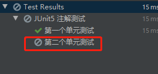

### JUnit

#### JUnit4

JUnit4是Spring，Spring、Spring Boot早期经常使用的单元测试框架


#### JUnit5

Spring Boot 2.2.0 版本开始引入 JUnit 5 作为单元测试默认库

作为最新版本的JUnit框架，JUnit5与之前版本的Junit框架有很大的不同。由三个不同子项目的几个不同模块组成。

JUnit 5 = JUnit Platform + JUnit Jupiter + JUnit Vintage

**JUnit Platform**: Junit Platform是在JVM上启动测试框架的基础，不仅支持Junit自制的测试引擎，其他测试引擎也都可以接入。

**JUnit Jupiter**: JUnit Jupiter提供了JUnit5的新的编程模型，是JUnit5新特性的核心。内部 包含了一个**测试引擎**，用于在Junit Platform上运行。

**JUnit Vintage**: 由于JUint已经发展多年，为了照顾老的项目，JUnit Vintage提供了兼容JUnit4.x,Junit3.x的测试引擎


spring-boot-starter-test参加启动器默认包含了JUnit相关jar包


> 注意：
>
> SpringBoot 2.4 以上版本移除了默认对 Vintage 的依赖。如果需要兼容junit4需要自行引入（不能使用junit4的功能 @Test）
>
> JUnit 5’s Vintage Engine Removed from spring-boot-starter-test,如果需要继续兼容junit4需要自行引入vintage
>
> 
>
> 若要使用则选哟手动导入依赖


#### 使用JUnit

1. 编写测试方法，标注@Test，
   如果使用了@SpringBootTest注解，那么在测试类中可以使用Springle Boot的功能，并且测试时会先启动Spring Boot，如测试类中可以使用Spring自动装配功能

```java
import org.junit.jupiter.api.Test;
import org.springframework.boot.test.context.SpringBootTest;

@SpringBootTest
class SpringBootDemo2ApplicationTests {

    @Test
    void contextLoads() {
    }

}
```

#### 注解实例

##### 1、@DisplayName

```java
@DisplayName("JUnit5 注解测试")
class SpringBootDemo2ApplicationTests {

    @DisplayName("@DisplayName 注解测试")
    @Test
    void contextLoads() {
        System.out.println(1);
    }

}
```


##### 2、@BeforeEach

```java
    // 该方法时在每个单元测试之前执行，不是一个测试单元，不需要@Test
	// 有几个单元测试，就会执行几次
	@BeforeEach
    void testBeforeEach(){
        System.out.println("单元测试开始！！");
    }
```


##### 3、@AfterEach

```java
    @AfterEach
    void testAfterEach(){
        System.out.println("单元测试结束！！");
    }
```


##### 4、@BeforeAll、@AfterAll

```java
// @BeforeAll、@AfterAll必须为静态方法，只在所以单元测试开始或结束时调用一次
	@BeforeAll
    static void testBeforeAll(){
        System.out.println("开始测试！！！");
    }

    @AfterAll
    static void testAfterAll(){
        System.out.println("测试结束！！！");
    }
```


##### 5、@Disabled

标注在测试单元上，标识当前测试单元不被执行

```java
    @Disabled
    @DisplayName("第二个单元测试")
    @Test
    void test2() {
        System.out.println(2);
    }
```




##### 6、@Timeout

```java
    @Timeout(value = 50,unit = TimeUnit.MILLISECONDS)
    @Test
    void testTimeOut() throws InterruptedException {
        Thread.sleep(100);
    }
```


##### 7、@ExtendWith

给JUnit测试引入扩展功能

如@SpringBootTest就使用了@ExtendWith在测试类中引入Spring的功能

```java
@Target(ElementType.TYPE)
@Retention(RetentionPolicy.RUNTIME)
@Documented
@Inherited
@BootstrapWith(SpringBootTestContextBootstrapper.class)
@ExtendWith(SpringExtension.class)
public @interface SpringBootTest
```

##### 8、@RepeatedTest

```java
    // 设置单元测试的重复次数，每次测试都会调用@BeforeEach、@AfterEach标注的方法
	@RepeatedTest(value = 3)
    @Test
    void testRepeatedTest(){
        System.out.println("@RepeatedTest注解测试");
    }
```


#### Assertions

断言机制时测试过程中常用的手段，常常用来测试业务逻辑返回是否正确

断言方法所在位置：package org.junit.jupiter.api.Assertions，所有断言方法都是静态方法

常用的断言方法：


##### 1、简单断言

```java
    // assertEquals判断两个值相等，第一个参数为预期值、第二个参数为实际值
	// 第三个参数为断言错误时希望显示的消息
	// 一个断言出错后，后面代码都不执行
	@DisplayName("第一个单元测试")
    @Test
    void test1() {
        int res = cal(2,3);
        Assertions.assertEquals(6,res,"---------断言1--------");
        System.out.println("===========");
        Assertions.assertEquals(7,res,"---------断言2---------");
    }

    int cal(int a, int b){
        return a+b;
    }
```


##### 2、数组断言

```java
   // 判断两个数组中的元素是否都相等，同样可以传入错误提示
    @DisplayName("数组断言")
    @Test
    void test2(){
        Assertions.assertArrayEquals(new int[]{1,2}, new int[]{3,4},"not same");
    }
```


##### 3、组合断言

```java
    // 一次性执行多个断言，不管前面断言是否出错都会执行完全部断言
	// 若组合断言中有一个不成功，则组合断言后的所有代码不执行
	@DisplayName("组合断言")
    @Test
    void test3(){
        Assertions.assertAll("test all",
                ()-> Assertions.assertEquals(4,3,"one"),
                ()-> Assertions.assertEquals(5,3, "two"));
    }
```


##### 4、异常断言

```java
// 断言方法执行过程一定会出现某种异常
@DisplayName("异常断言")
@Test
void test4(){
    Assertions.assertThrows(ArithmeticException.class, ()->{int a = 1/0;},"no Exception");
}
```


##### 5、超时断言

```java
// 断言方法运行时间不超时
// 使用参数使用Duration类的方法传入
@DisplayName("超时断言")
@Test
void test5(){
    Assertions.assertTimeout(Duration.ofMillis(500),()->{Thread.sleep(600);},"超时");
}
```


##### 6、快速断言

```java
// 可以在一些简单的条件判断不通过时直接决定测试失败
@DisplayName("快速失败断言")
@Test
void test6(){
    if (true){
        Assertions.fail("失败");
    }
}
```


#### Assumptions

用来判断前置条件是否满足，`若不满足则单元测试退出，不会算作失败的单元测试，会算作作废的单元测试`

所在包：package org.junit.jupiter.api.Assumptions，其中方法也全都是静态方法

```java
    @DisplayName("Assumptions测试")
    @Test
    void test7(){
        Assumptions.assumeTrue(false,"前置条件不满足");
    }
}
```


#### 嵌套测试

定义内置类，标注@Nested注解，表示嵌套测试

注意点：

1. 外层单元测试不能驱动内层单元测试的@BeforeEach、@BeforeAll等方法
2. 内层单元测试可以驱动外层单元测试的@BeforeEach、@BeforeAll等方法

```java
@DisplayName("A stack")
class TestingAStackDemo {

    Stack<Object> stack;

    @Test
    @DisplayName("is instantiated with new Stack()")
    void isInstantiatedWithNew() {
        new Stack<>();
    }

    @Nested
    @DisplayName("when new")
    class WhenNew {

        @BeforeEach
        void createNewStack() {
            stack = new Stack<>();
        }

        @Test
        @DisplayName("is empty")
        void isEmpty() {
            assertTrue(stack.isEmpty());
        }

        @Test
        @DisplayName("throws EmptyStackException when popped")
        void throwsExceptionWhenPopped() {
            assertThrows(EmptyStackException.class, stack::pop);
        }

        @Test
        @DisplayName("throws EmptyStackException when peeked")
        void throwsExceptionWhenPeeked() {
            assertThrows(EmptyStackException.class, stack::peek);
        }

        @Nested
        @DisplayName("after pushing an element")
        class AfterPushing {

            String anElement = "an element";

            @BeforeEach
            void pushAnElement() {
                stack.push(anElement);
            }

            @Test
            @DisplayName("it is no longer empty")
            void isNotEmpty() {
                assertFalse(stack.isEmpty());
            }

            @Test
            @DisplayName("returns the element when popped and is empty")
            void returnElementWhenPopped() {
                assertEquals(anElement, stack.pop());
                assertTrue(stack.isEmpty());
            }

            @Test
            @DisplayName("returns the element when peeked but remains not empty")
            void returnElementWhenPeeked() {
                assertEquals(anElement, stack.peek());
                assertFalse(stack.isEmpty());
            }
        }
    }
}
```


#### 参数化测试

参数化测试是JUnit5很重要的一个新特性，它使得用不同的参数多次运行测试成为了可能，也为我们的单元测试带来许多便利。


使用@ParameterizedTest标记参数化测试的方法

利用**@ValueSource**等注解，指定入参，我们将可以使用不同的参数进行多次单元测试，而不需要每新增一个参数就新增一个单元测试，省去了很多冗余代码。


**@ValueSource**: 为参数化测试指定入参来源，支持八大基础类以及String类型,Class类型

**@NullSource**: 表示为参数化测试提供一个null的入参

**@EnumSource**: 表示为参数化测试提供一个枚举入参

**@CsvFileSource**：表示读取指定CSV文件内容作为参数化测试入参

**@MethodSource**：表示读取指定方法的返回值作为参数化测试入参(注意方法返回需要是一个流)


##### @ValueSource方式

```java
    @DisplayName("参数化测试")
    @ParameterizedTest
    @ValueSource(ints = {1,2,3,4,5})
    void test1(int i){
        System.out.println(i);
    }
```


##### @MethodSource方式

```java
// 要求提供参数源的方法返回值必须时Stream类型，且是静态方法

@DisplayName("@MethodSource 方式")
@ParameterizedTest
@MethodSource("method1")
void test2(String s){
    System.out.println(s);
}

static Stream<String> method1(){
    return Stream.of("apple", "banana");
}
```

