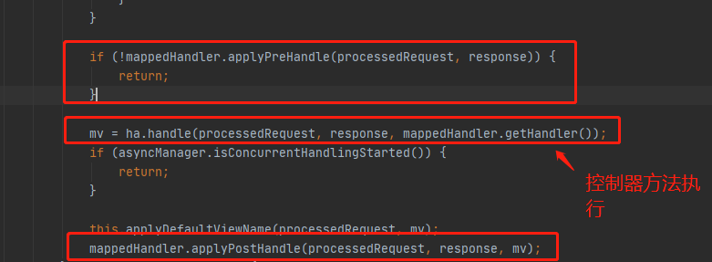
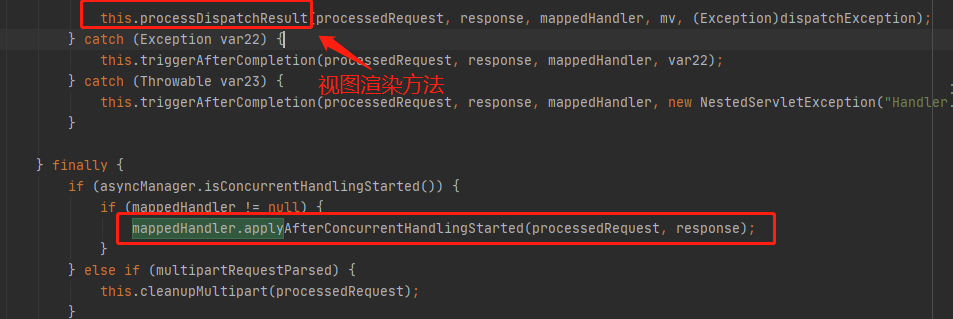
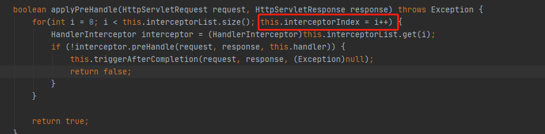
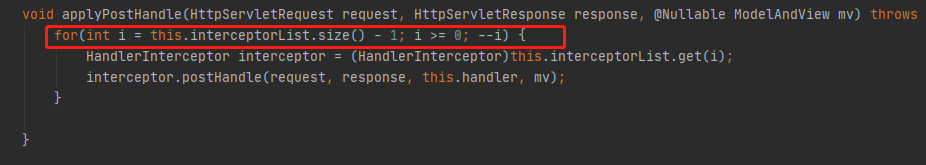
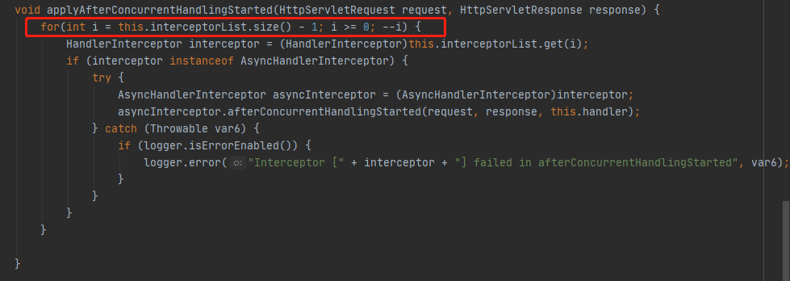
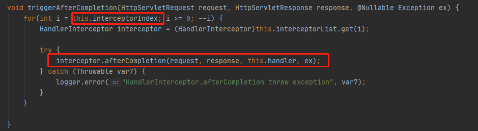

### 拦截器（Interceptor）

> 过滤器执行位置
>
> filter——>DispatcherServlet——>contoller方法
>
> 拦截器执行位置
>
> filter——>DispatcherServlet——>Interceptor——>contoller方法——>Interceptor
>
> （拦截器是围绕着控制器执行）

#### 1、拦截器的配置

> SpringMVC中的拦截器用于拦截控制器方法的执行
>
> SpringMVC中的拦截器需要实现HandlerInterceptor接口
>
> SpringMVC的拦截器必须在SpringMVC的配置文件中进行配置：
>
> 有3中配置方法
>
> 1. 通过bean标签配置
> 2. 通过ref标签配置
> 3. 通过\<mvc:interceptor>标签配置
>
> ```xml
>     <mvc:interceptors>
>         <bean class="com.atguigu.interceptor.FirstInterceptor"/>
>         <ref bean="firstInterceptor"/>
>         <!-- 以上两种配置方式都是对DispatcherServlet所处理的所有的请求进行拦截 -->
>         <mvc:interceptor>
>    <!-- 这里配置拦截所有要两个星号，一个星号只能拦截一层目录与过滤器的拦截配置不同-->
>             <mvc:mapping path="/**"/>
>             <mvc:exclude-mapping path="/testRequestEntity"/>
>             <ref bean="firstInterceptor"/>
>         </mvc:interceptor>
>         <!-- 
>             以上配置方式可以通过ref或bean标签设置拦截器，通过mvc:mapping设置需要拦截的请求，通过mvc:exclude-mapping设置需要排除的请求，即不需要拦截的请求
>         -->
>     </mvc:interceptors>
> ```
>
> 拦截器
>
> ```java
> package com.zlp.rest.interceptors;
> 
> import org.springframework.web.servlet.HandlerInterceptor;
> import org.springframework.web.servlet.ModelAndView;
> 
> import javax.servlet.http.HttpServletRequest;
> import javax.servlet.http.HttpServletResponse;
> 
> public class FirstInterceptor extends HandlerInterceptor {
>     @Override
>     public boolean preHandle(HttpServletRequest request, HttpServletResponse response, Object handler) throws Exception {
>         return false;
>     }
> 
>     @Override
>     public void postHandle(HttpServletRequest request, HttpServletResponse response, Object handler, ModelAndView modelAndView) throws Exception {
> 
>     }
> 
>     @Override
>     public void afterCompletion(HttpServletRequest request, HttpServletResponse response, Object handler, Exception ex) throws Exception {
> 
>     }
> }
> 
> ```
>
> 

#### 2、拦截器的三个抽象方法

> SpringMVC中的拦截器有三个抽象方法：
>
> preHandle：控制器方法执行之前执行preHandle()，其boolean类型的返回值表示是否拦截或放行，返回true为放行，即调用控制器方法；返回false表示拦截，即不调用控制器方法
>
> postHandle：控制器方法执行之后，视图渲染之前，执行postHandle()
>
> afterComplation：处理完视图和模型数据，渲染视图完毕之后执行afterComplation()
>
> （这三个方法执行顺序在DispatcherServlet源码中体现）
>
> 
>
> 

#### 3、多个拦截器的执行顺序

##### preHandle()按照配置顺序执行

> 

##### postHandle()按照配置顺序逆序执行

> 

##### afterComplation()按照配置顺序逆序执行

> 

##### preHandle()结果为false时执行顺序

> 由下图可知DispatchServlet之后的代码全都不执行，所以所有postHandle()不会执行
>
> 
>
> 由preHandle方法源码可知，遍历拦截器preHandle时若有一个为false则执行triggerAfterCompletion方法，然后在返回false
>
> 
>
> triggerAfterCompletion方法，由下图可知triggerAfterCompletion方法实际执行的就是afterComplation()方法，并且在触发false之前的afterComplation()都会被执行
>
> 

##### 总结

> a>若每个拦截器的preHandle()都返回true
>
> 此时多个拦截器的执行顺序和拦截器在SpringMVC的配置文件的配置顺序有关：
>
> preHandle()会按照配置的顺序执行，而postHandle()和afterComplation()会按照配置的反序执行
>
> b>若某个拦截器的preHandle()返回了false
>
> preHandle()返回false和它之前的拦截器的preHandle()都会执行，postHandle()都不执行，返回false的拦截器之前的拦截器的afterComplation()会执行