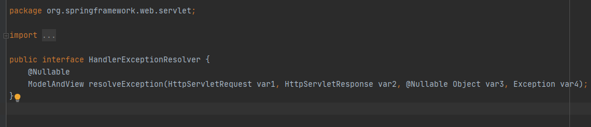
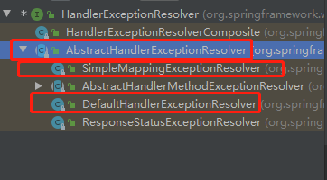
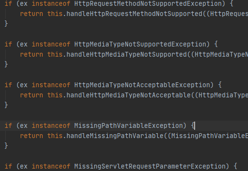

### 异常处理器

> SpringMVC提供了一个处理控制器方法执行过程中所出现的异常的接口：HandlerExceptionResolver是一个顶层接口
>
> 
>
> 
>
> DefaultHandlerExceptionResolver：处理SpringMVC控制器中会发生的大部分异常，若出现异常则返回一个ModelAndView对象，`使得该请求会返回一个内置的异常视图`
> 
>
> SimpleMappingExceptionResolver：用来处理控制器中发生的`自定义异常`，下面介绍这个类的使用

#### 1、基于配置的异常处理

> ```xml
> <!-- 创建对象，返回一个ModelAndView对象 -->
> <bean class="org.springframework.web.servlet.handler.SimpleMappingExceptionResolver">
>     
>     <!--exceptionMappings属性是一个Map类型-->
>     <property name="exceptionMappings">
>         
>         <!-- props属性设置Map对象 -->
>         <props>
>             
>             <!-- prop是一个键值对 -->
>             <!-- key表示处理的异常，必须是异常的全路径名
> 				value表示响应的视图名，该视图名和控制器返回值一样不加前缀有配置的视图解析器解析，
> 				若加了前缀则不由配置的视图解析器解析 -->
>             <prop key="java.lang.ArithmeticException">error</prop>
>         </props>
>     </property> 
>     
>     <!-- exceptionAttribute属性将异常信息共享到request域中，value的值为视图中的索引名 -->
>     <property name="exceptionAttribute" value="ex"></property>
> </bean>
> ```

#### 2、基于注解的异常处理

> ```java
> //@ControllerAdvice将当前类标识为异常处理的组件
> @ControllerAdvice
> public class ExceptionController {
> 
>     //@ExceptionHandler用于设置所标识方法处理的异常，注解可以接受多个异常对象以数组形式
>     @ExceptionHandler(ArithmeticException.class)
>     //ex表示当前请求处理中出现的异常对象接受异常对象，Model用来向共享域传递信息
>     public String handleArithmeticException(Exception ex, Model model){
>         model.addAttribute("ex", ex);
>         return "error";
>     }
> 
> }
> ```

