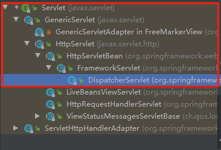
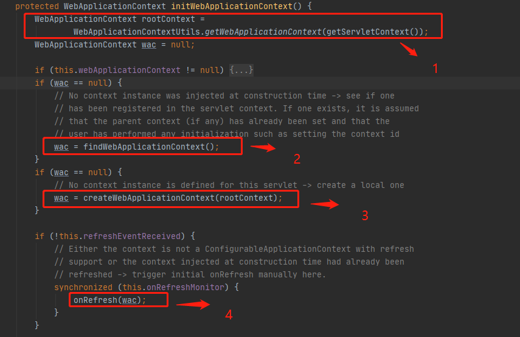
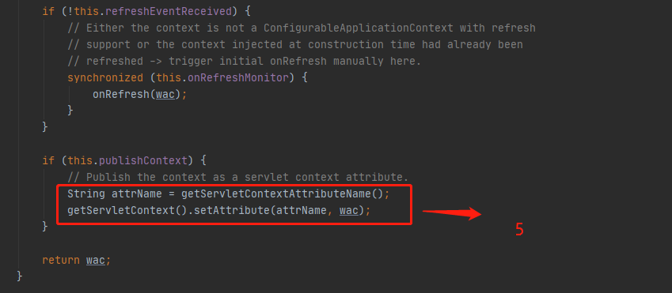
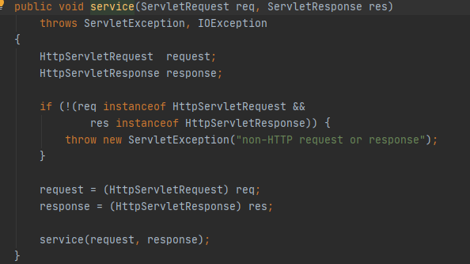
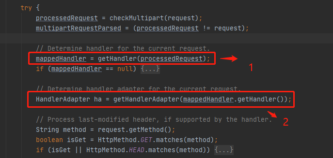

### Spring执行流程

#### 1、Spring常用组件

> - DispatcherServlet：**前端控制器**，不需要工程师开发，由框架提供
>
> 作用：统一处理请求和响应，整个流程控制的中心，由它调用其它组件处理用户的请求
>
> - HandlerMapping：**处理器映射器**，不需要工程师开发，由框架提供
>
> 作用：根据请求的url、method等信息查找Handler，即控制器方法
>
> - Handler：**处理器**，需要工程师开发
>
> 作用：在DispatcherServlet的控制下Handler对具体的用户请求进行处理
>
> - HandlerAdapter：**处理器适配器**，不需要工程师开发，由框架提供
>
> 作用：通过HandlerAdapter对处理器（控制器方法）进行执行
>
> - ViewResolver：**视图解析器**，不需要工程师开发，由框架提供
>
> 作用：进行视图解析，得到相应的视图，例如：ThymeleafView、InternalResourceView、RedirectView
>
> - View：**视图**
>
> 作用：将模型数据通过页面展示给用户

#### 2、DispatcherServlet初始化过程

> DispatcherServlet 本质上是一个 Servlet，所以天然的遵循 Servlet 的生命周期。所以宏观上是 Servlet 生命周期来进行调度。

##### 1)观察DispatcherServlet类的继承

> 

##### 2)观察父类初始化方法

> 

##### 3)WebApplicationContext方法

> 所在类：org.springframework.web.servlet.FrameworkServlet
>
> 
>
> 
>
> 1. 尝试获取根上下文
>    WebApplicationContextUtils.getWebApplicationContext(getServletContext());方法就是SpringIOC容器，`尝试获取xml配置文件`
> 2. 尝试直接获取web应用上下文（初始化时并没有创建所以为空）
> 3. 通过根配置文件创建应用上下文
> 4. 执行刷新（初始化组件过程）
> 5. 将创建的web应用上下文在Application域中共享

###### createWebApplicationContext方法

> 所在类：org.springframework.web.servlet.FrameworkServlet
>
> 

###### onRefresh方法

> 所在类：org.springframework.web.servlet.FrameworkServlet
>
> 
>
> DispatcherServlet中的实现
>
> 

###### initStrategies方法

> 所在类：org.springframework.web.servlet.DispatcherServlet
>
> FrameworkServlet创建WebApplicationContext后，刷新容器，调用onRefresh(wac)，此方法在DispatcherServlet中进行了重写，调用了initStrategies(context)方法，初始化策略，即初始化DispatcherServlet的各个组件
>
> ```java
> 	protected void initStrategies(ApplicationContext context) {
> 		initMultipartResolver(context);// 初始化文件上传组件
> 		initLocaleResolver(context);
> 		initThemeResolver(context);
> 		initHandlerMappings(context);// 初始化控制器映射组件
> 		initHandlerAdapters(context);// 初始化控制器调用组件
> 		initHandlerExceptionResolvers(context);// 初始化异常处理组件
> 		initRequestToViewNameTranslator(context);// 初始化视图名解析
> 		initViewResolvers(context);// 初始化视图解析组件
> 		initFlashMapManager(context);
> 	}
> ```
>

#### 3、DispatcherServlet服务过程

> DispatcherServlet本质上是一个Servlet，他的服务过程应该遵循servlet的服务过程
>
> 查看DispatcherServlet父类中的service()方法

##### Setvlet接口

> 所在类：javax.servlet.Setvlet（接口）
>
> 

##### GenericServlet类

> 所在类：javax.servlet.GenericServlet（继承Servlet接口）
>
> 

##### HttpServlet类

> **所在类：javax.servlet.http.HttpServlet**（继承GenericServlet，`实现servlet方法`）
>
> `传统的Java Web基于这个类实现`
>
> 重写了servlet方法对ServletRequest、ServletResponse类进行向下转型
>
> 
>
> 重载的service方法根据对应的请求方式调用对应的处理方法
>
> （传统的java Web实现就是继承HttpServlet类重写doGet、doPost方法处理请求）
>
> 

##### FrameworkServlet类

> 所在类：org.springframework.web.servlet.FrameworkServlet（SpringMVC框架的开始）
>
> Spring框架继承HttpServlet并对其中的方法进行重写实现了MVC模块
>
> 重写service方法
>
> 
>
> 重写doGet方法
>
> 
>
> 重写doPost方法
>
> 
>
> 重写doPut方法
>
> 
>
> 重写doDelete方法
>
> 
>
> 分析上述代码
>
> service方法中对请求方式进行了判断，若为空或PATCH方式则调用processRequest方法
>
> 若不为空则调用父类的service方法，而父类HttpServlet的service方法就是根据请求调用对应的do...方法，即调用该类中重写的do...方法，而do...方法都是调用processRequest方法
>
> **总结：FrameworkServlet使用processRequest方法处理所有请求**
>
> processRequest方法，调用doService方法处理请求
>
> 
>
> doService方法（由DispatcherServlet类具体实现）
>
> 

##### DispatcherServlet类

> 所在类：org.springframework.web.servlet.DispatcherServlet（继承FrameworkServlet）
>
> DispatcherServlet类重写doService方法
>
> doService方法使用doDispatch方法处理请求，**doDispatch方法就是处理请求的具体过程所在**
>
> 

##### 总结

> Httpservlet类实现了service抽象方法，`是传统java web处理请求时的使用类`
>
> FrameworkServlet类重写了Httpservlet类中的service方法，将请求的处理包揽，`是SpringMVC框架的开始`，并定义了doService方法由子类决定处理请求的具体过程
>
> DispatcherServlet类实现了实现了FrameworkServlet类中的doService方法，是`决定如何处理请求的最终类`，其中`请求的处理过程由doDispatch方法`实现。

#### 4、DispatcherServlet调用组件处理请求（doDispatch方法）

##### 1、创建处理执行链

> 调用控制器映射组件，获取请求对应的`处理方法`，`拦截器`
>
> mappedHandler对象中有3个对象：处理器方法、拦截器列表、拦截器索引
>
> 

##### 2、获取适配器对象

> 适配器用来`调用处理方法`处理请求
>
> 

##### 3、执行拦截器（PreHandle方法）

> 

##### 4、适配器对象调用处理方法

> 适配器对象调用处理方法处理函数，**这个过程中适配器将对处理方法的形参进行赋值**
>
> `返回ModelAndView对象`
>
> 

##### 5、执行拦截器方法（PostHandle）

> 

##### 6、处理控制器方法返回的结果

> 该过程中会
>
> 1、`调用异常处理组件`对处理器中发生的异常进行处理，返回异常视图
>
> 2、`调用视图解析器`渲染视图（render方法）
>
> 

##### 7、调用拦截器（After方法）

> 

#### 5、SpringMVC的执行流程

> 1) 用户向服务器发送请求，请求被SpringMVC 前端控制器 DispatcherServlet捕获。
>
> 2) DispatcherServlet对请求URL进行解析，得到请求资源标识符（URI），判断请求URI对应的映射：
>
> a) 不存在
>
> i. 再判断是否配置了mvc:default-servlet-handler
>
> ii. 如果没配置，则控制台报映射查找不到，客户端展示404错误
>
> 
>
> 
>
> iii. 如果有配置，则访问目标资源（一般为静态资源，如：JS,CSS,HTML），找不到客户端也会展示404错误
>
> 
>
> 
>
> b) 存在则执行下面的流程
>
> 3) 根据该URI，调用HandlerMapping获得该Handler配置的所有相关的对象（包括Handler对象以及Handler对象对应的拦截器），最后以HandlerExecutionChain执行链对象的形式返回。
>
> 4) DispatcherServlet 根据获得的Handler，选择一个合适的HandlerAdapter。
>
> 5) 如果成功获得HandlerAdapter，此时将开始执行拦截器的preHandler(…)方法【正向】
>
> 6) 提取Request中的模型数据，填充Handler入参，开始执行Handler（Controller)方法，处理请求。在填充Handler的入参过程中，根据你的配置，Spring将帮你做一些额外的工作：
>
> a) HttpMessageConveter： 将请求消息（如Json、xml等数据）转换成一个对象，将对象转换为指定的响应信息
>
> b) 数据转换：对请求消息进行数据转换。如String转换成Integer、Double等
>
> c) 数据格式化：对请求消息进行数据格式化。 如将字符串转换成格式化数字或格式化日期等
>
> d) 数据验证： 验证数据的有效性（长度、格式等），验证结果存储到BindingResult或Error中
>
> 7) Handler执行完成后，向DispatcherServlet 返回一个ModelAndView对象。
>
> 8) 此时将开始执行拦截器的postHandle(...)方法【逆向】。
>
> 9) 根据返回的ModelAndView（此时会判断是否存在异常：如果存在异常，则执行HandlerExceptionResolver进行异常处理）选择一个适合的ViewResolver进行视图解析，根据Model和View，来渲染视图。
>
> 10) 渲染视图完毕执行拦截器的afterCompletion(…)方法【逆向】。
>
> 11) 将渲染结果返回给客户端。

