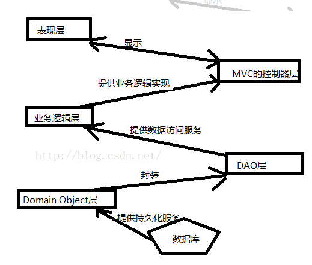
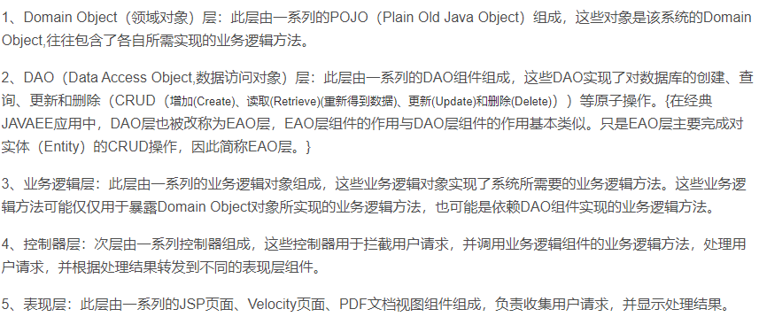
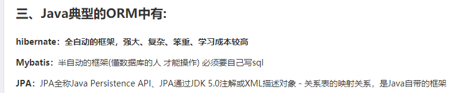
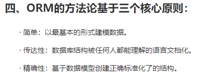

### Spring MVC简介

#### 一、什么是MVC

> MVC是一种设计思想，将项目按功能职责分为模型、视图、控制器
>
> **Model：**模型，是指与数据库交互的模块在java中一般指Bean类
>
> **View：**视图，展示与客户端的内容页面（jsp页面、html页面等）
>
> **Controller：**控制器，是核心模块接受用户请求，调用模型与数据库交互，并返回对应的视图响应给客户端，一般是java中的Servlet类

#### 二、什么是Spring MVC

> Spring MVC是Spring的一个子项目
>
> SPringMVC为表现层开发提供一套完整的解决方案
>
> 表现层表示**前台页面**和后台**Servlet**

#### 三、Spring MVC的特点

> 1. Spring家族的原生产品，与Spring基础IOC等基础设施完美对接
> 2. 基于**原生Servlet封装**，实现强大的前端控制器DispatcherServlet方便的进行统一处理
> 3. 容易解决表现层各种疑难问题
> 4. 代码量少，清新干净
> 5. 内部组件化程度高，即插即用
> 6. 性能卓越，满足于市面上大部分需求

#### 四、JavaEE分层模型

> JavaEE将应用分为以下5层
>
> 
>
> 

> Java中的Bean可以分为两种
>
> 实体Bean：用来映射数据库表结构，依此java可以将对数据库表的操作，转移为对对象的操作（也就是ORM技术）
>
> 业务处理Bean：指Service、Dao层的Bean，一般用来完成增删改查等数据库操作

#### 五、ORM

> **ORM：**（Object Relational Mapping）对象关系映射，对象代表面向对象编程语言中的对象，关系代表关系型数据库中的关系也就是数据表，M表示映射。
>
> **ORM的作用：**方便数据库数据到面向对象语言数据类型之间的转换，将对象实体属性与数据表字段进行映射。
>
> **Mapping：**在java中这个映射使用元数据（XML）来描述，这样做的好处是，方便各种中间件的接入都能很好的进行Dao层和数据库之间的交互。
>
> **ORM中间件：**
> 
> **ORM核心原则**：
> 
>
> 参考：https://www.cnblogs.com/weibanggang/p/10167006.html