### 简单实例

#### 1、开发环境

> IDE：idea 2020.1.2
>
> 构建工具：maven3.5.4
>
> 服务器：tomcat9
>
> Spring版本：5.3.7

#### 2、IDEA创建项目

> 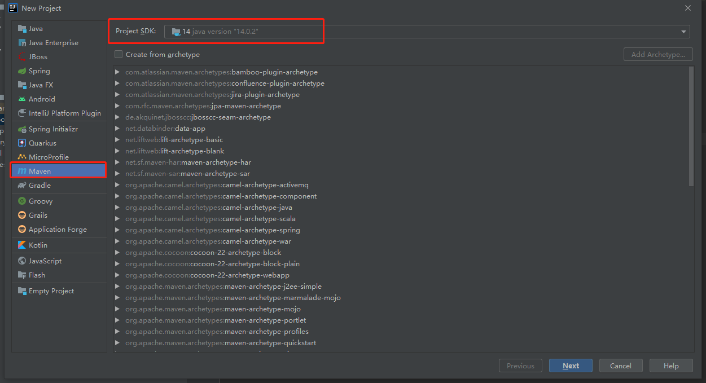
>
> 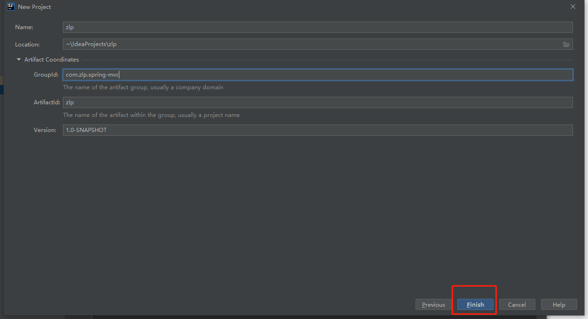

#### 3、引入依赖

> 在pom.xml中配置依赖
>
> 1. spring-mvc
> 2. 日志库
> 3. servlet（Tomcat内置）
> 4. 视图解析库依赖（前后端不分离）
>
> ```xml
>     <dependencies>
>         <!--引入spring-mvc-->
>         <dependency>
>             <groupId>org.springframework</groupId>
>             <artifactId>spring-webmvc</artifactId>
>             <version>5.3.7</version>
>         </dependency>
> 
>         <!--引入日志依赖-->
>         <dependency>
>             <groupId>ch.qos.logback</groupId>
>             <artifactId>logback-classic</artifactId>
>             <version>1.2.5</version>
>         </dependency>
> 
>         <!--引入servlet依赖-->
>         <dependency>
>             <groupId>javax.servlet</groupId>
>             <artifactId>javax.servlet-api</artifactId>
>             <version>3.1.0</version>
>             <scope>provided</scope>
>         </dependency>
> 
>         <!--引入视图模板依赖-->
>         <dependency>
>             <groupId>org.thymeleaf</groupId>
>             <artifactId>thymeleaf-spring5</artifactId>
>             <version>3.0.12.RELEASE</version>
>         </dependency>
>     </dependencies>
> ```

#### 4、创建应用，配置web.xml

> 注册前端控制器（servlet）
>
> 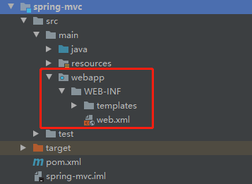
>
> 传统的web.xml配置
>
> 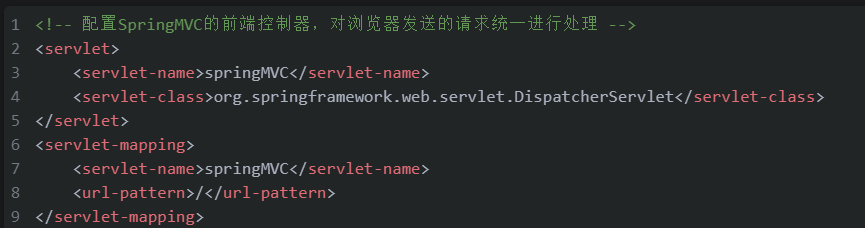
>
> 使用Spring时对象由Spring创建需要手动配置xml配置文件路径，使用`init-param`标签配置
>
> ```XML
> <servlet>
>         <servlet-name>springMVC</servlet-name>
>         <servlet-class>org.springframework.web.servlet.DispatcherServlet</servlet-class>
> 
>         <!--从xml配置文件中获取servlet，配置xml所在路径和名称-->
>         <init-param>
>             <param-name>contextConfigLocation</param-name>
>             <!-- classpath表示路径，springMVC表示名称-->
>             <param-value>classpath:springMVC.xml</param-value>
>         </init-param>
> 
>         <!-- 将该servlet初始化在服务器启动时 -->
>         <load-on-startup>1</load-on-startup>
>     </servlet>
>     <servlet-mapping>
>         <servlet-name>springMVC</servlet-name>
>         <!--拦截所有请求，除了.jsp请求，因为jsp本质上就是一个servlet不需要在前端控制器中去分配servlet-->
>         <url-pattern>/</url-pattern>
>     </servlet-mapping>
> ```

#### 5、使用xml配置文件创建对象

> springMVC.xml的配置
>
> 1. 创建控制器对象
> 2. 创建视图解析对象
>
> 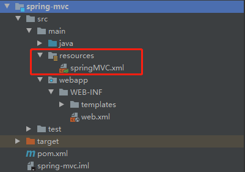
>
> ```xml
>  <!--开启组件扫描-->
> <context:component-scan base-package="com.zlp">
>     </context:component-scan>
> 
>     <!--配置thymeleaf解析类-->
>     <bean id="zlp" class="org.thymeleaf.spring5.view.ThymeleafViewResolver">
>         <!--解析类优先级-->
>         <property name="order" value="1"/>
>         <property name="characterEncoding" value="utf-8"/>
>         <property name="templateEngine">
>             <!--内部bean 解析引擎-->
>             <bean class="org.thymeleaf.spring5.SpringTemplateEngine">
>                 <property name="templateResolver">
>                     <!--内部bean 解析资源-->
>                     <bean class="org.thymeleaf.spring5.templateresolver.SpringResourceTemplateResolver">
>                         <!--资源路径前缀-->
>                         <property name="prefix" value="/WEB-INF/templates/" />
>                         <!--资源路径后缀-->
>                         <property name="suffix" value=".html" />
>                         <property name="templateMode" value="HTML5" />
>                         <property name="characterEncoding" value="utf-8" />
>                     </bean>
>                 </property>
>             </bean>
>         </property>
>     </bean>
> ```

#### 6、控制器对象

> 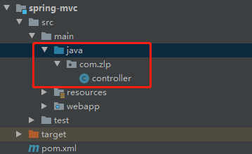
>
> ```JAVA
> package com.zlp;
> 
> import org.springframework.stereotype.Controller;
> import org.springframework.web.bind.annotation.RequestMapping;
> 
> @Controller
> public class controller {
> 
>     @RequestMapping(value = "/")
>     public String index(){
>         return "index";
>     }
> }
> 
> ```

#### 7、创建视图

> 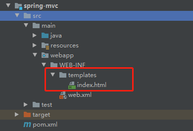
>
> ```HTML
> <!DOCTYPE html>
> <html lang="en">
> <head>
>     <meta charset="UTF-8">
>     <title>Title</title>
> </head>
> <body>
> <p>ZLP</p>
> </body>
> </html>
> ```

#### 8、配置Tomcat

> 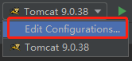
>
> 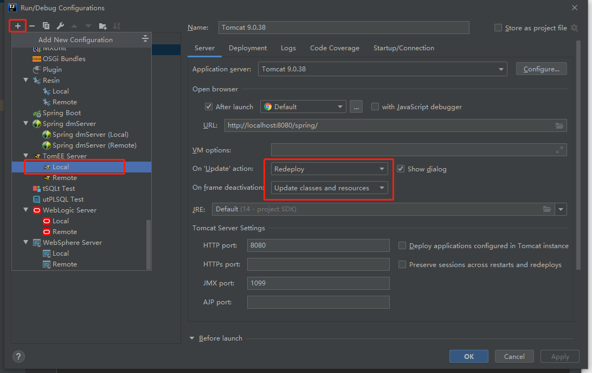
>
> 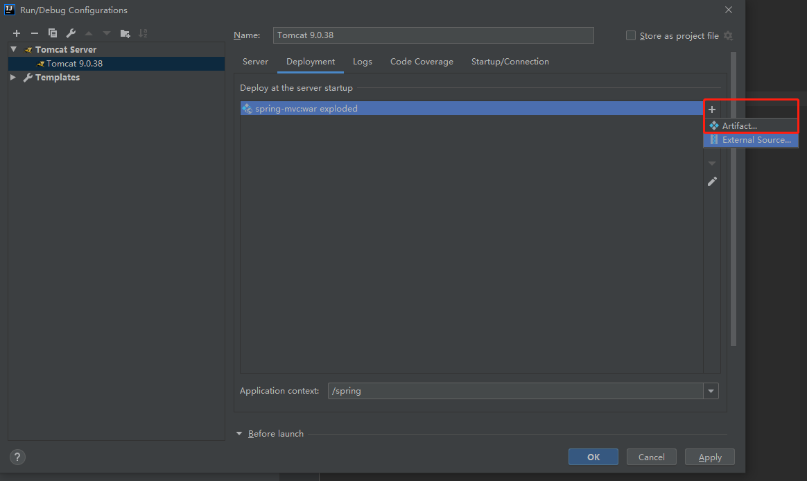

#### 9、预览效果

> 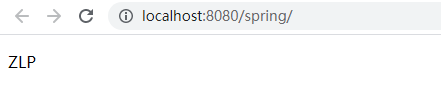