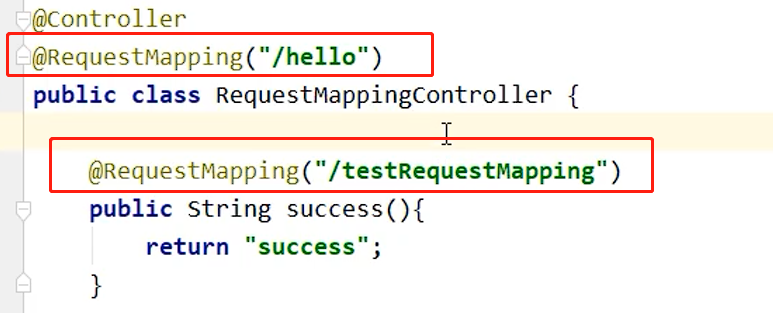
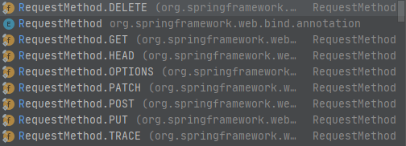

### @RequestMapping注解

#### 0、@RequestMapping注解的功能

> 作用就是将请求和处理请求的控制器方法关联起来，建立映射关系。

#### 1、@RequestMapping注解作用的位置

> 1. 作用在类上：相当于路由分发，将一组路由交给一个类，前端控制器不需要知道内部分发细节
> 2. 作用在方法上：url映射的最终点，是真正的处理代码
>
> 如：访问/hello路径下的路由由当前控制类管理，/hello/testRequestMapping
>
> 

#### 2、@RequestMapping注解value属性

> value属性：根据请求地址匹配处理方法
>
> value可以接受一个数组，数组中的任意一个映射匹配到请求就会进行对应方法处理
>
> @RequestMapping：默认将值赋给value属性，value属性必须配置
>
> ```JAVA
> @RequestMapping(
> 	value={"/xxx", "/yyy"}
> )
> @RequestMapping(value="/ccc")
> ```

#### 3、@RequestMapping注解method属性

> method属性：根据HTTP请求类型匹配（GET，POST。。。）
>
> 
>
> 下面设置要求请求**同时满足两个条件**才会匹配到index方法
>
> ```java
>     @RequestMapping(value = "/", method = RequestMethod.POST)
>     public String index(){
>         return "index";
>     }
> ```

> 注：
>
> 1、对于处理指定请求方式的控制器方法，SpringMVC中提供了@RequestMapping的派生注解
>
> 处理get请求的映射-->@GetMapping
>
> 处理post请求的映射-->@PostMapping
>
> 处理put请求的映射-->@PutMapping
>
> 处理delete请求的映射-->@DeleteMapping
>
> 2、常用的请求方式有get，post，put，delete
>
> **但是目前浏览器只支持get和post**，若在form表单提交时，为method设置了其他请求方式的字符串（put或delete），则按照默认的请求方式get处理
>
> 若要发送put和delete请求，则需要通过spring提供的过滤器HiddenHttpMethodFilter，在RESTful部分会讲到
>
> ```java
>     @GetMapping("/")
>     public String index(){
>         return "index";
>     }
> ```

#### 4、@RequestMapping注解params属性

> params属性：通过请求参数匹配处理方法
>
> params属性是一个字符串类型的数组，可以通过四种表达式设置请求参数和请求映射的匹配关系
>
> "param"：要求请求映射所匹配的请求必须携带param请求参数
>
> "!param"：要求请求映射所匹配的请求必须不能携带param请求参数
>
> "param=value"：要求请求映射所匹配的请求必须携带param请求参数且param=value
>
> "param!=value"：要求请求映射所匹配的请求必须携带param请求参数但是param!=value
>
> ```JAVA
> @RequestMapping(
>         value = {"/testRequestMapping", "/test"}
>         ,method = {RequestMethod.GET, RequestMethod.POST}
>         ,params = {"username","password!=123456"}
> )
> public String testRequestMapping(){
>     return "success";
> }
> ```

> 注：
>
> 若当前请求满足@RequestMapping注解的value和method属性，但是不满足params属性，此时页面回报错400：Parameter conditions "username, password!=123456" not met for actual request parameters: username={admin}, password={123456}

#### 5、@RequestMapping注解header属性

> header属性：通过请求头匹配方法
>
> headers属性是一个字符串类型的数组，可以通过四种表达式设置请求头信息和请求映射的匹配关系
>
> "header"：要求请求映射所匹配的请求必须携带header请求头信息
>
> "!header"：要求请求映射所匹配的请求必须不能携带header请求头信息
>
> "header=value"：要求请求映射所匹配的请求必须携带header请求头信息且header=value
>
> "header!=value"：要求请求映射所匹配的请求必须携带header请求头信息且header!=value

> 若当前请求满足@RequestMapping注解的value和method属性，但是不满足headers属性，此时页面显示404错误，即资源未找到

#### 6、SpringMVC支持ant风格路径

> SpringMVC支持模糊的路径表达式映射方法
>
> ？：表示任意的单个字符
>
> *：表示任意的0个或多个字符
>
> \**：表示任意的一层或多层目录
>
> 注意：在使用\**时，只能使用/**/xxx的方式

#### 7、SpringMVC使用路径占位符获取url中的信息

> Spring使用`{}`获取url中的信息，通过@PathVariable注解使用该信息
>
> ```JAVA
> @RequestMapping("/testRest/{id}/{username}")
> public String testRest(@PathVariable("id") String id, @PathVariable("username") String username){
>     System.out.println("id:"+id+",username:"+username);
>     return "success";
> }
> ```

> SpringMVC中经常使用**RESTful风格**的url表示带参数的GET请求
>
> 原始方式：/deleteUser?id=1
>
> rest方式：/deleteUser/1