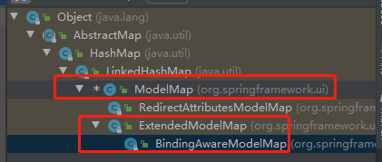
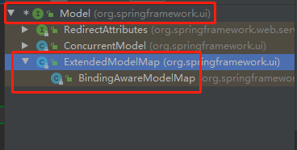

### 向域对象共享数据

> 域对象：request、session、application（作用范围依次增加）
>
> request：作用于一次请求，页面刷新失效
>
> session：作用于一次会话，客户端浏览器被关闭时失效，30分钟没有访问失效
>
> application：作用于webapp，服务器关闭时失效
>
> （域对象相当于一个共享的数据空间，可以在多个方法中被使用，避免了参数传递的繁琐）

#### 1、使用ServletAPI向request域共享数据

> 实参由前端控制器传递
>
> ```JAVA
> @RequestMapping("/testServletAPI")
> public String testServletAPI(HttpServletRequest request){
>     request.setAttribute("testScope", "hello,servletAPI");
>     return "success";
> }
> ```

#### 2、使用Model向request域共享数据

> ```java
> @RequestMapping("/testModel")
> public String testModel(Model model){
>     model.addAttribute("testScope", "hello,Model");
>     return "success";
> }
> ```

#### 3、使用Map向request域共享数据

> ```JAVA
> @RequestMapping("/testMap")
> public String testMap(Map<String, Object> map){
>     map.put("testScope", "hello,Map");
>     return "success";
> }
> ```

#### 4、使用ModelMap向request域共享数据

> ```JAVA
> @RequestMapping("/testModelMap")
> public String testModelMap(ModelMap modelMap){
>     modelMap.addAttribute("testScope", "hello,ModelMap");
>     return "success";
> }
> ```

#### 5、Model、Map、ModelMap之间的关系

> 三者有共同的子类`BindingAwareModelMap`，上述3个示例中的实参都是这个类的实例，由前端控制器传递
>
> ```java
> public interface Model：package org.springframework.ui包中顶层接口
> Map:jdk提供标准库
> public class ModelMap extends LinkedHashMap<String, Object>：继承LinkedHashMap具有Map功能
> 
> public class ExtendedModelMap extends ModelMap implements Model：连接Model和ModelMap两个
> public class BindingAwareModelMap extends ExtendedModelMap：最终实现类
> ```
>
> 
> 
>
> 

#### 6、使用ModelAndView向request域共享数据

> ```java
> @RequestMapping("/testModelAndView")
> public ModelAndView testModelAndView(){
>     /**
>      * ModelAndView有Model和View的功能
>      * Model主要用于向请求域共享数据
>      * View主要用于设置视图，实现页面跳转
>      */
>     ModelAndView mav = new ModelAndView();
>     //向请求域共享数据
>     mav.addObject("testScope", "hello,ModelAndView");
>     //设置视图，实现页面跳转
>     mav.setViewName("success");
>     return mav;
> }
> ```
>
> 这个例子中控制器返回值是一个ModelAndView对象不是视图名。
>
> 可以这样做的原因是SpringMVC的前端控制器的实现中调用请求对应的处理方法后，会将返回的视图名封装成一个ModelAndView对象，所有这里提前将ModelAndView实例化并返回并不会发生错误
> ModelAndView对象的含义：就是模型处理结果和响应的视图，这个对象在SpringMVC中非常重要

#### 7、向session域共享数据

> 实参由前端控制器传递
>
> ```java
> @RequestMapping("/testSession")
> public String testSession(HttpSession session){
>     session.setAttribute("testSessionScope", "hello,session");
>     return "success";
> }
> ```

#### 8、向application域共享数据

> 实参由前端控制器传递，ServletContext对象就是application对象，获取Servlet对象的方法有很多，通过request对象也能获取
>
> ```java
> @RequestMapping("/testApplication")
> public String testApplication(HttpSession session){
> 	ServletContext application = session.getServletContext();
>     application.setAttribute("testApplicationScope", "hello,application");
>     return "success";
> }
> ```