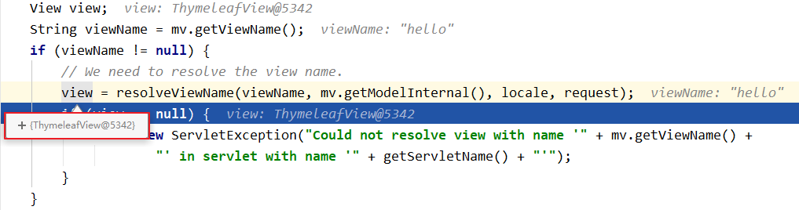

### SpringMVC视图

> SpringMVC中的视图是View接口，视图的作用渲染数据，将模型Model中的数据展示给用户
>
> SpringMVC视图的种类很多，默认有转发视图和重定向视图
>
> 当工程引入jstl的依赖，转发视图会自动转换为JstlView
>
> 若使用的视图技术为Thymeleaf，在SpringMVC的配置文件中配置了Thymeleaf的视图解析器，由此视图解析器解析之后所得到的是ThymeleafView

#### 1、ThymeleafView

> 当控制器方法中所设置的视图名称没有任何前缀时，此时的视图名称会被SpringMVC配置文件中所配置的视图解析器解析，视图名称拼接视图前缀和视图后缀所得到的最终路径，会通过转发的方式实现跳转
>
> ```java
> @RequestMapping("/testHello")
> public String testHello(){
>     return "hello";
> }
> ```
>
> `view = this.resolveViewName(viewName, mv.getModelInternal(), locale, request);`语句调用视图解析器解析视图名，产生视图对象
>
> 

#### 2、转发视图

> **转发视图：将一个url请求转发给另一个url请求，属于服务器内部转发不会改变浏览器地址**
>
> SpringMVC中默认的转发视图是InternalResourceView
>
> SpringMVC中创建转发视图的情况：
>
> 当控制器方法中所设置的视图名称以"forward:"为前缀时，创建InternalResourceView视图，此时的视图名称不会被SpringMVC配置文件中所配置的视图解析器解析，而是会将前缀"forward:"去掉，剩余部分作为最终路径通过转发的方式实现跳转
>
> 例如"forward:/"，"forward:/employee"
>
> ```java
> @RequestMapping("/testForward")
> public String testForward(){
>     return "forward:/testHello";
> }
> ```
>
> 对视图名进行解析后生成的是`InternalResourceView视图`，不是Thymeleaf视图
>
> InternalResourceView视图会解析一个内部请求转发，前端控制器会找到`/testHello`对应的控制器方法在进行一次视图处理
>
> （这种转发会改变）
>
> 

#### 3、重定向视图

> **重定向视图：将一个url请求重定向到另一个url请求，属于客户端重定向，会改变浏览器地址**
>
> SpringMVC中默认的重定向视图是RedirectView
>
> 当控制器方法中所设置的视图名称以"redirect:"为前缀时，创建RedirectView视图，此时的视图名称不会被SpringMVC配置文件中所配置的视图解析器解析，而是会将前缀"redirect:"去掉，剩余部分作为最终路径通过重定向的方式实现跳转
>
> 例如"redirect:/"，"redirect:/employee"
>
> ```java
> @RequestMapping("/testRedirect")
> public String testRedirect(){
>     return "redirect:/testHello";
> }
> ```
>
> 对视图名进行解析后生成的是`RedirectView视图`
>
> 处理流程：
>
> 1. 请求`/testForward`url
> 2. 解析视图名发现需要进行转发，不进行thymeleaf解析，进入RedirectView视图视图处理
> 3. RedirectView视图视图向浏览器回复一个重定向响应
> 4. 浏览器重新请求`/testHello`url
>
> 

#### 4、视图控制器view-controller

> 当控制器方法中，仅仅用来实现页面跳转，即只控制器方法只需要返回视图名称时，可以将处理器方法使用view-controller标签进行表示
>
> ```xml
> <!--
> 	path：设置处理的请求地址
> 	view-name：设置请求地址所对应的视图名称
> -->
> <mvc:view-controller path="/testView" view-name="success"></mvc:view-controller>
> ```

> 注：
>
> 当SpringMVC中设置任何一个view-controller时，其他控制器中的请求映射将全部失效，此时需要在SpringMVC的核心配置文件中设置开启mvc注解驱动的标签：
>
> <mvc:annotation-driven />

#### 5、Spring内置视图解析器

> 生成的视图与转发视图类型相同（InternalResourceView）
>
> ```xml
>     <bean class="org.springframework.web.servlet.view.InternalResourceViewResolver">
>         <property name="prefix" value="/WEB-INF/templates"/>
>         <property name="suffix" value=".jsp"/>
>     </bean>
> ```