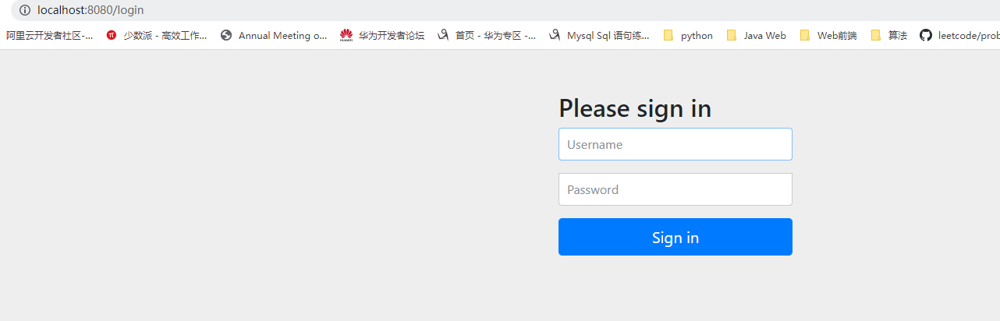

### 单点登录原理

表现：用户在父站点认证后无需在子站点重新登录

特点：跨域保持登录状态

使用场景：父站点下的子站点

原理：

1. 统一的认证服务器认证（Oauth协议）
2. 子站点保持token信息
3. 设置登录信息到cookie，cookie的作用域设置为父域
4. 浏览器访问另一个子站点，携带父域的cookie
5. 子站点提取cookie信息向认证服务器确认
6. 页面跳转到认证服务器，要求用户确认是否授权（这一步一般省略，自动配置确认）
7. 认证服务器服务器确认后子站点重定向到原请求页面进行业务处理


### Spring Security Oauth2单点登录

1. 在认证服务器注册两个客户端

   ```java
       @Override
       public void configure(ClientDetailsServiceConfigurer clients) throws Exception {
           clients.inMemory()
                   .withClient("Zapp")
                   .redirectUris("http://localhost:8081/login")
                   .scopes("all")
                   .secret(bCryptPasswordEncoder.encode("123"))
                   .authorizedGrantTypes("authorization_code","password","refresh_token")
                   .resourceIds("oauth2-resource")
   
                   .and()
                   .withClient("Zapp1")
                   .redirectUris("http://localhost:8082/login")
                   .scopes("all")
                   .secret(bCryptPasswordEncoder.encode("123"))
                   .accessTokenValiditySeconds(60)
                   .resourceIds("oauth2-resource2")
   
                   .refreshTokenValiditySeconds(60*60)
                   .authorizedGrantTypes("authorization_code","password","refresh_token");
   
       }
   ```

   ```java
       @Override
       public void configure(AuthorizationServerSecurityConfigurer security) throws Exception {
           security.tokenKeyAccess("isAuthenticated()");
       }
   ```

   

2. 配置两个客户端
   客户端1

   ```java
   server.port=8081
   server.servlet.session.cookie.name=OAUTH2-CLIENT-SESSION01
   
   
   
   security.oauth2.client.client-id=Zapp
   security.oauth2.client.client-secret=123
   security.oauth2.client.user-authorization-uri=http://localhost:8080/oauth/authorize
   security.oauth2.client.access-token-uri=http://localhost:8080/oauth/token
   security.oauth2.resource.jwt.key-uri=http://localhost:8080/oauth/token_key
   ```

   客户端2

   ```java
   server.port=8082
   server.servlet.session.cookie.name=OAUTH2-CLIENT-SESSION02
   
   
   
   security.oauth2.client.client-id=Zapp1
   security.oauth2.client.client-secret=123
   security.oauth2.client.user-authorization-uri=http://localhost:8080/oauth/authorize
   security.oauth2.client.access-token-uri=http://localhost:8080/oauth/token
   security.oauth2.resource.jwt.key-uri=http://localhost:8080/oauth/token_key
   
   ```

3. 测试

1. 访问站点1，自动跳转到认证服务器登录页
   
2. 登陆后重定向到请求页
   
3. 访问站点2，无需登录直接访问
   

抓包观察

访问站点1时，存在Oauth协议的状态码授权模式的运行


访问站点2时，同样存在Oauth协议的状态码授权模式的运行


### 总结

在用户看来不需要登录的操作实际上由Oauth协议在完成。

不同站点看起来时共享了登录信息，实际上是通过cookie和认证服务器来完成的，并不是将认证信息保存到了每一个站点上。


每次第一次访问一个站点都会存在一次Oauth协议的操作，后续站点就会保持登录信息，不需要再次进行Oauth认证