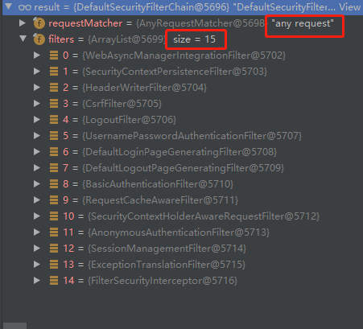
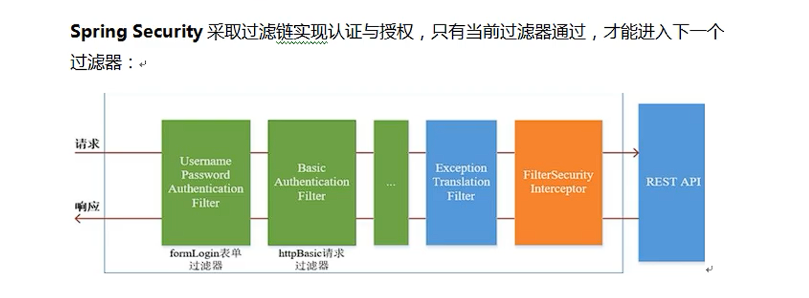

### 过滤器加载过程

自动配置类SecurityAutoConfiguration导入组件如下（相关前缀spring.security）

- SpringBootWebSecurityConfiguration：配置过滤链

  ```java
  // HttpSecurity对象的bulid方法返回SecurityFilterChain对象
  // 配置15条过滤链
  // 设置SecurityFilterChain对象的拦截请求为所有
  ```

  

- WebSecurityEnablerConfiguration：导入了如下组件

  - WebSecurityConfiguration
  - SpringWebMvcImportSelector
  - OAuth2ImportSelector
  - HttpSecurityConfiguration

- SecurityDataConfiguration：web环境中没被使用


### 过滤器链



三个主要过滤器

- FilterSecurityInterceptor：是一个方法级权限过滤器，位于过滤链最底部
- ExecptionTranslationFilter：异常过滤器，用于处理认证授权过程中抛出的异常
- UsernamePasswordAuthenticationFilter：校验表单中的用户名和密码


### 两个主要接口

1、`UserDetailsService`：用于自定义认证过程，例如：在验证用户名密码时通过查询数据库方式，而不是默认用户名密码


自定义认证过程主要步骤

1. 创建类继承UsernamePasswordAuthenticationFilter过滤器，重写三个方法

   ```java
   // attemptAuthentication，获取Post中的用户名密码进行认证
   // successfulAuthentication，认证成功调用的方法
   // unsuccessfulAuthentication，认证失败调用的方法
   ```

2. 创建类实现UserDetailsService接口，编写数据查询过程，返回User对象，该类由Secruity框架提供。该类将被attemptAuthentication方法调用，处理用户名密码匹配


2、`PasswordEncoder接口`，用于密码加密