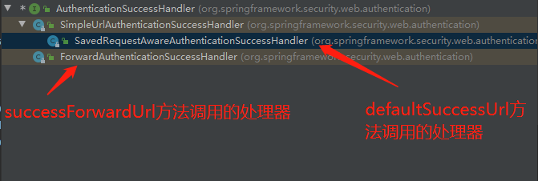
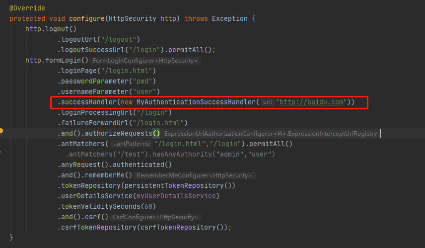
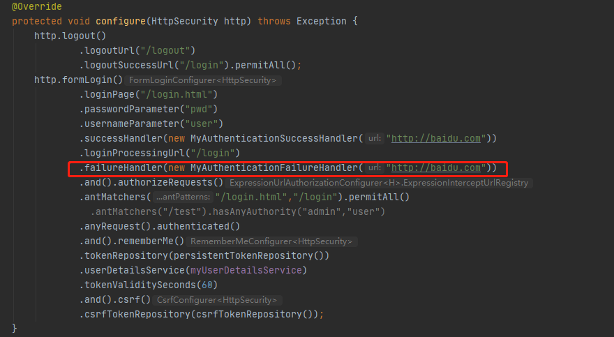

## 自定义用户

### 三种自定义用户的方法

- 配置文件

- 配置类

- 自定义类


### 配置文件

```yaml
spring:
  security:
    user:
      name: zlp
      password: 123
```


### 配置类

```java
@Configuration
public class SecurityConfig extends WebSecurityConfigurerAdapter {

    @Override
    protected void configure(AuthenticationManagerBuilder auth) throws Exception {
        // BCryptPasswordEncoder对象用来加密明文密码
        // 该对象容器中存在一个PasswordEncoder接口的实现类对象
        // 所有下面注入了这样的对象
        BCryptPasswordEncoder bCryptPasswordEncoder = new BCryptPasswordEncoder();
        String pwd = bCryptPasswordEncoder.encode("123");
        // 设置用户，密码，角色
        auth.inMemoryAuthentication().withUser("zlp").password(pwd).roles("admin");
    }

    @Bean
    public BCryptPasswordEncoder bCryptPasswordEncoder(){
        return new BCryptPasswordEncoder();
    }
}
```


### UserDetailsService接口


UserDetailsService接口返回用户流程

1. 自定义类继承UserDetailsService接口，重写方法

   ```java
   @Component
   // User类是UserDetails的实现类
   public class MyUserDetailsService implements UserDetailsService {
   
       @Override
       public UserDetails loadUserByUsername(String s) throws UsernameNotFoundException {
           // 使用工具类，构建角色列表
           List<GrantedAuthority> roles = AuthorityUtils.commaSeparatedStringToAuthorityList("admin");
           // User构造方法接受3个参数。用户名、密码、角色
           return new ("zlp",new BCryptPasswordEncoder().encode("123"),roles);
       }
   }
   ```

2. Security会自动搜索UserDetailsService类型对象，通过loadUserByUsername方法获取UserDetails对象


### 小结

Spring Security会通过配置文件、配置类和UserDetailsService三个途径验证POST表单上传的用户是否正确。`自定义用户的根本目的是返回一个用户使得Security可以验证POST上传是否正确`


## 自定义登录响应

重写WebSecurityConfigurerAdapter类的config方法

```java
protected void configure(HttpSecurity http) throws Exception
```

在`formLogin`方法中设置相关登录选项

```java
    @Override
    protected void configure(HttpSecurity http) throws Exception {
        http.formLogin()
            // 设置登录页
                .loginPage("/login.html")
            // 设置表单用户名输入框的name属性值格式
                .passwordParameter("user")
            // 设置表单密码输入框的name属性值格式
                .usernameParameter("pwd")
            // 设置登录成功后跳转的页面，以转发方式跳转
                .successForwardUrl("/")
            // 设置登陆成功后跳转的页面。以重定向方式跳转，
            // 可以设置第二个参数true，保证跳转一定发生，
            // 若不设置则根据Referer来跳转到页面
                .defaultSuccessUrl("/")
            // 设置表单提交的处理url，该控制器由security内置实现
                .loginProcessingUrl("/test/login")
            // 设置登录失败跳转页面
                .failureForwardUrl("/login.html")
            
            // 定义授权
                .and().authorizeRequests()
            // 一定要将登录页和登录提交路径排除，否则会一直重复重定向
                .antMatchers("/login.html","/login").permitAll()
            // 应用所有url都需要认证
                .anyRequest().authenticated()
            
            
            // 关闭csrf防护
                .and().csrf().disable();

    }
```

### 自定义登录成功处理器

defaultSuccessUrl方法，successForwardUrl方法内部都是一个Handler进行处理，前者进行重定向，后者进行转发。




自定义处理器继承AuthenticationSuccessHandler接口

```java
public class MyAuthenticationSuccessHandler implements AuthenticationSuccessHandler {

    private String url;

    public MyAuthenticationSuccessHandler(String url) {
        this.url = url;
    }

    // authentication参数可以获得用户信息
    @Override
    public void onAuthenticationSuccess(HttpServletRequest httpServletRequest, HttpServletResponse httpServletResponse, Authentication authentication) throws IOException, ServletException {
        httpServletResponse.sendRedirect(url);
    }
}
```

应用



### 自定义失败处理器

自定义类继承AuthenticationFailureHandler接口

```java
public class MyAuthenticationFailureHandler implements AuthenticationFailureHandler {
    private String url;

    public MyAuthenticationFailureHandler(String url) {
        this.url = url;
    }

    @Override
    public void onAuthenticationFailure(HttpServletRequest httpServletRequest, HttpServletResponse httpServletResponse, AuthenticationException e) throws IOException, ServletException {
        httpServletResponse.sendRedirect(url);
    }
}
```

应用




## 自定义退出设置

```java
    @Override
    protected void configure(HttpSecurity http) throws Exception {
        http.logout()
            // 退出操作处理控制器，控制器由Security内置
                .logoutUrl("/logout")
            // 退出成功跳转页面
                .logoutSuccessUrl("/login").permitAll();
    }
}
```


## 匿名访问

anonymous() 允许匿名用户访问,不允许已登入用户访问

```Java
// 路径匿名模式下，不带token的请求可以正常通过，带token的请求拒绝访问
```

permitAll() 不管登入,不登入 都能访问

```java
// permitAll下，不判断请求是否认证都可以访问
```