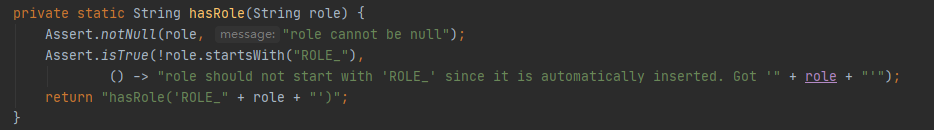
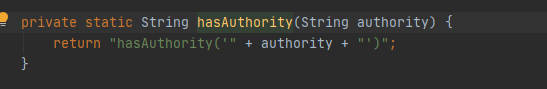
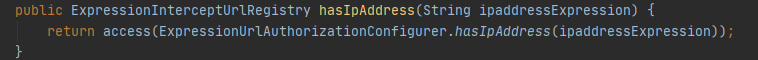
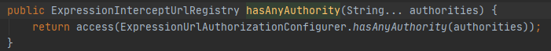
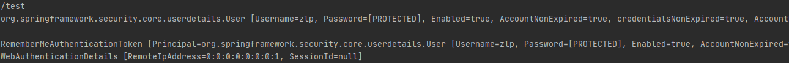

### 授权设置

```java
    @Override
    protected void configure(HttpSecurity http) throws Exception {
        // 授权设置
        http.authorizeRequests()
            // 放行部分url
                .antMatchers("/login.html","/login").permitAll()
            // 对/test接口进行权限认证
                .antMatchers("/test").hasAnyAuthority("admin","user")
            // 对所有接口进行身份日志，除了上述接口外
                .anyRequest().authenticated();
    }
}
```

#### antMatchers方法

字符串匹配url

```java
.antMatchers("/login.html","/login").permitAll()
// 放行所有jpg文件
.antMatchers("/img/*.jpg", "/**/*.jpg").permitAll()
```


#### regexMatchers方法

正则表达式匹配url

```java
// 放行所有jpg文件
.regexMatchers(".+[.]jpg")
```


#### mvcMatchers方法

字符串匹配，处理有servletPath的情况

```java
// 设置了servletPath的请求路径为：/test/demo，使用mvcMatchers方法可以不用每个添加前缀
.mvcMatchers("/demo").servletPath("/test")
```


### 基于权限的访问控制

设置url访问权限

```java
// 设置一个权限，只有该权限能访问
.antMatchers(/main).hasAuthority("admin")
// 设置多个权限，任意一个权限都能访问
.antMatchers("/adminlogin").hasAnyAuthority("admin","user")
```

为用户设置权限

```java
    @Override
    public UserDetails loadUserByUsername(String s) throws UsernameNotFoundException {
        // 设置权限列表
        List<GrantedAuthority> Authority = AuthorityUtils.commaSeparatedStringToAuthorityList("admin");
        return new User("zlp",new BCryptPasswordEncoder().encode("123"),Authority);
    }
```

若没有访问权限则返回403错误页


### 基于角色的访问控制

设置url访问角色

```java
// 设置一个权限，只有该权限能访问
.antMatchers(/main).hasRole("admin")
// 设置多个权限，任意一个权限都能访问
.antMatchers("/adminlogin").hasAnyRole("admin","user")
```

设置用户角色

```java
    @Override
    public UserDetails loadUserByUsername(String s) throws UsernameNotFoundException {
        // 设置权限列表，角色列表
        List<GrantedAuthority> Authority = AuthorityUtils.commaSeparatedStringToAuthorityList("admin","ROLE_admin");
        return new User("zlp",new BCryptPasswordEncoder().encode("123"),Authority);
    }
```

> 通过AuthorityUtils工具类设置用户角色是需要添加前缀ROLE_，这一特点是由源码导致的
>
> 可以看出设置角色时在输入字符串前添加了ROLE_，所以自定义时也需要添加，保持一致
>
> 
>
> 


### 基于IP的访问控制

设置访问IP

```java
.antMatchers("/test").hasIpAddress("127.0.0.1")
```


### access方法

access方法是所有权限控制方法的底层调用






access方法接受一个表达式来返回是否放行

| Expression                                                   | Description                                                  |
| :----------------------------------------------------------- | :----------------------------------------------------------- |
| `hasRole(String role)`                                       | Returns `true` if the current principal has the specified role.For example, `hasRole('admin')`By default if the supplied role does not start with 'ROLE_' it will be added. This can be customized by modifying the `defaultRolePrefix` on `DefaultWebSecurityExpressionHandler`. |
| `hasAnyRole(String… roles)`                                  | Returns `true` if the current principal has any of the supplied roles (given as a comma-separated list of strings).For example, `hasAnyRole('admin', 'user')`By default if the supplied role does not start with 'ROLE_' it will be added. This can be customized by modifying the `defaultRolePrefix` on `DefaultWebSecurityExpressionHandler`. |
| `hasAuthority(String authority)`                             | Returns `true` if the current principal has the specified authority.For example, `hasAuthority('read')` |
| `hasAnyAuthority(String… authorities)`                       | Returns `true` if the current principal has any of the supplied authorities (given as a comma-separated list of strings)For example, `hasAnyAuthority('read', 'write')` |
| `principal`                                                  | Allows direct access to the principal object representing the current user |
| `authentication`                                             | Allows direct access to the current `Authentication` object obtained from the `SecurityContext` |
| `permitAll`                                                  | Always evaluates to `true`                                   |
| `denyAll`                                                    | Always evaluates to `false`                                  |
| `isAnonymous()`                                              | Returns `true` if the current principal is an anonymous user |
| `isRememberMe()`                                             | Returns `true` if the current principal is a remember-me user |
| `isAuthenticated()`                                          | Returns `true` if the user is not anonymous                  |
| `isFullyAuthenticated()`                                     | Returns `true` if the user is not an anonymous or a remember-me user |
| `hasPermission(Object target, Object permission)`            | Returns `true` if the user has access to the provided target for the given permission. For example, `hasPermission(domainObject, 'read')` |
| `hasPermission(Object targetId, String targetType, Object permission)` | Returns `true` if the user has access to the provided target for the given permission. For example, `hasPermission(1, 'com.example.domain.Message', 'read')` |

示例

```java
.antMatchers(HttpMethod.GET,"/login.html","/login").permitAll()
// 等价于
.antMatchers(HttpMethod.GET,"/login.html","/login").access("permitAll");


.antMatchers("/test").hasAnyAuthority("admin","user");
// 等价于
.antMatchers("/test").access("hasAnyAuthority('admin','user')")
```


### 自定义access方法，进行权限控制

经常使用来查询数据库表，判断是否具有权限

常用的权限判断表：用户、角色、权限、用户-角色、角色-权限表。

自定义方法返回Boolean

```java
@Service
public class MyService {
    public Boolean auth(HttpServletRequest request, Authentication authentication){
        // 获取当前URI
        String requestURI = request.getRequestURI();
        System.out.println(requestURI);
        
        // 获取UserDetail对象
        Object principal = authentication.getPrincipal();
        UserDetails userDetails = (UserDetails) principal;
        System.out.println(userDetails);
        
        // 获取证书信息
        Object credentials = authentication.getCredentials();
        System.out.println(credentials);
        
        // 获取用户权限信息
        Collection<? extends GrantedAuthority> authorities = authentication.getAuthorities();
        System.out.println(authentication);
        
        // 获取用户详细信息
        Object details = authentication.getDetails();
        System.out.println(details);
        
        /**
         * 进行权限认证流程
         * 1. 根据用户信息查询数据库，获得用户权限
         * 2. 判断用户选项是否能访问该URI
         */
        return true;
    }
}
```

使用

```java
.antMatchers("/test").access("@myService.auth(request,authentication)")
```

效果



