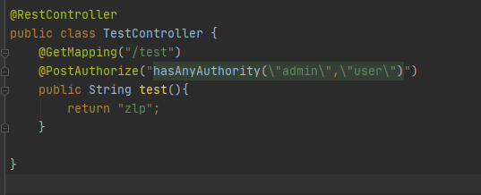

### @Secured

使用@Secured注解可以快速为接口配置`访问角色`

1. 全局开启@Secured注解

```java
@EnableGlobalMethodSecurity(securedEnabled = true)
@SpringBootApplication
public class Demo1Application {

    public static void main(String[] args) {
        SpringApplication.run(Demo1Application.class, args);
    }

}
```

2. 在控制器方法上使用@Secured注解，完成权限控制，设置的访问角色必须以`ROLE_`开头，可以设置多个角色


### @PreAuthorize

快速设置访问控制，可以配置各种认证方式，在控制器方法`执行之前`验证访问权限

1. 全局开启@PreAuthorize注解

   ```java
   @EnableGlobalMethodSecurity(prePostEnabled = true)
   @SpringBootApplication
   public class Demo1Application {
   
       public static void main(String[] args) {
           SpringApplication.run(Demo1Application.class, args);
       }
   
   }
   ```

   

2. 在控制器方法上使用@PreAuthorize注解，设置访问控制
   @PreAuthorize内部可以配置创建的4个权限，角色方法

   

   


### @POSTAuthorize

快速设置访问控制，可以配置各种认证方式，在控制器方法`执行之后`验证访问权限

1. 全局开启@PostAuthorize注解

```java
@EnableGlobalMethodSecurity(prePostEnabled = true)
@SpringBootApplication
public class Demo1Application {

    public static void main(String[] args) {
        SpringApplication.run(Demo1Application.class, args);
    }

}
```

2. 在控制器上配置@PostAuthorize注解，设置访问控制，格式和@PreAuthorize一致
   控制器方法会先执行一般，然后进行权限验证，判断是否返回




### @PreFilter

对控制器方法的传入值进行过滤

示例

```java
    @PostMapping("/test")
    @PostAuthorize("hasAnyAuthority(\"admins\",\"user\")")
    @PreFilter("filterObject.name == 'zlp'")
    public List<User> test(@RequestBody List<User> userList){
        return userList;
    }
```

提交参数

```json
[
    {
    "id": 1,
    "name": "zlp"
    },
    {
        "id": 2,
        "name": "zlp123"
    }
]
```

响应参数

```java
[
    {
        "id": 1,
        "name": "zlp"
    }
]
```

name属性为zlp123的对象被过滤


### @PostFilter

对控制器方法的返回值进行过滤

示例

```java
    @GetMapping("/test")
    @PostAuthorize("hasAnyAuthority(\"admins\",\"user\")")
// filterObject指向列表中的元素，表达式为真则放行，为假则过滤
    @PostFilter("filterObject.name == 'zlp'")
    public List<User> test(){
        User user1 = new User(1L, "zlp");
        User user2 = new User(1L, "zlp123");
        List<User> userList = new ArrayList<>();
        userList.add(user1);
        userList.add(user2);
        return userList;
    }
```

响应结果


name属性为zlp123的对象被过滤了