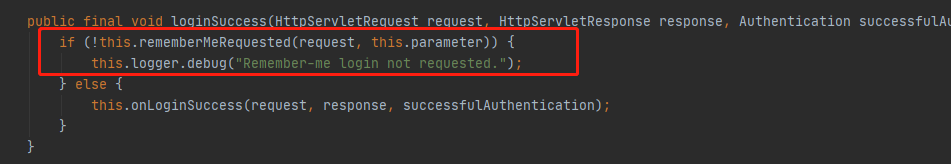
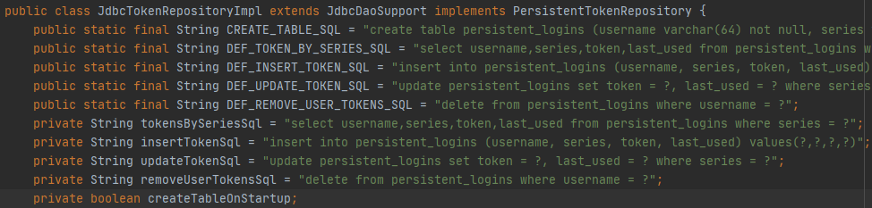
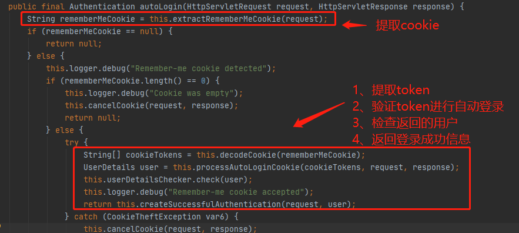

### 介绍

RememberMe是Security内置的一个功能，可以实现自动登录


### 原理

创建一个加密的Token，分别存入客户端cookie和服务器数据库中，每次用户请求时从cookie中读取Token，在数据库中查找，若存在则认证通过。

流程：

1. 用户登录，通过`UsernamePasswordAuthenticationFilter`过滤器进行认证

2. 认证成功后在`successfulAuthentication方法`中调用RememberMe服务

   

   

3. RememberMe服务会先`判断认证表单中是否存在name属性remember-me的复选框`，若存在则使用RememberMe功能
   

4. RememberMe服务调用`onLoginSuccess`方法将Token写入数据库和cookie中
   

5. 写入数据库使用`JdbcTokenRepositoryImpl对象的createNewToken方法`。该对象封装了Token表的创建，Token表的增删改查语句
   
   

6. 用户下次访问时，携带cookie，经过`RememberMeAuthenticationFilter过滤器`

7. RememberMeAuthenticationFilter过滤器在doFilter方法中`调用rememberMeServices对象的autoLogin方法`进行自动登录
   

8. `processAutoLoginCookie`方法对token校验。`返回用户信息对象`

   1. 根据cookie中的Series字段从数据库中获取token
   2. 判断token是否为空，是否相等
   3. 判断token是否过期
   4. token验证通过，创建新token，更新到数据库和cookie中，主要是刷新过期时间

   

   


### 示例

1、创建表

```sql
create table persistent_logins (username varchar(64) not null, series varchar(64) primary key, token varchar(64) not null, last_used timestamp not null) ENGINE=InnoDB DEFAULT CHARSET=utf8;
```

2、配置Security类

```java
    @Override
    protected void configure(HttpSecurity http) throws Exception {

        http.formLogin()
				...
            // 开启rememberMe功能
                .and().rememberMe()
            // 设置操作数据库实体类
                .tokenRepository(persistentTokenRepository())
            // 设置自定义登录认证逻辑
                .userDetailsService(myUserDetailsService)
            // 设置前端name属性的格式
                .rememberMeParameter()
            // 设置token过期时间，单位秒
                .tokenValiditySeconds(60)
                .and().csrf().disable();
    }
}

// 创建操作数据库实体类JdbcTokenRepositoryImpl对象，该类依赖JDBC.jar包
    @Bean
    public PersistentTokenRepository persistentTokenRepository(){
        JdbcTokenRepositoryImpl jdbcTokenRepository = new JdbcTokenRepositoryImpl();
        // 设置数据源
        jdbcTokenRepository.setDataSource(dataSource);
        // 是否自动创建表
        // jdbcTokenRepository.setCreateTableOnStartup(true);
        return jdbcTokenRepository;
    }
```


3、前端复选框

```html
<input type="checkbox" name="remember-me">
```


### 效果

登录成功返回cookie携带remember-me字段


每次请求cookie携带remember-me字段，重启浏览器不需要重新登录


> remember默认设置
>
> 默认cookie的key名称：remember-me
>
> 默认过期时间：1209600s（两周）
>
> 这些设置在：AbstractRememberMeServices类中