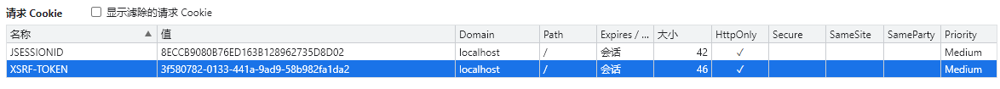
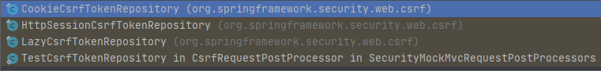

### 简介

跨站请求伪造（英语：Cross-site request forgery），也被称为 one-click  attack 或者 session riding，通常缩写为 CSRF 或者 XSRF， 是一种`挟制用户在当前已 登录的 Web 应用程序上执行非本意的操作的攻击方法`。跟跨网站脚本（XSS）相比，XSS 利用的是用户对指定网站的信任，CSRF 利用的是网站对用户网页浏览器的信任。

 跨站请求攻击，简单地说，是攻击者通过一些技术手段欺骗用户的浏览器去访问一个 自己曾经认证过的网站并运行一些操作（如发邮件，发消息，甚至财产操作如转账和购买 商品）。由于浏览器曾经认证过，所以被访问的网站会认为是真正的用户操作而去运行。 这利用了 web 中用户身份验证的一个漏洞：`简单的身份验证只能保证请求发自某个用户的 浏览器，却不能保证请求本身是用户自愿发出的。 `

从 Spring Security 4.0 开始，默认情况下会启用 CSRF 保护，以防止 CSRF 攻击应用 程序，Spring Security CSRF 会`针对 PATCH，POST，PUT 和 DELETE 方法`进行防护。


### 常见防护方式

1、用户操作限制，比如验证码；
2、请求来源限制，比如限制HTTP Referer才能完成操作；
3、token验证机制，比如请求数据字段中添加一个token，响应请求时校验其有效性

（相当于数字签名的方式）


第一种方案明显严重影响了用户体验，而且还有额外的开发成本；
第二种方案成本最低，但是并不能保证100%安全，而且很有可能会埋坑；
第三种方案，可行，token验证的CSRF防御机制是公认最合适的方案


### Token防护的思路

第一步：后端随机产生一个token，基于这个token通过SHA-56等散列算法生成一个密文；
第二步：后端将这个token和生成的密文都设置为cookie，返回给前端；
第三步：前端需要发起请求的时候，从cookie中获取token，把这个token加入到请求数据或者头信息中，一起传给后端；
第四步：后端校验cookie中的密文，以及前端请求带过来的token，进行正向散列验证；


### Security中的CSRF原理

1. 生成一个token保存到session或者cookie中，并设置到request域中，默认设置到会话中

   ```java
   // CsrfFilter过滤器完成整个csrf流程
   
   // 根据request计算token
   csrfToken = this.tokenRepository.generateToken(request);
   // 使用实体类保存token到session，或者cookie中
   this.tokenRepository.saveToken(csrfToken, request, response);
   
   // 设置到request域中
   request.setAttribute(CsrfToken.class.getName(), csrfToken);
   request.setAttribute(csrfToken.getParameterName(), csrfToken);
   ```

2. 返回页面时从request域中获取token，设置到前端页面的隐藏域

   ```html
   <!--使用模板语言获取request域中的csrf的token数据，name固定为_csrf-->
   <input type="hidden" name="_csrf" th:value="${_csrf.token}"/>
   ```

3. 每次表单提交时CsrfFilter过滤器从请求中获取隐藏域token信息，与session或者cookie中的token进行比较，若合法则通过验证

   ```java
   // 从session或者cookie中获取token，取决于使用的实体类
   CsrfToken csrfToken = this.tokenRepository.loadToken(request);
   
   // 从请求头，或者post参数中获取token
   String actualToken = request.getHeader(csrfToken.getHeaderName());
   if (actualToken == null){
       actualToken = request.getParameter(csrfToken.getParameterName());
   }
   // 比较两个token是否相等
   !equalsConstantTime(csrfToken.getToken(), actualToken)
   ```

   

### 将token设置到cookie中

```java
@Override
protected void configure(HttpSecurity http) throws Exception {
    http.csrf().csrfTokenRepository(csrfTokenRepository());
}


@Bean
public CsrfTokenRepository csrfTokenRepository(){
    return new CookieCsrfTokenRepository();
}
```




> CsrfTokenRepository接口
>
> 实现类
>
> 