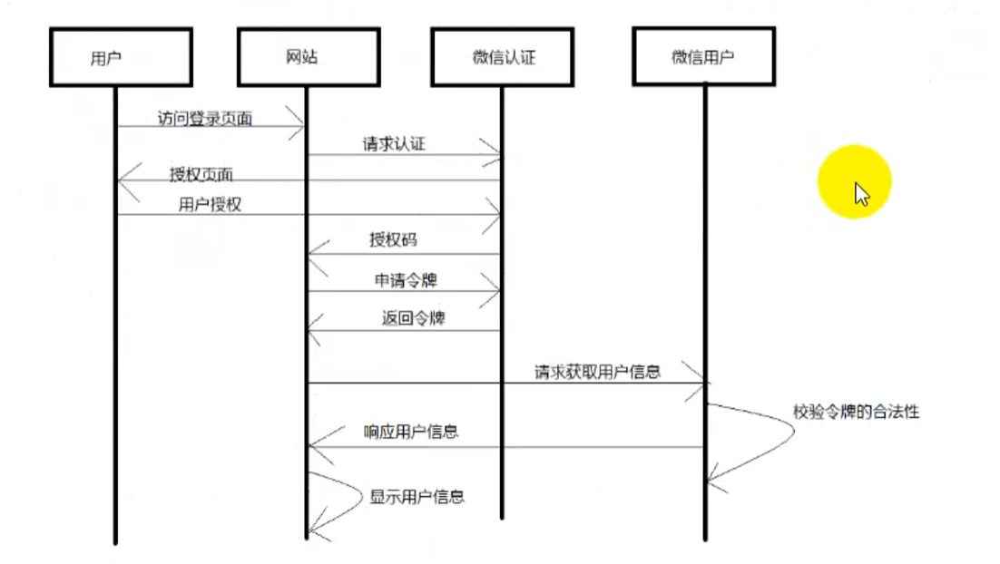
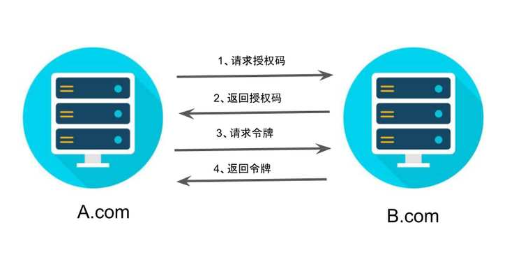
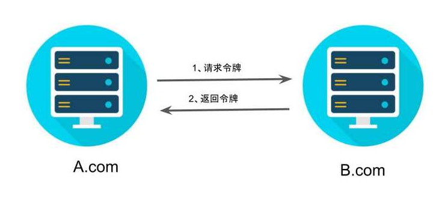
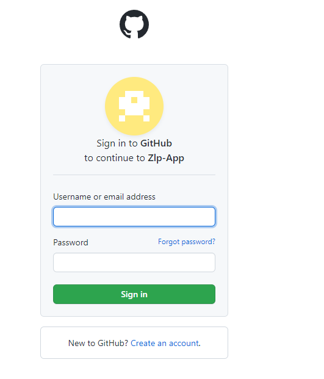
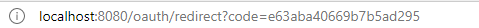
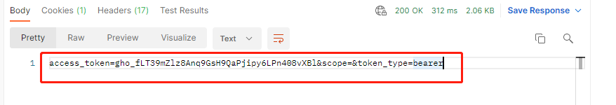
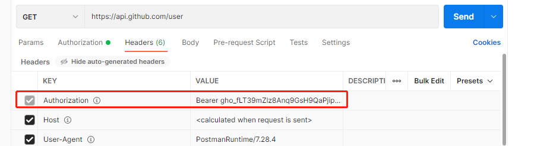
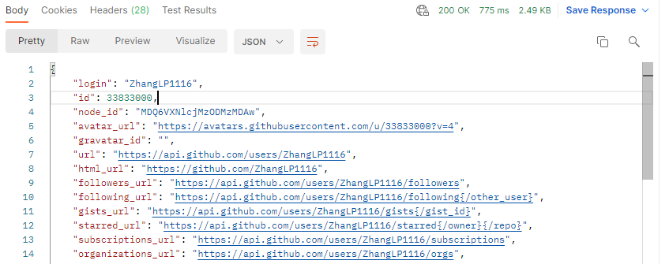

### Oauth2协议

OAUTH协议为用户资源的授权提供了一个安全的、开放而又简易的标准。与以往的授权方式不同之处是`OAUTH的授权不会使第三方触及到用户的帐号信息（如用户名与密码），即第三方无需使用用户的用户名与密码就可以申请获得该用户资源的授权`，因此OAUTH是安全的。oAuth是Open Authorization的简写。


OAuth2.0是OAuth协议的延续版本，但不向后兼容OAuth 1.0即完全废止了OAuth1.0。1版本太过复杂。


### 场景示例

微信授权认证




### 几种角色

- 资源拥有者：用户
- 客户端：第三方
- 授权服务器：例如，微信认证服务器
- 资源服务器：例如，微信资源服务器


###  术语

- 客户凭证：客户配置是认证服务器颁发给第三方客户端的，主要包含两个身份识别码：客户端 ID（client ID）和客户端密钥（client secret）。这是为了防止令牌被滥用，没有备案过的第三方应用，是不会拿到令牌的。
- 令牌：访问资源服务器的凭证，具有有效期和作用域
- 作用域：令牌的作用域限定了该令牌的持有者可以访问哪些资源


### 令牌类型

- 授权码：认证服务器颁发，用来获取访问令牌和刷新令牌
- 访问令牌：携带该令牌可以分为资源服务器
- 刷新令牌：携带该令牌到认证服务器可以刷新分为令牌的有效期
- BearerToken：不在意谁拥有该令牌，只在意令牌的作用范围
- Proof of Possession Token：：校验客户端是否对Token具有拥有权


### 四种授权模式

#### 1、授权码模式

这种方式是最常用的流程，安全性也最高，`它适用于那些有后端的 Web 应用`。授权码通过前端传送，`令牌则是储存在后端`，而且所有与资源服务器的通信都在后端完成。这样的前后端分离，可以避免令牌泄漏。


执行流程

1. A 网站提供一个链接，用户点击后就会跳转到 B 网站，授权用户数据给 A 网站使用。下面就是 A 网站跳转 B 网站的一个示意链接。

   ```
   https://b.com/oauth/authorize?
     response_type=code&
     client_id=CLIENT_ID&
     redirect_uri=CALLBACK_URL&
     scope=read
   ```

   上面 URL 中，`response_type`参数表示要求返回授权码（`code`），`client_id`参数让 B 知道是谁在请求，`redirect_uri`参数是 B 接受或拒绝请求后的跳转网址，`scope`参数表示要求的授权范围（这里是只读）。

2. 用户跳转后，B 网站会要求用户登录，然后询问是否同意给予 A 网站授权。用户表示同意，这时 B 网站就会跳回`redirect_uri`参数指定的网址。跳转时，会传回一个授权码，就像下面这样。

   ```
   https://a.com/callback?code=AUTHORIZATION_CODE
   ```

   上面 URL 中，`code`参数就是授权码。

3. A 网站拿到授权码以后，就可以在后端，向 B 网站请求令牌。

   ```
   https://b.com/oauth/token?
    client_id=CLIENT_ID&
    client_secret=CLIENT_SECRET&
    grant_type=authorization_code&
    code=AUTHORIZATION_CODE&
    redirect_uri=CALLBACK_URL
   ```

   上面 URL 中，`client_id`参数和`client_secret`参数用来让 B 确认 A 的身份（`client_secret`参数是保密的，因此只能在后端发请求），`grant_type`参数的值是`AUTHORIZATION_CODE`，表示采用的授权方式是授权码，`code`参数是上一步拿到的授权码，`redirect_uri`参数是令牌颁发后的回调网址。

4. B 网站收到请求以后，就会颁发令牌。具体做法是向`redirect_uri`指定的网址，发送一段 JSON 数据。

   ```json
   {    
     "access_token":"ACCESS_TOKEN",
     "token_type":"bearer",
     "expires_in":2592000,
     "refresh_token":"REFRESH_TOKEN",
     "scope":"read",
     "uid":100101,
     "info":{...}
   }
   ```

   上面 JSON 数据中，`access_token`字段就是令牌，A 网站在后端拿到了。



#### 2、含蓄模式

有些 Web 应用是纯前端应用，没有后端。这时就不能用上面的方式了，必须将`令牌储存在前端`。RFC 6749 就规定了第二种方式，允许直接向前端颁发令牌。这种方式没有授权码这个中间步骤，所以称为（授权码）"隐藏式"（implicit）。


执行流程

1. A 网站提供一个链接，要求用户跳转到 B 网站，授权用户数据给 A 网站使用。

   ```
   https://b.com/oauth/authorize?
     response_type=token&
     client_id=CLIENT_ID&
     redirect_uri=CALLBACK_URL&
     scope=read
   ```

   上面 URL 中，`response_type`参数为`token`，表示要求直接返回令牌。

2. 用户跳转到 B 网站，登录后同意给予 A 网站授权。这时，B 网站就会跳回`redirect_uri`参数指定的跳转网址，并且把令牌作为 URL 参数，传给 A 网站。

   ```
   https://a.com/callback#token=ACCESS_TOKEN
   ```

   上面 URL 中，`token`参数就是令牌，A 网站因此直接在前端拿到令牌。

   注意，令牌的位置是 URL 锚点（fragment），而不是查询字符串（querystring），这是因为 OAuth 2.0 允许跳转网址是 HTTP 协议，因此存在"中间人攻击"的风险，而浏览器跳转时，锚点不会发到服务器，就减少了泄漏令牌的风险。

   > 浏览器发起一个请求时，地址栏里 `#` 以及后面部分都是不会随请求发送到服务器的



#### 3、密码模式

如果你高度信任某个应用，RFC 6749 也允许用户把用户名和密码，直接告诉该应用。该应用就使用你的密码，申请令牌，这种方式称为"密码式"（password）。

例如自己内部的应用使用自己的认证服务器


执行流程

1. A 网站要求用户提供 B 网站的用户名和密码。拿到以后，A 就直接向 B 请求令牌。

   ```
   https://oauth.b.com/token?
     grant_type=password&
     username=USERNAME&
     password=PASSWORD&
     client_id=CLIENT_ID
   ```

   上面 URL 中，`grant_type`参数是授权方式，这里的`password`表示"密码式"，`username`和`password`是 B 的用户名和密码。

2. B 网站验证身份通过后，直接给出令牌。注意，这时不需要跳转，而是把令牌放在 JSON 数据里面，作为 HTTP 回应，A 因此拿到令牌。

   

   

#### 4、客户端模式

最后一种方式是凭证式（client credentials），适用于没有前端的命令行应用，即在命令行下请求令牌。


执行流程

1. A 应用在命令行向 B 发出请求。

   ```
   https://oauth.b.com/token?
     grant_type=client_credentials&
     client_id=CLIENT_ID&
     client_secret=CLIENT_SECRET
   ```

   上面 URL 中，`grant_type`参数等于`client_credentials`表示采用凭证式，`client_id`和`client_secret`用来让 B 确认 A 的身份。

2. B 网站验证通过以后，直接返回令牌。

   这种方式给出的令牌，是针对第三方应用的，而不是针对用户的，即有可能多个用户共享同一个令牌。

   

### 令牌的使用

A 网站拿到令牌以后，就可以向 B 网站的 API 请求数据了。

此时，每个发到 API 的请求，都必须带有令牌。具体做法是在请求的头信息，加上一个`Authorization`字段，令牌就放在这个字段里面。


### 更新令牌

令牌的有效期到了，如果让用户重新走一遍上面的流程，再申请一个新的令牌，很可能体验不好，而且也没有必要。OAuth 2.0 允许用户自动更新令牌。


具体方法是，B 网站颁发令牌的时候，一次性颁发两个令牌，一个用于获取数据，另一个用于获取新的令牌（refresh token 字段）。令牌到期前，用户使用 refresh token 发一个请求，去更新令牌。

```
https://b.com/oauth/token?
  grant_type=refresh_token&
  client_id=CLIENT_ID&
  client_secret=CLIENT_SECRET&
  refresh_token=REFRESH_TOKEN
```

上面 URL 中，`grant_type`参数为`refresh_token`表示要求更新令牌，`client_id`参数和`client_secret`参数用于确认身份，`refresh_token`参数就是用于更新令牌的令牌。

B 网站验证通过以后，就会颁发新的令牌。


### 第三方登录示例

https://www.ruanyifeng.com/blog/2019/04/github-oauth.html

1. 发生请求授权授权码

   ```
   https://github.com/login/oauth/authorize?client_id=f7c8bc9d65c47c657d52&redirect_uri=http://localhost:8080/oauth/redirect
   
   请求方式：GET
   请求参数：
   client_id
   redirect_uri
   ```

2. 页面跳转，用户登录并授权
   

3. 返回授权码
   

4. 请求token

   ```
   https://github.com/login/oauth/access_token?client_id=f7c8bc9d65c47c657d52&client_secret=aed753013551b434bd4b293ecd0ba0ea746ee140&code=4ff4677b5466c655b6fa
   
   请求方式：GET
   请求参数：
   client_id
   client_secret
   code
   ```

   

5. 携带token，获取用户数据

   ```
   https://api.github.com/user
   ```

   

6. 响应结果
   

   ```json
   {
       "login": "ZhangLP1116",
       "id": 33833000,
       "node_id": "MDQ6VXNlcjMzODMzMDAw",
       "avatar_url": "https://avatars.githubusercontent.com/u/33833000?v=4",
       "gravatar_id": "",
       "url": "https://api.github.com/users/ZhangLP1116",
       "html_url": "https://github.com/ZhangLP1116",
       "followers_url": "https://api.github.com/users/ZhangLP1116/followers",
       "following_url": "https://api.github.com/users/ZhangLP1116/following{/other_user}",
       "gists_url": "https://api.github.com/users/ZhangLP1116/gists{/gist_id}",
       "starred_url": "https://api.github.com/users/ZhangLP1116/starred{/owner}{/repo}",
       "subscriptions_url": "https://api.github.com/users/ZhangLP1116/subscriptions",
       "organizations_url": "https://api.github.com/users/ZhangLP1116/orgs",
       "repos_url": "https://api.github.com/users/ZhangLP1116/repos",
       "events_url": "https://api.github.com/users/ZhangLP1116/events{/privacy}",
       "received_events_url": "https://api.github.com/users/ZhangLP1116/received_events",
       "type": "User",
       "site_admin": false,
       "name": "ZhangLP",
       "company": null,
       "blog": "",
       "location": "China",
       "email": null,
       "hireable": null,
       "bio": null,
       "twitter_username": null,
       "public_repos": 2,
       "public_gists": 0,
       "followers": 0,
       "following": 0,
       "created_at": "2017-11-20T12:29:29Z",
       "updated_at": "2021-10-12T08:41:36Z"
   }
   ```

   

