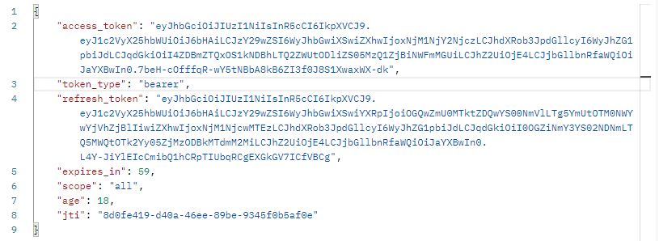

### 场景描述

使用security+Oauth2搭建认证服务器和应用服务器


### 依赖

在意Spring Boot和oauth2框架的版本匹配

使用Cloud中的oauth2和Security的原因是整合更加便捷

```xml
<?xml version="1.0" encoding="UTF-8"?>
<project xmlns="http://maven.apache.org/POM/4.0.0" xmlns:xsi="http://www.w3.org/2001/XMLSchema-instance"
         xsi:schemaLocation="http://maven.apache.org/POM/4.0.0 https://maven.apache.org/xsd/maven-4.0.0.xsd">
    <modelVersion>4.0.0</modelVersion>
    <parent>
        <groupId>org.springframework.boot</groupId>
        <artifactId>spring-boot-starter-parent</artifactId>
        <version>2.3.1.RELEASE</version>
        <relativePath/> <!-- lookup parent from repository -->
    </parent>
    <groupId>com.zlp.demo</groupId>
    <artifactId>demo2</artifactId>
    <version>0.0.1-SNAPSHOT</version>
    <name>demo2</name>
    <description>Demo project for Spring Boot</description>
    <properties>
        <java.version>1.8</java.version>
        <spring-cloud.version>Greenwich.SR2</spring-cloud.version>
    </properties>
    <dependencyManagement>
        <dependencies>
            <dependency>
                <groupId>org.springframework.cloud</groupId>
                <artifactId>spring-cloud-dependencies</artifactId>
                <version>${spring-cloud.version}</version>
                <type>pom</type>
                <scope>import</scope>
            </dependency>
        </dependencies>
    </dependencyManagement>
    <dependencies>
        <dependency>
            <groupId>org.springframework.cloud</groupId>
            <artifactId>spring-cloud-starter-security</artifactId>
        </dependency>
        <dependency>
            <groupId>org.springframework.cloud</groupId>
            <artifactId>spring-cloud-starter-oauth2</artifactId>
        </dependency>
        <dependency>
            <groupId>org.springframework.boot</groupId>
            <artifactId>spring-boot-starter-web</artifactId>
        </dependency>
        <dependency>
            <groupId>org.springframework.boot</groupId>
            <artifactId>spring-boot-starter-test</artifactId>
            <scope>test</scope>
        </dependency>
    </dependencies>

    <build>
        <plugins>
            <plugin>
                <groupId>org.springframework.boot</groupId>
                <artifactId>spring-boot-maven-plugin</artifactId>
            </plugin>
        </plugins>
    </build>

</project>

```

### 自定义认证

```java
@Service
public class MyUserAuthentication implements UserDetailsService {
    @Override
    public UserDetails loadUserByUsername(String s) throws UsernameNotFoundException {

        return new User("zlp",new BCryptPasswordEncoder().encode("123"),AuthorityUtils.commaSeparatedStringToAuthorityList("admin"));
    }
}
```

### 配置Security

```java
@Configuration
public class MySecurityConfig extends WebSecurityConfigurerAdapter {

    @Bean
    public BCryptPasswordEncoder bCryptPasswordEncoder(){
        return new BCryptPasswordEncoder();
    }

    @Override
    protected void configure(HttpSecurity http) throws Exception {
        // 放行Oauth相关的接口、登录接口
        // oauth2框架内置实现了Oauth协议的接口，以oauth开头
        http.authorizeRequests()
                .antMatchers("/oauth/**","/login/**").permitAll()
                .anyRequest().authenticated()
                .and().formLogin()
                .permitAll()
                .and().csrf().disable();
    }
}
```

### 配置认证服务器

```java
@Configuration
@EnableAuthorizationServer
public class AuthorizationServerConfig extends AuthorizationServerConfigurerAdapter {
    @Autowired
    private BCryptPasswordEncoder bCryptPasswordEncoder;

    @Override
    public void configure(ClientDetailsServiceConfigurer clients) throws Exception {
        // 内置客户端，此步骤相当于在认证服务器注册
        // 客户端可以请求的范围，使用的认证模式，重定向的url都在这定义
        // 客户端不能使用定义外的参数
        clients.inMemory()
                .withClient("Zapp")
                .redirectUris("http://www.baidu.com")
                .scopes("all")
                .secret(bCryptPasswordEncoder.encode("123"))
                .authorizedGrantTypes("authorization_code");
    }
}

```

### 配置资源服务器

```java
@Configuration
@EnableResourceServer
public class ResourceServerConfig extends ResourceServerConfigurerAdapter {
    @Override
    public void configure(HttpSecurity http) throws Exception {
        http.authorizeRequests()
            // 必须全局开启认证
                .anyRequest().authenticated()
                .and().requestMatchers()
            // 设置资源API
                .antMatchers("/user/**");
    }
}
```


### 定义资源接口

```java
@RestController
@RequestMapping("/user")
public class UserController {
    @GetMapping
    public Object getUser(Authentication authentication){
        // 返回UserDetails对象
        return authentication.getPrincipal();
    }

}
```


### 授权模式测试

1. 访问认证服务器请求授权码

   ```
   localhost:8080/oauth/authorize?response_type=code&client_id=Zapp&redirect_uri=http://www.baidu.com&scope=all
   ```

2. 认证服务器返回页面，让用户确实是否提供数据
   

3. 用户同意，重定向到指定页面，并返回授权码
   

4. 使用授权码去获取令牌

   > 请求地址：http://localhost:8080/oauth/token
   >
   > 请求方式：POST（Oauth2内置获取Token接口为POST请求）
   >
   > 设置认证：
   >
   > 
   >
   > 请求参数：
   >
   > 
   >
   > 

5. 获取Token
   

6. 携带token请求
   

7. 得到用户数据
   


### 密码模式测试

Security配置

```java
    @Bean
    public AuthenticationManager authenticationManager() throws Exception {
        return super.authenticationManager();
    }
```

认证服务器配置

添加密码模式、配置端点的认证管理器

```java
@Configuration
@EnableAuthorizationServer
public class AuthorizationServerConfig extends AuthorizationServerConfigurerAdapter {
    @Autowired
    private BCryptPasswordEncoder bCryptPasswordEncoder;
    @Autowired
    private AuthenticationManager authenticationManager;
    @Autowired
    private UserDetailsService userDetailsService;

    @Override
    public void configure(AuthorizationServerEndpointsConfigurer endpoints) throws Exception {
        endpoints.authenticationManager(authenticationManager)
                .userDetailsService(userDetailsService);
    }

    @Override
    public void configure(ClientDetailsServiceConfigurer clients) throws Exception {
        clients.inMemory()
                .withClient("Zapp")
                .redirectUris("http://www.baidu.com")
                .scopes("all")
                .secret(bCryptPasswordEncoder.encode("123"))
                .authorizedGrantTypes("authorization_code","password");
    }
}
```

请求token


响应token


携带token请求数据


### 刷新令牌

在认证服务器添加刷新令牌模式

```java
    @Override
    public void configure(ClientDetailsServiceConfigurer clients) throws Exception {
        clients.inMemory()
                .withClient("Zapp")
                .redirectUris("http://www.baidu.com")
                .scopes("all")
                .secret(bCryptPasswordEncoder.encode("123"))
            // 设置接入令牌过期时间
                .accessTokenValiditySeconds(60)
            // 设置刷新令牌过期时间
                .refreshTokenValiditySeconds(60*60)
            // 添加刷新令牌模式
                .authorizedGrantTypes("authorization_code","password","refresh_token");
    }
```

测试

获取令牌


使用刷新令牌获取新令牌

请求接口不变，参数改变


返回新的接入令牌和刷新令牌




### 使用redis存储Token

配置RedisTokenStore，依赖redis，Oauth

```java
@Configuration
public class RedisConfig {
    @Autowired
    RedisConnectionFactory redisConnectionFactory;

    @Bean
    public TokenStore redisTokenStore(){
        return new RedisTokenStore(redisConnectionFactory);
    }
}
```

配置使用RedisTokenStore

```java
    @Override
    public void configure(AuthorizationServerEndpointsConfigurer endpoints) throws Exception {
        endpoints.authenticationManager(authenticationManager)
                .userDetailsService(userDetailsService);

        endpoints.tokenStore(tokenStore);
    }
```

效果

