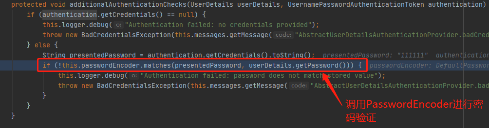

### 认证流程

security本质上是一个过滤链，认证流程发生在`UsernamePasswordAuthenticationFilter`过滤器上


流程图


代码流程

1. UsernamePasswordAuthenticationFilter过滤器调用父类`AbstractAuthenticationProcessingFilter`的`dofliter方法`
   
   认证成功调用方法
   
   认证失败调用方法
   
   （登录成功和失败的处理流程可以重写successfulAuthentication方法和unsuccessfulAuthentication方法实现，也可以通过实现对应的处理器实现）

2. `UsernamePasswordAuthenticationFilter`的`attemptAuthentication方法`，返回Authentication对象

   
   （可以通过继承UsernamePasswordAuthenticationFilter类，重写attemptAuthentication方法实现自定义请求中的用户信息解析和封装）

3. `UsernamePasswordAuthenticationToken`对象
   继承树

   > 
   >
   > 

   构造方法

   > ```JAVA
   > public class UsernamePasswordAuthenticationToken extends AbstractAuthenticationToken {
   >     private static final long serialVersionUID = 520L;
   >     private final Object principal;
   >     private Object credentials;
   > 
   >     // 为认证用户封装发生
   >     public UsernamePasswordAuthenticationToken(Object principal, Object credentials) {
   >         super((Collection)null);
   >         this.principal = principal;
   >         this.credentials = credentials;
   >         this.setAuthenticated(false);
   >     }
   > 
   >     // 已认证用户封装方式
   >     public UsernamePasswordAuthenticationToken(Object principal, Object credentials, Collection<? extends GrantedAuthority> authorities) {
   >         super(authorities);
   >         this.principal = principal;
   >         this.credentials = credentials;
   >         super.setAuthenticated(true);
   >     }
   > ```

4. 认证管理器`ProviderManager`，`authenticate方法`委托认证服务提供者
   继承树

   > 

   

5. DaoAuthenticationProvider对象的父类`AbstractUserDetailsAuthenticationProvider`调用，`authenticate方法`进行认证，主要工作：根据用户名信息获取后端存储的用户名密码，和请求中的信息进行比对。
   继承树
   

   
   

6. `DaoAuthenticationProvider`对象`retrieveUser方法`，是父类抽象方法的实现，主要工作：调用UserDetailsService获取用户信息，调用additionalAuthenticationChecks方法验证密码是否正确
   

   
   （此处的UserDetailsService和PasswordEncoder都可以通过继承接口重写方法来自定义）


### 权限访问流程

相关过滤器：ExceptionTranslationFilter、FilterSecurityInterceptor

ExceptionTranslationFilter


FilterSecurityInterceptor


### 认证信息共享

流程图


流程

1. 认证成功在`UsernamePasswordAuthenticationFilter`过滤器的successfulAuthentication方法中设置用户信息到security共享域中
   

2. SecurityContextHolder类方法getContext返回SecurityContext对象
   

   

   

3. SecurityContext接口的实现类`SecurityContextImpl`的`setAuthentication`方法将认证信息封装
   

4. `SecurityContextPersistenceFilter`的`doFilter`方法
   构造方法，接受一个SecurityContextRepository，或者创建一个SecurityContextRepository
   

   doFilter方法，在一次请求开始时设置共享对象，在一定时期清空共享对象，设置的共享对象可以在后续的servlet中使用
   
   

使用示例


总结：spring security将已经认证的用户信息对象Authentication与session绑定，实现在多个请求中共享