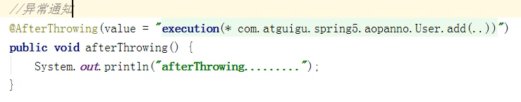
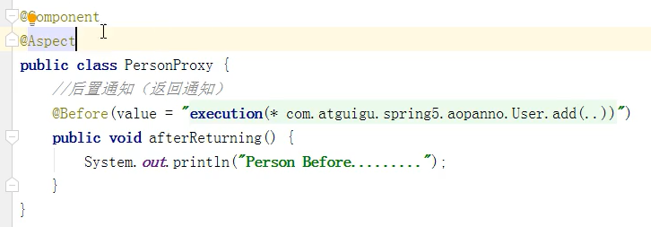
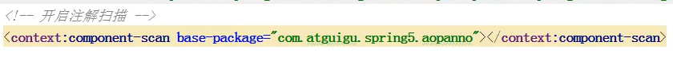

# Spring Aop操作

## AOP操作术语

> 1. 连接点
> 2. 切入点
> 3. 通知（增强）
> 4. 切面

### 1、连接点

> **被代理对象**中可以被增强的方法，**每个方法**都是一个代理实例的**连接点**。

### 2、切入点

> 代理**实例实际增强的方法**，就是切入点

### 3、通知

> 代理实例**增强的代码**就是**通知**。
>
> 通知的分类
>
> 1. 前置通知：在原有方法之前执行
> 2. 后置通知：在原有方法之后执行
> 3. 环绕通知：在原有方法前后都执行
> 4. 异常通知：原有方法出现异常时执行
> 5. 最终通知：类似try-catch-finally中的finally语句块，无论是否发生异常都会执行

### 4、切面

> 切面是一个动作，把通知应用到切入点的动作就是通知

## Spring_AOP实现准备

### Spring_AOP操作的依赖

> Spring框架的AOP操作一般依赖于AspectJ实现
>
> AspectJ是不Spring的组成部分，它是一个独立框架，一般把AspectJ和Spring框架一起使用进行AOP操作

### 基于AspectJ的Spring_AOP实现方式

> 有两种方式
>
> 1. 基于XML配置文件实现
> 2. 基于注解方式实现

### 依赖的jar包

> 
>
> 

### 切入点表达式

> 表达式的作用：要对哪个类里面的哪个方法进行增强
>
> 表达式语法结构
>
> ```
> execution([权限修饰符][返回类型][类的全路径][方法名称]([参数列表]))
> 
> 举例1：对comatguigu.daoBookDao类里面的add方法进行增强
> execution(* comatguigu.daoBookDao.add(..))
> *：表示任意权限修饰符
> 返回类型省略
> 类的全路径和方法名参数列表一起写
> .. 表示参数列表
> 
> 举例2：对comatguigu.daoBookDao类里面的所以方法进行增强
> execution(* comatguigu.daoBookDao.*(..))
> *表示所有方法
> 
> 举例3：对comatguigu包中所有类里面的所以方法进行增强
> execution(* comatguigu.*.*(..))
> ```

## Spring_AOP基于AspectJ实现

### 基于注解

#### 前置通知配置（@Before）

> 1. 创建被增强类
>     
>
> 2. 创建增强类
>     
>
> 3. 开启Spring注解扫描（就是开启组件扫描的配置）
>
>     1. 引入名称空间
>         
>     2. 添加扫描配置
>         
>
> 4. 使用注解创建User和UserProxy对象
>
>     
>
>     
>
> 5. 在增强类UserProxy上添加注解@AspectJ
>
>     
>
> 6. 通过配置xml开启Spring生成代理实例的功能
>
>     1. 引入名称空间
>         
>
>     2. 添加配置
>
>         
>
> 7. 配置不同类型的通知（以前置通知为例）
>
>     1. 增强代码前添加通知注解（每种通知都有对应的注解）
>
>         
>
>     2. 使用切入点表达式，对User类的add方法进行增强
>
>         
>
> 8. 测试
>     
>
>     

#### 后置通知配置（@AfterReturning）

> AfterReturning也可以叫返回通知，在返回结果后执行，发生异常不执行
>
> 

#### 环绕通知配置（@Around）

> 

#### 异常通知配置（@AfterThrowing）

> 

#### 最终通知配置（@After）

> After原方法执行后就执行，不论是否发生异常都会执行
>
> 

#### 通知执行顺序

> 正常情况下
>
> 1. @Around注释方法执行
> 2. @Before注释方法执行
> 3. 原方法执行
> 4. @Around注释方法执行
> 5. @After注释方法执行
> 6. @AfterReturning注释方法执行
>
> 发生异常情况下
>
> 1. @Around注释方法执行
> 2. @Before注释方法执行
> 3. @After注释方法执行
> 4. @AfterThrowing注释方法执行

#### 公共切入点抽取

> **目的：**简化切入点表达式使用，上述5种通知配置中切入点表达式都相同，使用公共切入点抽取方式可以避免写5遍相同的切入点表达式，**修改切入点表达式时只需要修改一处即可**
>
> **做法：**定义重用切入点
>
> **流程**
>
> 1. 使用@Pointcut注解定义公共切入点
>
>     1. 在增强类中定义一个方法
>     2. 在该方法上使用@Pointcut注解
>
>     
>
> 2. 使用**方法调用**代替原来的**切入点表达式**
>     

#### 多增强类的优先级设置

> 对于**同一个方法**有**多个增强类**时可以通过优先级**设置**不同增强了的**执行顺序**。
>
> 1. 第一个增强类
>     
>
> 2. 第二个增强类(上文的增强类)
>
> 3. 使用@Order注解设置优先级，@Order(数值)，数值越小优先级越高
>
>     
>
>     
>
> 4. 测试（测试代码也是上午不变）
>     

#### 完全注解开发

> 使用配置类代替xml文件
>
> 1. 实现Spring注释扫描
>
>     
>
>     
>
> 2. 实现Spring生成代理实例
>
>     
>
>     
>
> 

### 基于xml配置

> 1. 创建增强类
>     
>
> 2. 创建被增强类
>     
>
> 3. 配置xml生成两个类的对象
>     
>
> 4. 配置xml完成通知操作
>
>     1. 引入aop名称空间
>         
>
>     2. 使用**aop:config标签**配置通知
>         
>
>     3. 使用**aop:pointcut标签**配置切入点
>         用id标识一个切入点，expression属性值填写切入点表达式
>         使用id也可以达到公共切入点效果
>
>         
>
>     4. 使用**aop:aspect标签**配置切面（将通知配置到切入点）
>         ref属性用来获取增强类
>         **aop:before标签**标识配置前置通知，method和pointcut属性表示将增强类中的**哪个方法作用到哪个切入点**。
>
>         
>
> 5. 测试
>     
>
>     

