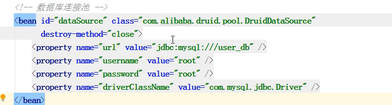
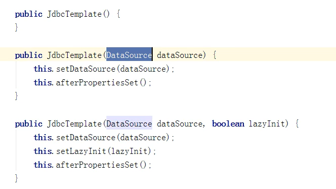
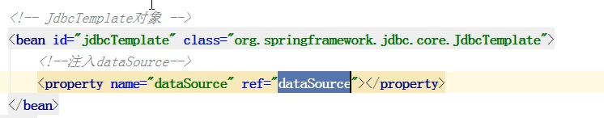
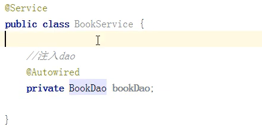
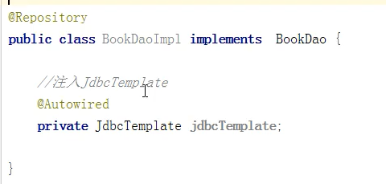

# JDBCTemplate概述

> Spring框架对JDBC进行了封装提供JDBCTemplata，使得程序员可以很方便的对数据库进行增删改查操作

## JDBCTemplate使用准备

### 1、引入jar包依赖

> 数据库连接依赖（要连接哪个数据库就使用哪个jar包）
> 
> Spring依赖，spring-jdbc是对jdbc进行了封装，tx是与事务处理相关，orm是与操作mybatis数据库有关的依赖
>
> 
>
> 
>
> 

### 2、在Spring中配置数据库连接池

> 需要引入druid.jar包
>
> 

### 3、配置JDBCTemplate对象，注入数据库配置（DataSource对象）

> 1. JDBCTemplate有三个构造方法，观察构造函数可知真正的DataSource对象是通过**set方法设置**的
>     
>
> 2. 通过set注入方式配置xml
>     
>
> 3. 创建service类、dao类，在dao类中注入JDBCTemplate对象，在service中注入dao对象
>
>     
>
>     