# JDBCTemplate操作数据库

### 数据库准备

> 1. 数据库：user_db
> 2. 数据表：t_book
>     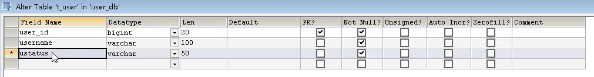

### 增

#### 增加单条记录（update方法）

> 1. t_user表对应的实体类
>
>     1. 创建属性对应表中字段
>         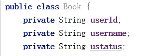
>
>     2. 创建属性的get、set方法
>
>         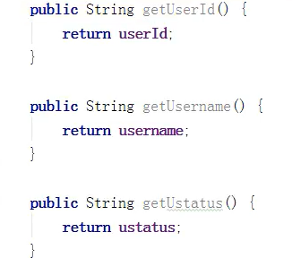
>
>         
>
>         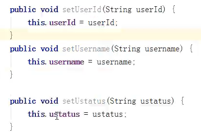
>
> 2. 编写service和dao类调用JDBCTemplate对象方法实现添加操作
>     JDBCTemplate中的**update方法**可以实现数据库的增删改操作，和python操作mysql时的excute方法效果一致。接受一个**动态sql表达式**和**参数列表**，返回整性表示影响行数。
>
>     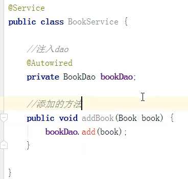
>
>     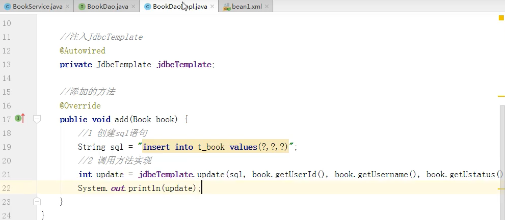

#### 批量增加记录（batchUpdate）

> 1. 使用batchUpdate方法，返回一个数组，表示每条sql语句影响的行数
>     
>
>     1. 接受一个sql语句，接受一个列表。列表每个成员都是一个列表，每个**成员都是**update方法中的**参数列表**。
>
>     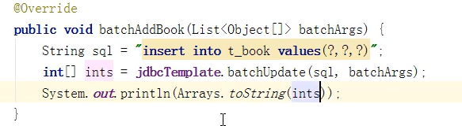
>
> 2. 测试
>     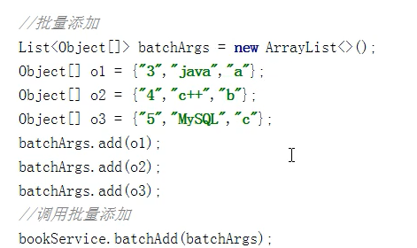
>
>     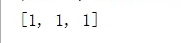
>
> （batchUpdate方法底层就是变量list数值，将其每一个成员带入sql语句中执行）

### 删

#### 单条删除（update方法）

> 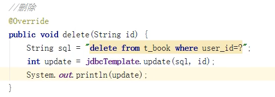

#### 批量删除（batchUpdate）

> 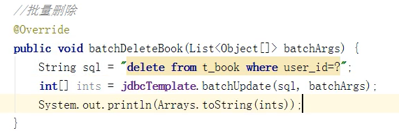
>
> 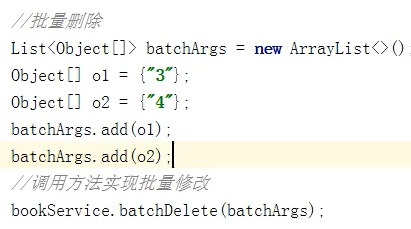

### 改

#### 单条修改（update方法）

> 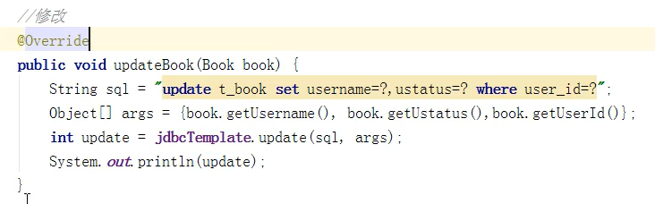

#### 批量修改（batchUpdate）

> 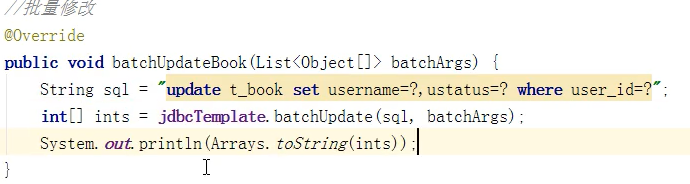
>
> 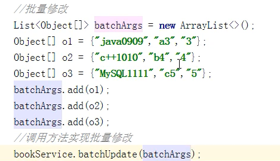

### 查

#### 查询返回单个值（queryForObject方法）

> 1. 查询数据表中有多少条记录
>
>     1. 使用方法
>         
>     2. 接受一个sql语句，和一个返回的查询结果数据类型
>
>     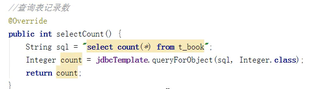

#### 查询返回对象（返回单条记录）（queryForObject）

> java通过对**对象的操作**来**实现对数据库的操作**，从高层面的抽象上看一条记录就是一个对象，记录中的字段就是对象的信息
>
> 1. 返回一条记录，封装成java对象
>
>     1. 使用方法，返回一个对象
>         
>     2. 接受sql语句，RowMapper接口的实现类，参数列表
>     3. RowMapper接口的实现类，实现将一条记录的数据封装到对象中，并将这个封装好的对象返回
>
>     （下面使用内置的RowMapper接口的实现类**BeanPropertyRowMapper**，传入要封装的类型）
>
>     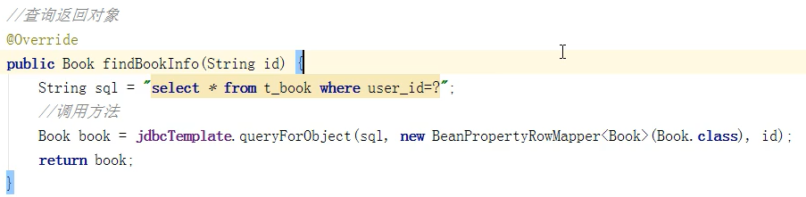

#### 查询返回对象集合（多行数据）（query方法）

> 1. 返回多行记录，将每条记录封装成对象，将多个对象放置到集合中
>
>     1. 使用方法，返回一个对象的集合
>         
>     2. 参数和queryForObject方法一样
>
>     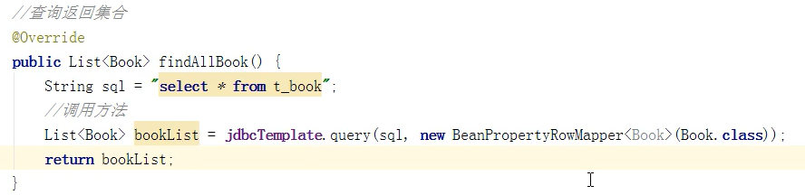

