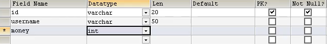
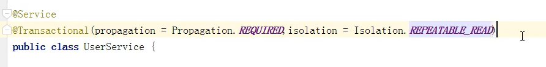

# Spring事务操作

## 事务场景搭建

### 银行转账场景

> 

### 场景逻辑分析

> 

### 搭建数据库

> 1. 创建数据表t_account，设置id、username、money字段
>     

### 配置service、dao对象

> 1. 创建service、dao对象，将dao对象注入service，将JDBCTemplate对象注入dao
>     
>
>     
>
>     
>
> 2. 在dao创建增加钱和减少钱的方法，在service中创建转账方法
>     
>
>     

### 问题引入

> 在上述过程中很明显存在一个问题，转账方法在分别调用两个方法之间发生了异常那么必定导致100块钱凭空消失。
>
> **所以将转账的整个过程作为一个事务进行处理**。

## Spring事务操作实现

> 事务实现位置：service层（业务逻辑层）
>
> 事务实现方式：编程式（复杂麻烦）、声明式（简单方便）

### 编程式事务管理

> 

### 声明式事务管理

> **实现方式：**
>
> 1. 基于注解
> 2. 基于xml
>
> **实现原理：**底层使用AOP方式声明式事务管理
>
> **实现事务功能的接口**：**事务管理器接口**，该接口针对不同操作数据库框架有不同的实现类。
>
> （为JDBCTeamplate接口、Mybatis数据库等提供事务功能就调用DataSourceTransactionManager）
>
> 

#### 注解方式

##### 实现

> 1. 在xml中配置事务管理器对象（JDBCTemplate模板使用DataSourceTransactionManager实现类）
>
>     
>
>     1. set方式注入数据库连接对象（不是JDBCTemplate对象）
>         
>
>     
>
> 2. 开启事务注解
>
>     1. 在xml中引入tx命名空间
>         
>
>     2. 开启事务注解
>         **tx:annotation-driven标签**开启事务注解功能
>         **transaction-manager属性**填写对应事务管理器对象
>
>         
>
> 3. 在service类对应位置上添加@Transaction注解
>
>     1. 在类上添加注解：表示整个类中的方法都添加事务特性
>     2. 在方法上添加注解：使该方法添加事务特性
>
> （**这种在不改变原方法代码又能使得方法具有新特性的方式就是AOP**）

##### @Transaction注解参数

> 

###### propagation：事务传播行为

> 多事务方法之间进行调用时，对事务的管理，Spring定义了7种事务的传播行为
>
> 
>
> 示例：
>
> 1. REQUIRED传播行为（没有配置传播行为时默认为REQUIRED）
>     

###### ioslation：事务隔离级别

> 隔离是为了解决并发操作下的问题。（与MYSQL隔离概念一致）
>
> **并发问题**
>
> 1. 更新丢失：一个事务写数据的过程中其他事务覆盖了这个更新（写-写矛盾）
>
> 2. 脏读：读取到另一个事务为提交的数据（写-读矛盾）
>
> 3. 不可重复读：一个事务读取数据的过程中其他事务对数据进行了修改，导致无法读到最开始的数据。（读-写矛盾）
>
> 4. 幻影读：为了解决不可重复读mysql在二级封锁协议下使用了快照机制，解决了一个事务在读的过程中其他事务的写覆盖问题，同时也引入了幻影读问题，**其他事务的写不会反应到另一个事务中**，导致原来事务的读到的数据如幻影一般从未出现过，这时候可能会出现插入重复主键等问题。
>
> （事务的隔离性底层使用锁实现，这一部分mysql中说明更加详细）
>
> **隔离级别**
>
> 1. READ UNCOMMITTED(读未提交)：解决更新丢失问题
> 2. READ COMMITTED(读已提交)：解决更新丢失、脏读问题
> 3. REPEATABLE READ(可重复读)：解决更新丢失、脏读、不可重复读问题（快照机制引入幻影读问题）
> 4. SERIALIZABLE(串行化)：将所有事务顺序执行，完全排除并发操作带来的问题
>
> **示例**：
>
> （默认也是REPEATABLE READ级别）
>
> 
>
> （暂时无法发理解java层面的数据库临界区资源是什么，java如何判断对临界区的资源的读操作和写操作）

###### timeout：超时时间

> 要求事务必须在规定时间内提交，否则就回滚退出。避免事务一直阻塞
>
> 该属性默认值为-1，没有超时限制。该属性以秒为单位
>
> **示例：**
>
> 

###### readOnly是否只读

> 标识事务是否进行只读操作，默认值false
>
> 该属性可以标识java层面一个事务的读写性质，配合事务隔离级别，良好的使用该属性可以大幅度提高系统的并发性。
>
> （REPEATABLE READ级别下对应二级封锁协议，读操作完成后立刻释放共享锁不用等待事务结束，此时写事务可以并发进行）
>
> 设置：
> 

###### rollbackFor：回滚

> 设置出现哪些异常**才进行**时回滚，默认对所有异常都回滚

###### noRollbackFor：不回滚

> 设置出现哪些异常时**不进行**回滚，默认为空

#### xml方式

##### 实现

> 1. 配置事务管理器，引入tx命名空间（与注解实现步骤一直）
>     
> 2. 配置通知（AOP操作，要增加的新特性）
>     
> 3. 配置切入点，配置切面（AOP操作）
>     

#### 完全注解方式

> 1. 创建配置类，添加xml中响应的注解
>     
>
> 2. 在配置类中创建xml中的bean对象，通过@Bean注解
>
>     1. 创建方法返回，数据库连接池对象
>         
>
>     2. 创建方法，JDBCTemplate对象
>         （下面JDBCTemplate对象需要注入数据库连接池对象不需要再次调用上一个创建方法获得，可以通过设置数据库连接池对象形参获得，这个方法中的**形参由Spring通过类型注入方式传入**）
>
>         
>
>     3. 创建方法返回，事务管理器对象
>         
>
> 3. 测试类
>     