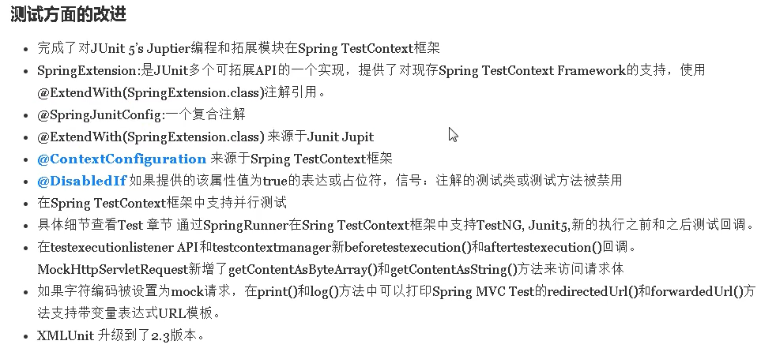
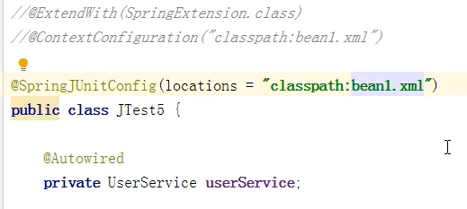

# Spring5新特性

> Spring整个框架基于java8实现，兼容JDK9，删除了旧版本中不建议使用的方法

## 核心特性

> 
>
> 

### Spring5整合log4j2

> Spring5弃用了Log4ConfigListener，建议使用log4j2
>
> 1. 引入log4j2所需依赖
>     
> 2. 创建log4j2.xml配置文件（文件名固定Spring5自动检测）
>     

### Spring5核心容器支持@Nullable注解

> @Nullable注解表示可以为空值
>
> 1. 作用在方法上，表示返回值可以为空
>     
> 2. 使用在方法的参数上，表示该参数可以为空
>     
> 3. 使用在属性上，表示该属性可以为空
>     

### Spring5核心容器支持函数式风格

> 通过CenericApplicationContext类实现
>
> 示例：手动创建对象并向Spring注册
>
> 1. 创建CenericApplicationContext对象
>     
> 2. 调用registerBean方法注册对象，对象使用函数式风格创建
>     
> 3. 获取对象，由于调用registerBean方法时没有传入对象名，所有只能用类所在的全路径获得对象，类属于类型注入
>     
>
> registerBean方法
>
> 

## 测试方面的改进

> 

### 整合JUnit4

> 1. 引入JUnit4依赖
>
>     
>
> 2. 创建测试类，使用注解完成测试
>
>     1. 使用@RunWith注解说明整合的测试框架
>         
>
>     2. 使用注解取代手动加载配置文件
>         
>
>         
>
>     3. 使用注入得到bean对象
>         
>
>     4. 编写测试方法
>
>         

### 支持整合JUnit5

> 1. 引入JUnit5依赖
>     
>
> 2. 创建测试类，使用注解完成测试
>     （除了引入框架的注解其他都不变）
>
>     1. 使用@ExtendWith注解引入JUnit5框架（@ExtendWith注解包含Spring5新扩展支持的框架）
>
>     

#### @SpringJUnitConfig使用复合注解一步完成配置

> 

